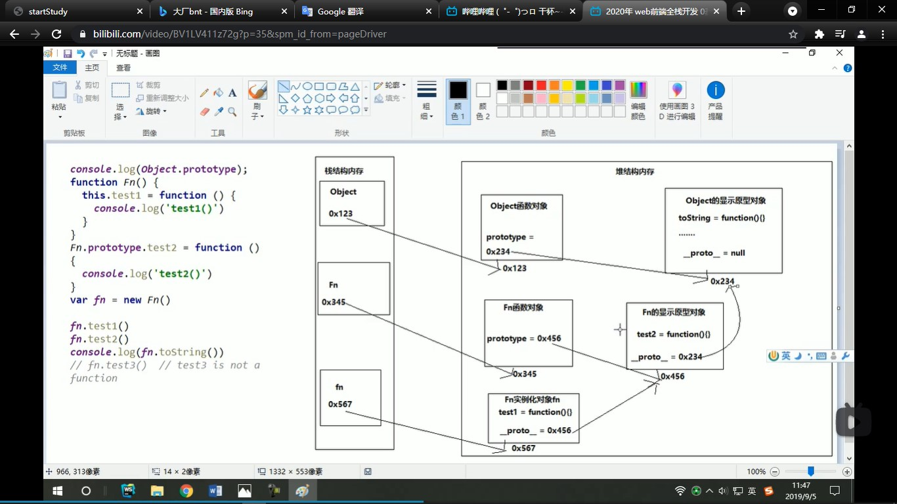
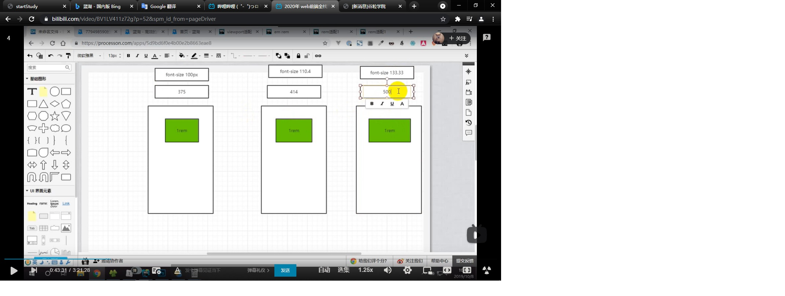
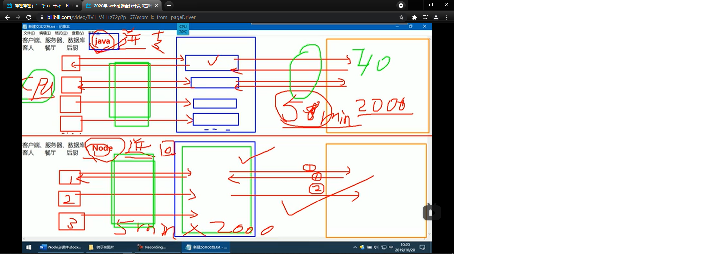
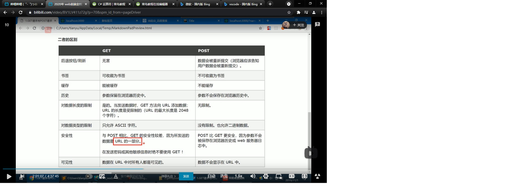
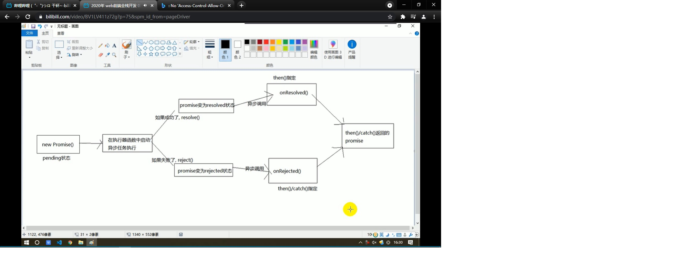
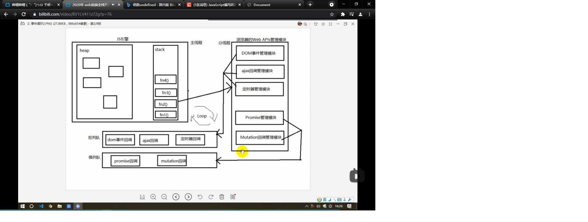
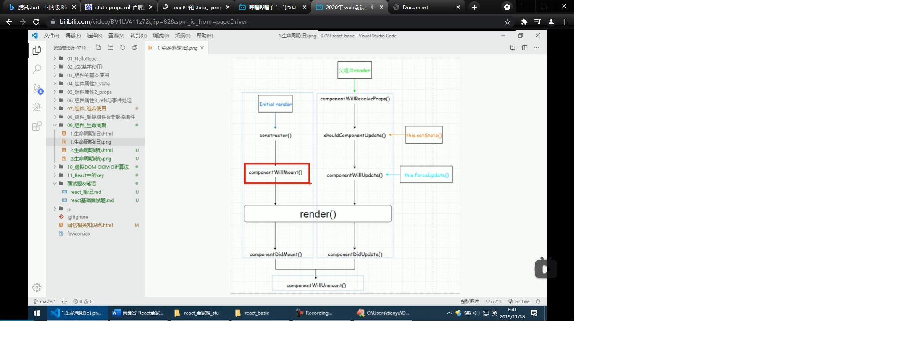
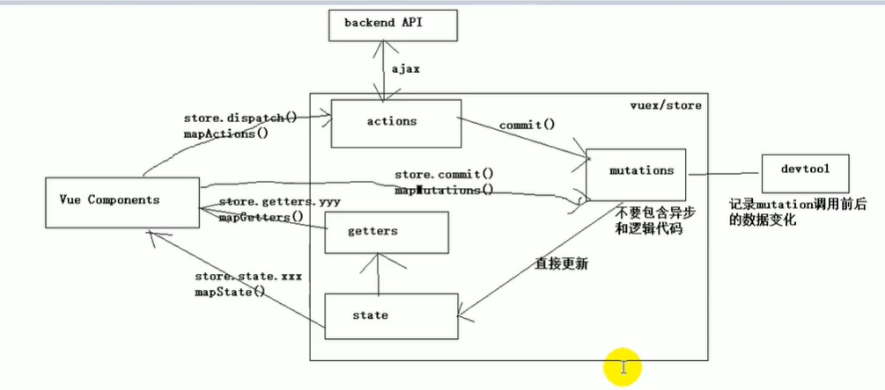
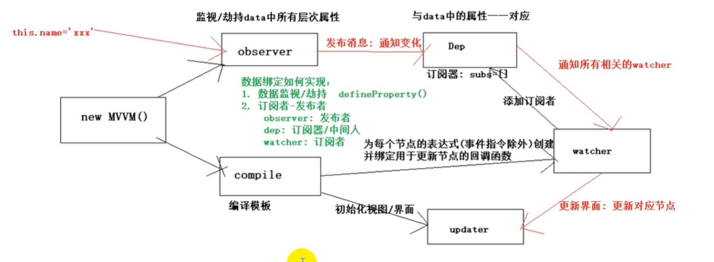

## css	c/s    更新，客户要更新  客户端
**函数在于三要素	功能 参数	返回值**
b/s   更新,客户不更新    服务器端   b是浏览器   s是服务器
需求分析
网页   结构  表现   行为
<title>小米官网</title>
注释习惯要养成
注释不可以嵌套使用
API application program interface
<!DOCTYPE html>文档声明
<html lang="zh">//lang属性来指定语言
zh是中文   en是英文
<meta charset="UTF-8">自结束标签   设置网页的基本信息
byte字节   bit位
h标签1-6  一般只用h1-->h3

分割线
&nbsp空格
&gt 大于
&lt 小于
&copy 版权符号
&#Unicode  编码表
win + s  搜索框
meta标签设置网页的元数据   一般用来告诉浏览器如何解析网页
							--》name设置属性的名字
							-->content设置属性的内容
							--》description用于告诉搜索引擎网页的主要内容
em标签   强调
p标签不放任何块元素
./相对路径指的是当前文件夹所在目录的路径
jpeg(jpg)不支持透明效果
png支持透明   较于其他格式png更好  当然还要考虑透明  图像大小   颜色丰富度等因素
webp   专门为网页设计的一种图片格式   但是兼容性差  特别是ie
base64 用来将图片转换为字符串   直接在页面加载时候就可以用   提升速度
iframe  src  引入外部网页   iframe不会被爬虫解析
<embed src="" type=""> //照顾ie8的音频文件格式
<audio>音频标签</audio>
<iframe src="">引入视频</iframe>//引入外部资源难用
target="_blank"  直接跳转新的页面
http-equiv:设置http协议的响应头
<meta name="description" contents="...">
<meta name="keywords" contents="...">
<nav>导航栏标签</nav>
<section>表示区块</section>
块元素表示占一行
q标签表示引用
内联元素不会独占一行
blockquote长引用
./当前目录
../上级目录
ol有序列表   ul无序列表   列表项很常用
<dl>表<dt>表项<dd>表项描述</dd></dt></dl>
css  (层叠样式表)
stylesheet样式表     css   js  html 实现分离会  加快页面加载速度
div.box{}//设置class为box 的div
div.box*10  + tab   //这样会直接创建10个div  class为box
ctrl+e   //选中相同的名字
选择器:
div span{}
.boxq span{}
div p span{}
span + p{}兄弟元素
span ~ p{}选择后面的所有p兄弟元素
div>p+tab //就生成了div 里面有个 p
div *{}
伪类选择器，用来表示元素的一些特殊状态或者位置  伪类选择器前有冒号:
div p:first-child{}//div的第一个子元素必须并且是p 才成立 
div p:first-of-type{}//div的p类型中的第一个
p:nth-child{}
odd 奇数   even  偶数
:only-child{}//只有一个的子元素
div:empty{}//div是空的来选择 		匹配空元素
:not()//否定伪类
p:not(.p1){}//除了.p1类名的元素
:link//正常的超链接,没有访问过的链接的样式
:visited//访问过的超链接，来设置样式   只能该颜色
:hover//被鼠标移上去的时候的样式
:active//鼠标点击时候的样式
<link>//引入css
属性选择器   [title]{}//有title 这个属性的 时候就执行内容
[title='hello']{}//title为hello
[title^='h']{}//title以h开头
[title$='h']{}//title以h结尾
[title*='h']{}//title含有h的来设置样式
[title='hello']{}//区分大小写  但是[title='hello' i]//加上i代表忽略大小写

伪元素
::有两个冒号
.box::before{content:'hello';}//内容前面加内容
.boc::after{content:'bye';}//内容后面加内容
::first-letter   第一个单词   .box1::first-letter
::first-line   第一行  .box::first-line
:selection   选中的内容
继承简化了代码的编写
transparent透明
权重优先级
内联1000>id100>类和伪类10>元素1
但是   为一个样式添加了！impotant    ,则这个样式>内联
但是要谨慎使用,以为别的东西不可覆盖   color:blue !import;
复合选择器  所有选择器的权重相加再来比较
相对于其包含块叫法更合适   相对于其父元素
hsl(,,)//h表示色相0-360   s表示饱和度0%-100% 	  l表示亮度0%-100%		工业上表示颜色的方法
border  	不占盒子大小
盒子的可见框大小   由		内容区	内边距	边框共同决定
margin border padding
padding 在内容区和border之间
margin border	padding		height	padding		border	margin
width	auto	默认占满		height	auto	默认内容多高就多高	没有内容就没没高度
height一般不写死  	会溢出的问题
overflow来设置溢出的设置
overflow   			可以设置的值有		-->visible(默认的)		
										-->hidden		溢出的内容会被裁剪
										-->scroll		生成滚动条来查看完整内容
										-->auto			根据需要生成滚动条
外边距的折叠问题			两个div之间的属性可能会折叠		
						margin-bottom		and 		margin-top
子元素的margin会传递给父元素
子父元素可以设置颜色来研究
文档流
垂直方向的padding不会影响页面布局
水平方向相邻的外边距不会重叠  		会相加两者之间的距离
display来指定元素生成的框的类型	--》inline行内元素		display:inline
								--》block块元素		display:block
								--》inline-block行内块元素		display:inline-block
								inline-block有点像图片不独占一行又有块元素的特点可以设置块元素
								-->none		元素不在页面中显示
visibility:hidden;			-->不显示元素但是占领位置
但是 		display		-->不显示元素且不占领位置
.outer>li:hover .inner{display:block;}			-->outer里面选中的li 才显示
houver显示的问题可以用到祖先和子类的相关的知识  -->点祖先，祖先和子类都显示
开发中第一步就是去除浏览器的默认样式
*{margin:0;padding:0;}
list-style:none;//去除列表项点
一般只会在块元素里面放内联元素，反之不可
<a>里面什么都可以放</a>
text-align//水平居中   		text-align:center;
line-height://直接写满元素的height    则文字垂直居中了
display:-->table表格表示    --》flex弹性容器显示			-->行内弹性容器
.box1::before{content:"";display:table;}//处理外边距折叠问题
文档流		文档就是网页
before是元素开始			after在元素结尾
display:inline-block     margin-top:1px;
outline:-->是不占空间的边框		设置轮廓不会影响元素的内容
box-shadow-->设置阴影		和轮廓一样		就是加上一个特效
box-shadow:（inset）20px 20px 10px #ffe;-->第一个值正值向右移动
								--》第二个值正值向下移动
								--》第三个值越大阴影就越模糊
								--》inset  表示内部阴影  	默认外部阴影
								--》可以设置多重阴影
float 元素完全脱离文档流  		不占据文档流里面的位置
float就是浮上一层去布局排列
超链接是内联元素
脱离文档流的元素全是块元素
浮动元素位置默认不会超过其上的其他元素
脱离文档流可能会高度塌陷
BFC是元素的一个隐藏属性		一旦元素开了BFC他将会开启一个独立的布局区域
开启了BFC的元素可以包含浮动子元素		
BFC无法直接开启			需要特殊属性来开启BFC
设置元素浮动可以开启BFC
CLEAR   来清除浮动元素的影响
.clearfix::before,
.clearfix::after{
	content:'';
	display:table;
	clear:both;
}						-->就解决高度塌陷问题还有外边距重叠问题
outline 		-->outline:1px solid red;
box-shadow				rgba(0,0,0,0.5);//阴影
浮动元素不会覆盖文字
top right bottom left
position 			-->absolute		会脱离文档流		宽高都随内容撑高		性质会改变	相对于离他最近的开启了定位的元素来定位
					-->relative		相对于自身原来的位置		不会脱离文档流		设置之后会提升元素的层级
					--》fixed		开启元素的固定定位		像一种特殊的绝对定位		但是他是总是相对于视口
					-->
z-index			-->表示层级的高度		--》z-index:1..   父元素层级再高不会盖住子元素
opacity:		-->用来设置元素的不透明度		
一般来说子绝父相
绝对元素相对于其包含块来定位的
元素设置了		absolute，那么margin:0 auto;就不管用了 	除非设置的时候left top right bottom 设置为0   	那么margin:auto;-->就会水平居中
元素设置了定位 		那么就多了left bottom right top 这几个值
水平方向			left margin border padding width padding border margin right
设置的时候left top right bottom 设置为0   	那么margin:auto;-->就会水平居中
position  	默认值是static 	表示没有开启定位
font awesome 		图标库 
1em  ==  1font-size		-->font-size是自己定义的
1rem == HTML的1font-size		-->默认16px
默认行高line-height是1.33		height	and 	line-height是不一样的
font-weight		字体是否加粗		100~900	越来越粗
min-width 	max-width		最小宽度		最大宽度
--》浏览器缩小放大的时候不改变框的大小
 text-align:-->left		左对齐
			-->right		右对齐
			-->center
			-->justify		文本两端对齐
vertical-align-->baseline		沿基线对齐
				--》sub		下标
				--》super	上标
				--》bottom	沿父元素底部对齐
				--> top		沿父元素顶部对齐
				--》middle	相对于小写子母的middle对齐
				-->特殊情况会遇到		图片位置默认和文字的基线对齐的
line-through		文本删除线
over-line 		上划线
solid	wavy	dotted	dashed	
text-indenet		首行缩进  	俩个文字的px   2em
white-space		-->normal	文本自动换行
				-->nowrap	文本不换行
				--》pre		保留文本的本来格式
text-overflow		-->ellipsis		处理溢出的文本
						文本显示不全用省略号显示		
white-space & overflow & text-overflow		这三个一般一起来用
letter-spacing		字母之间的间距
word-spacing		单词之间的距离		指定空格的大小
background-clip		-->padding-box		可以到padding 框
					-->
background-image		url('')		-->no-repeat
									-->repeat	默认重复
									-->repeat-x	x轴平铺
									-->repeat-y y轴平铺
图片存储为web使用格式
background-size:100%		-->图片来适应容器来等比缩放大
background-position:top left;		-->九宫格
									-->background-positon:100px 100px;
									-->第一个值正值		图片向右移动100px
									-->第二个值正值		图片向下移动100px
									-->一般都是赋值		将多个按钮的状态保存在同一个图片当中
									-->再来通过偏移量来显示需要的状态
									-->这叫做CSS Sprite(CSS精灵),雪碧图
									-->有效降低了发送请求的速度，提升用户的体验，降低图片的总大小
									-->降低加载的速度
									-->只适用于背景图片background-image
行内元素不支持宽高的设置		只随内容来撑起宽高
link 	hover		active		hover-->active
							第一次刷新的时候为什么会闪烁呢
							因为图片这些外部资源只会在页面在加载之后，有页面请求的时候在来加载
							图片需要使用的时候才来加载就会闪烁这种叫做懒加载
							
请求-->响应-->请求

href="javascript:;"		-->javascript:;来作为占位符是可以的		不会跳转页面
table		表格		里面的colspan所占领的大小
					-->colspan行
					-->rowspan列
					-->th是表头单元格		会加粗
					-->border-collapse:collapse		表格边框重叠
					-->创建table的时候		如果没有添加	tbody theader	tfooter
					-->那么浏览器会自动只加上tbody
		<table>
			--><tr>
			--><td>
<form action='#'></form>			表单提交数据的时候   	要有input框里面要有name属性
							-->action表单提交的位置
							--><input type='email' name='email' required autofocus>-->必填的
							-->autofocus  	自动聚焦的
							-->autocomplete		自动填写表单的关闭		不再记忆所输入的内容
absolute		脱离文档流		不占空间了

设置小三角形
.arrow{
	display:none;
	width:0;
	height:0;
	boeder:10px solid #fff;
	border-top:none;
	border-color:transparent transparent #fff;
	top:10px;...
}

height  line-height		text-align
hover绑定对象也有讲究
是a标签		还是div
隐藏元素的position可以是absolute		脱离文档流		不占大小
transition		过渡效果
transition:all 4s 1s;		-->第一个值是执行动画的属性
							-->第二个值执行动画的时间
							-->第三个值要延迟多久才来执行动画
height:0		overflow:hidden		也可以隐藏元素

阿里云的图标			下载至本地	下的压缩包的里面的两个demo
不用管		直接新建iconfont文件夹来引入其它剩余的文件
class="iconfont"

margin-left是固定的距离		left不是固定的距离
outline:none;		-->去除轮廓线
left margin-left border padding-left width..
*****right=1/2父元素			margin-right=-1/2父元素
li:nth-child(1):before{}
伪元素

ico文件就是web网站标签的图标
<link rel='icon' href='favicon.ico'>
net标签小图标
开发环境和生产环境
transition-property:height,width,background-color;-->变换属性
transition-duration:2s;-->变换时间
transition-delay:1s;-->过渡延时效果
transition-time-function:		linear-->匀速效果
								ease-in-->加速运动
								ease-out-->减速运动
								ease-->先加速再减速(默认值)比ease-in-out猛一点
								ease-in-out-->先加速后减速
								steps(6,end)-->图像分六步来变换
								steps(6,start)-->快一点
transition:left 2s steps(6,end)-->简写属性
transition实现了过渡效果		交互效果		类似动画效果但不是动画
@keyframes 名字{
	
}					-->keyframes用来设置关键帧
@keyframes test{
	from{}
	to{}
}
animation			-->实现动画效果
 cubic-bezier(p1,p2,p3,p4)			-->贝塞尔曲线	设置运动风格
 animation-play-state			动画播放状态
 animation-direction		-->normal
							-->reverse
							-->alternate
							-->alternate-reverse
anomation:test 400ms steps(6) alternate-reverse;
							-->动画简写属性
元素定位之后   多了left		right
				-->记住left:0;right:0;
				-->margin:0 auto;-->这样才会居中
@keyframes falldown{
	from{top:0;}
	to{top:396px;}
	0%,50%,100%{top:0;}
	from{top:0;}
	to{top:450px;}
	infinate alernate
}			
transform:translateX();		-->沿着x轴方向平移
				translateY()	-->沿着y轴方向平移
				translateZ()	-->沿着z轴方向平移	元素距离用户的距离
.box2{
	position:absolute;
	background-color:#bfa;
	left:50%;
	top:50%;
	transform:translateX(-50%) translateY(-50%);
}			-->让一个元素永远垂直水平居中
perspective		-->视距  设置人的眼睛和网页之间的距离	让视觉有3D效果
perspective:100px;-->不宜过小
transform:rotateX()		-->沿x轴旋转		45deg
rotateY()		-->沿y轴旋转
rotateZ()		-->沿z轴旋转
div.clock-wrapper
	div.sec-wrapper
	div.hour-wrapper
	div.min-wrapper
定位之后会多left right top bottom居中		left right top bottom =	0;	margin = auto;	
transform-style: preserve-3d;		-->**添加3D效果**
html里面添加视图效果  		眼屏距离perspective: 800px;
opacity添加透明效果   transform: rotateX(90deg) translateZ(-100px);旋转
rotate			-->deg
translate			-->px
transform		-->形式
@keyframes			关键帧
transform-origin		-->旋转原点
transform:scaleX(2)		-->X轴放大两倍
transform:scale(1.2)		-->X Y轴放大1.2倍
横向布局就是不断浮动
相对路径		绝对路径
公用资源存储在一个CND服务器里面
通过CDN来加载图片
一般网站会防止盗链		但是图片防盗链很少
margin-left:-100%		左边导航栏的设置不被挤下去
<!-- 双飞翼布局
min-width

width:100%;

zhongjian
padding:0 200px;

zuo
margin-left:-100%;

you
margin-left:-200px; -->
min-width:600px;
.outer-->margin:0 200px;
width:calc(100% - 200px)		-->双飞翼布局
linear-gradient		-->线性渐变		自上向下(默认)
radial-gradient		-->径向渐变		
repeating-linear-gradient		-->重复线性渐变
ellipse		椭圆
radial-gradient(at 0 0,red,..)		-->at指定圆心位置
less是css预处理语言	扩展了css语言	增加了变量
**使CSS更容易维护**
#	less里面封装一个混合mixin
less里面混合的函数		是不会在css文件当中存在的
例如
.hiedBox(){

}
命令行
		-->指令进行操作
		-->d:	e:转到对应盘符
		-->dir		当前目录下的所有文件
		-->cd + 路径 	进入指定目录		cd desktop\..
		-->cd ..		上一级目录
		-->cd .		当前目录
		-->mkdir		创建一个文件夹
		-->rmdir		删除一个文件夹
		-->cd \			c的根目录
用户变量 & 环境变量
用户变量设置的时候   PATH可以设置一组路径
当前目录下找不到文件的时候，会依次去到path的路径中去寻找
例如path 里面配置了 c:\users\desktop
		node.js里面的npm
		npm用命令行下载里面的包
		npm是国外的
		那么就用npm来下载cnpm镜像服务器
		npm install -g less
		下载less包
--a:100px;		-->定义了一个变量
width:var(--a);		-->使用了变量
方便了改的时候		直接找到变量名来修改对应的值
html{
	--a:100px;
	--b:orange;<!-- 在html里面来定义变量 -->
}
lessc style.less style.css
				-->将less文件转换为css文件
less文件：
@a:10px;
.box1{
	width:@a;
	height:10px;
	.box2{}
}			-->原生的css
转换为css文件
.box1{
	width:10px;
	<!-- 不用担心兼容性问题
	 a变量的定义-->
}.. 
ddos来攻击服务器
npm可以下载和上传
**cnpm只可以下载**
less里面的函数
darken()函数用来加深颜色

background-color:darken(yellow,20%);	-->加深了黄色

.box1{
	width:160px;
	height:$width;
}
										-->使用$符号来直接引用其他的值
										-->使用变量的时候就近原则
.box2{
	.box1();
}								-->box2里面来使用box1的样式**
.box2:extend(.box1){
	font-size:12px;
}	
								-->box2在box1的样式基础上进行了扩展
.box2:extend(.box1 all){

}							-->继承了所有关于box1的属性
.hello(){

}						-->选择器加了括号那么就只是用来被其他选择器来继承		（）里面可以传值		.hello(20px,40px)
相当于定义了一个函数		是一个形式参数
.hello(@a,@b){
	width:@a;
	height@b;
	background-color:#f00;
}			--->简化了开发 		要引入的时候就引入
.wrapper{
.hello(300px,500px);	}	
					-->简化了开发		减少了代码量
.box4.extend(ul){}
.box4{&.extend(ul);}		-->&符号就是这么来表示的表示外层选择器的
@import "demo02";		-->将外部的less文件来导入当前less文件
Program Files		64位的软件
Program Files(x86)		32为的软件

弹性盒子是CSS中新增的一种布局方式，是自适应容器的大小，是非常灵活的布局
display:flex;			-->弹性盒子		不会高度塌陷
justify-content:			-->space-around	空白位置到元素前后
							-->元素在主轴上的对齐方式
							-->flex-start	主轴起边
							-->flex-end		主轴终边
							-->center		水平居中
							-->space-between 	空白位置平均来分配
							-->space-evenly	空白位置在元素的一侧
							-->stretch		拉伸让元素充满盒子	

弹性容器
			-->弹性元素就是弹性容器
		弹性元素（弹性项，弹性子元素）
		inline-flex		行内弹性容器
		flex		块级弹性容器
flex-direction			-->row		横着排	自左向右
						-->column	竖着排	自上向下
						-->row-reverse	横着排	自右向左
						-->column-reverse 	竖着排	自下向上
flex-shrink:0;		-->禁止盒子收缩
flex-wrap:			-->nowrap		盒子不够的时候自动不换行		flex-flow:			-->表示可以设置flex-direction  & 	flex-wrap
flex-flow:row nowrap;	
 align-items:center			-->弹性元素在盒子里面垂直居中
							-->stretch	元素充满侧边
flex-grow：1；			指定元素的增长系数		分配弹性盒子的空间
子元素总宽度超过父元素的时候，需要使用缩短系数flex-shrink
flex-basis:			-->指定弹性盒子标准大小	默认值是auto
flex:0 1 300px;
flex:0 1 200px;		-->假设元素溢出了200px	
					-->200/(300+200)-->x
					-->x*缩短系数1*basis(分别是300和200)
flex:伸 缩 xxpx(基准);			flex-->给伸缩元素来设置
div
		div-inner	-->width:calc(20% - 10px);
					-->margin:0 5px;
					text-align:center;
		div-inner img
					-->width:100%;	-->随父元素变换
窗口放大缩小的问题
				-->引出内部网页文字图标布局同步放大缩小问题
				-->还有迁移到移动手机端的问题
pc端和移动端的屏幕问题来设计网页
修改浏览器的视口
<meta name="viewport"	content="width=device-width">
device-width 		-->设备的完美视口值	手机端有完美体验
	--><meta name="viewport" content="width=devcice-width,initial-scale=1.0">
1vw		1%视口宽度
100vw		100%视口宽度
弹性盒是float的增强版				
inline-flex		不独占一行
flex			独占一行
order可以来调整弹性元素的顺序
css像素		物理像素
视口大小就是html标签的大小
vw总是相对于视口来计算的
百分比是根据包含块来计算的
html{
	font-size:5.3333vw;-->视口大小
}
vw		设计图px 		视口大小vw		rem是html的font-size
		750px			100/750=0.13333vm		font-size最小是12px
响应式布局		-->布局样式随着视口变化而响应变化
@media		-->媒体查询		为不同的设备		不同的屏幕大小设置样式
				all			-->样式适用到所有设备
				print		-->样式到打印机上
				screen		-->..屏幕上
				speech		-->阅读器
设置断点
超小屏幕	<768
小屏幕		>=768
中等屏幕	..
-----------------------------------------------------------------------

## JS
what 布莱登 艾奇   1995年		10天开发了js语言		动态的 弱类型的
解释性的脚本语言
动态			-->只有在执行的时候才能确定数据类型
弱类型			-->数据类型是不缺定的，可以随意改变的
解释型			-->不需要去编译		执行的时候一行一行去解释执行
脚本			-->一般脚本语言		可以嵌在其他语言当中去执行
java		javascript是由livescript改名来的
java   javascript之间没有关系
why 
how
js可以      --》表单验证
            --》用户交互
            --》后端开发
            -->游戏
js组成部分      --》ECMAscript      负责js的语法规范
                -->DOM          document object model       文档对象模型    (操作元素)
                -->BOM          browser    object   model   浏览器对象模型   (操作浏览器)
js三种书写位置
			--》内嵌式
			--》外链式
			--》行内式
var  变量名
## 基本数据类型		number string boolean undefined	null
num = 3e10;		-->几乎不用
0b	开头代表是二进制数
0	开头是八进制数
0x  开头是16进制
var age;		-->undefined		-->定义变量未赋值	-->里面存的就是undefined
null		-->空类型		var obj = null;-->一般定义对象的时候来使用	用于对象初始化或者删除一个对象的时候来使用		那么console.log(obj)		-->是Object		--->对象	
console.log(typeof num);-->
console.log(typeof typeof num)-->相当于console.log(typeof "number")-->	打印出string
!==			--->不全等于
num+1		-->是一个表达式 
var a = 5;var c = '5';		a==c	-->true	-->数字型字符串自动隐式转换为数字		判断值
							a===c	-->false	--》全等
							判断类型和值					
a	= 5&&8;		console.log(a);	-->8
var b = a>8 || a<9;-->a==10-->b==tue;
Number();			-->强转类型函数		若字符串看起来不是一个数字	那么转换为NaN		而不是数字		true->1		false->0
undefined-->NaN		null--->0	"" " "-->0
String();			-->强转string类型函数
Boolean();			-->强转boolean类型函数
0    和   空字符串''	和	undefined  	和	null	转换为Boolean的时候为false		
var a = b + false;		-->false-->隐式转换为0
parseInt(a)		-->提取整数		--》a="123adf"-->a==123
								-->a="asf123"-->a==NaN
								-->第一个要为数字来开头
1/0			--》infinity	-->无穷大
'abc'<'bc'		-->因为b>a		
undefined	>	undefined	-->false
num + str -->str
num - str -->str-->num -->num-num-->num
num +- bool	-->bool	-->num
NaN+-*/	-->num
'abc'+true		-->abctrue
'abc'-true		-->NaN
NaN == NaN		-->false		-->没有可比性
***空串和null不相等		''==null		-->false;
	false和null不相等		false==null	-->false;
	undefined和Null相等		undefined==null	-->true
	0和null不相等			null是表示对象的		0是基本数据类型
	0==null				-->false

Number('23');			-->
'23'-0					-->第二种最快
parseInt('23');			-->'23'转换为23
'23'-0
键盘上输入的东西一概是字符串
prompt('输入数字')		-->键盘上面输入数据
多分支情况去考虑各种情况发生的可能性
顺序结构		分支结构		循环结构
一个if else 的时候可以用三元运算符来表示
冒泡排序	从小到大		从大到小
function maopao(){for(){}}..封装完成        为maopao();
var arr = [..];maopao(arr);
函数传参分为        --》基本数据类型
                                --》函数外和函数内部操作的不是一个值 
                    --》对象数据类型
                                --》数组是对象  那么函数内部和外部是操作的一个数据
函数的封装减轻了代码的冗余问题		function  xxx()
返回值问题
作用域链
				--》变量在查找的过程
栈结构			--》先进后出	有序的	栈底	栈顶
堆结构			--》随意增删

### 程序执行开始：首先肯定是创建全局环境	然后才是局部环境	并且这些环境是在栈里面进行管理的	创建完全局环境之后 	会把程序中所有的全局变量收集起来并且进行执行开辟空间		接着函数调用的时候才会创建函数环境	并且搜集所有的局部变量并且开辟空间 		当函数返回值之后，代表函数执行完成，此时，函数环境会立马从栈中弹出，函数环境被销毁，释放内存
当整个程序执行结束之后，全局环境才会弹出栈，也就是销毁了全局环境，释放全局环境占用的内存
ES5里面没有块级作用域   只有全局和局部
作用域分为	全局	局部	块级
let是ES6里面的语法
if(a > 1){let c =1;}console.log(c);-->undefined因为ES6里面的块级作用域的影响
## 预解析				console.log(a);
					var a = 10;		-->预解析之后的代码
					var a;
					console.log(a);
					a = 10;			-->预解析造成的代码
					预解析只会解析带var的变量,不带var的,不进行预解析
					function f1(){}
					-->这种写法	函数整体会提升
					var f1 = function(){}
					-->只会提升var f1,不会提升函数的表达式
function fun(){var a = 10;var b = 20;}
				-->预解析的效果就是
				var a;var b;a=10;b=20;
				-->开辟空间	再来赋值 

预解析优先级		
			--》先去解析函数	函数如果有同名会发生覆盖
			-->再去解析var变量
## IIFE	立即调用函数表达式
			(匿名函数自调用)
(function(){})();		-->匿名函数	不会发生预解析
						--》匿名函数自调用只能执行一次
			--》匿名函数自调用可以封装代码实现，不把代码暴露出去
			-->防止外部的命名空间被污染
jquery放在了匿名函数里面		对代码进行了封装
jquery不是一个项目	而是一个包和库
arguments		可以存放参数			
函数作为形参		--》回调函数
Arguments		是函数实参伪数组
## 回调函数
函数是我定义的		我没有调用		最终执行了
事件		定时器		ajax		生命周期回调函数
全局变量		和		局部变量没有关系
## 对象
简单数据		var a = 10;
一堆数据		var arr = [];
一段代码		function(){}
复杂混合体		对象	一般对象都是Object的实例对象
var obj = {};		-->定义了一个对象
## new 关键字实例化对象
1.开辟内存空间		
2.this指向该内存
3.执行函数
4.生成对象实例
对象创建的方法
1.var obj = {}
2.var obj = new Object();
3.工厂函数模式
##		原型对象和原型链
prototype		-->原型对象(灵魂)		--》默认是Object实例化的
			-->原型对象做到了资源共享	节省空间
constructor		-->指向了构造函数(肉体)
_proto_			-->隐式原型对象
console.dir(singer1);		-->详细查看	singer1
a.prototype.run = function(){console.log('fast');}
        -->原型对象里面去添加run这个函数
Object.prototype.run = function(){console.log('fast')};
        -->Object是原型对象的原型对象
		对象找属性的过程形象地成为原型链
A的原型对象是被共享的	节省了空间	A	new出来的a实例对象不是函数对象
那么a就没有显式原型对象prototype  但是有_proto_隐式原型对象,其指向A的原型对象prototype
## apply/call 改变一个函数的执行对象	bind
apply call是立即调用函数		bind()是将函数返回
add是一个window下面的函数
add.apply(cat1,[10,20]);		-->cat本来没有这个方法
								-->但是用了apply之后,换了cat可以由这个方法,cat1是cat的对象,[10,20]是参数,参数必须是数组形式
add.call(cat1,10,20)			-->call函数参数不用数组形式
add.bind(cat1,123)();-->bind修改this指向
setTimeout(function(){
	console.log(this);
}.bind(cat1),1000)
数组类型是Object
a=function(){}  -->类型是function
a={}			-->Object类型的
## typeof  instanceof 
typeof		区分基本数据类型  function	区分不了对象
instanceof			区分对象和数组
## 值类型		引用数据类型
值类型就是基本数据类型	number string boolean undefined null
引用数据类型就是对象数据类型	arr function object 内置工具
变量存在栈		数据存在堆
function()里面的参数		涉及全局变量会改变外部的值与否很关键
栈里面  
栈里面有
		全局环境
			 arr  地址	0x2b19	arr就是引用数据类型
		基本数据直接存在栈里面 a为10		10转化为2进制来存储
		function函数跟arr一样	引用数据类型
		函数环境

堆里面		存的0x2b19的内容
			堆空间的释放是靠垃圾回收机制来进行的
			删除对象	就给对象赋值为null	
var  a = [];
var  b = [];
console.log(a==b);--->false		地址不一样
new		之后开辟新的空间		传地址的时候要注意 
##		JSON		内置对象
json通常情况说的字符串就是json串	前端json串的格式就是对象或者对象的数组
"{
	"name":"abc",
	"age":32
}"
JSON对象的方法		parse(JSON串转换为对象或者数组)		stringify(JSON串)
JSON化就是字符串化		JSON.stringify(data);	-->JSON化
前端和后台交互的主要数据
后台需要的是JSON串
前端需要的JSON串.parse
##		Math函数
Math.floor()		-->向下取整
Math.ceil()			-->向上取整
Math.round()		-->四舍五入
Math.random()		-->随机数	0~1之间的数 含0不含1
Math.max(1,2,3,4)	-->返回多个数之间的最大数
Math.min(1,2,3,4)	-->返回多个数之间的最小数
Math.PI				-->圆周率
Math.pow(2,3)		-->第一个数代表底数
					-->第二个数代表指数
Math.sin()			-->三角函数的正弦函数三角函数在Math当中全部要使用弧度而不是角度			Math.PI/2		-->弧度
## 求数值范围公式

**function getRandom(min,max){Math.floor(Math.random()*(max-min+1))+min;}**
--->封装在函数里面完成了

##		Date日期对象
`var date = new Date();`
`date.getFullYear()-->获得年`
`date.getMonth()+1-->月份 月份是0~11`
`date.getDate()`
`date.getHours()`
`date.getMinutes()`
`date.getSeconds()`
`date.toLocalTimeString()时间`
`date.toLocalDateString()年份日期`
`date.getTime()1970年1月1日到现在的毫秒数`
API就是接口		接口就是函数
格式化时间
2018年...
图例		全局变量和局部变量的涉及更改
封装函数到一个js		引入文件再来调用
**Number()	String()	Boolean()强转函数**
NaN是未定义或者不可表示的值
js里面很多自带函数		toString()
var b= new Number(10);-->包装对象 
var a = 10;
console.log(a.toString());-->会把a**包装成对象**	然后进行调用	包装对象的方法	调用完成之后  **临时的包装对象会立即清除**
##	ES5增加了严格模式
		--》消除了js语法的一些不合理之处
		--》消除代码运行的不安全之处	保证代码运行的安全
		--》提高编译器效率	增加运行速度
		--》为未来新版本的js做好铺垫
"use strict"
			-->变量声明必须写var
			--》禁止this指向window
			-->函数不可有重复参数
##  ES6都是严格模式下的
let 		块级作用域声明变量	let声明的变量不会进行预解析
const		定义的变量无法更改	也是块级作用	定义的时候必须初始化
Array		数组方法
**函数	--》功能 参数  返回值**
**str.match(/12/g)		-->正则	-->g表示全局global**
concat一般不用		因为用+法就行了		不用调用函数来执行
**join()-->数组变为字符串	split()-->字符串变为数组**
arr.sort();	-->数组按照unicode码进行比较排序	类似字符串比较
arr.sort(function(a,b){
	return a - b;	--》return b -a;	-->按照从大到小来排序
})-->按照从小到大来排序
**push()-->数组后面加元素	pop()后面删除一个元素	都影响原数组**
**unshift()原数组头部添加元素	shift()原数组开头删除元素	都影响原数组**
**splice	数组的这个方法是一个万能方法	可以增删改	都是在原数组基础进行的**
arr.forEach(function(item,index){
	console.log(item,index);
})-->forEach方法是遍历数组的手段，需要传递一个回调函数参数，这个方法返回的是undefined,没有return;
arr.map(function(item,index){
	return item*2;
})-->map方法就是快速生成一个新数组，与传入的数组有一个特殊的关系
arr.filter(function(item,index){
	return item>=2;
})-->过滤特定条件的数组元素，来返回一个新的符合条件的数组，不会影响原数组
## DOM	一切都是对象	文档对象模型
DOM		是一个让程序和脚本有能力动态访问和更新文档内容		结构以及样式的平台和语言中立的接口
DOM		描述了网页内容的方法和接口
DOM文档树
`<head></head>`			-->**称为根**--》HTML的**root**
### 文档对象
	节点			元素		属性	文本		注释
	元素			标签
	根元素			html标签
	文档树
####		document是window下的一个属性	代表整个DOM文档对象
window.onload		-->页面加载完成事件
一般我们等待页面加载完成后		--》才去操作dom元素
window.onload = function(){}		--》页面加载完成	执行函数代码
语法是无法操作的		只可以通过setAttribute  getAtterbute 去操作
**无论元素是天生的	还是自定义的 都可以去操作**
**setAttribute		设置属性的值**
**getAttribute		获取属性的值**
querySelectorAll('');		-->选择全部的	多个元素
innerHTML		-->内部的文本显示		-->可以识别html标签
innerText		-->文本显示	--》不可以识别标签
**innerHTML   innerText在读取内容的时候的区别**
**console.log时候的区别**
innerhtml是		会把标签内部带着其他的标签全部输出
innerText是		只会输出所有标签里面的内容或者文本	不会输出标签
var arr1 = new Array(5);-->arr1数组里面是5个undifined
---------------------------------------------------
##	textContent		innerText	的区别
textContent	可以获取隐藏元素的文本		包括换行和空白**visible:hidden	的元素可见**
innerText		不可获取隐藏元素的文本
---------------------------------------------------------
for(var i = 0;i  < pList.length;i++){
	pList[i].a = i;
	pList[i].onclick = function(){
		for(var j = 0;j<pList.length;j++){
			pList[j].innerHTML = 'haha';
		}
		pList[this.a].innerHTML = 'shuang';
	}
}
**排他思想来书写驱动程序  pList[i].a = i;**
----------------------------------------------------------
onmousemove鼠标移入		
onmouseover鼠标悬浮		onmouseout鼠标移出		
onmounseenter鼠标进入	onmouseleave鼠标离开
onclick点击		ondbclick双击
onmousedown鼠标按下		onmouseup鼠标抬起	
------------------------------------------------------
**写结构时候用class     写js的时候用id**
----------------------------------------------------
innerText		浏览器都认识
textContent			IE低版本不认识
要注意兼容性处理
------------------------------------------------------
for循环只是添加了事件监听		但是事件回调函数是不会执行的；**事件回调函数当中的代码实在事件发生的一瞬间执行的，但此时for循环已经执行完毕**
所有在事件函数当中只要出现了循环变量就会报错
--------------------------------------------------------------
arguments.length			transparent		-->透明
-----------------------------------------------
###	keyup	keydown		focus	blur
keyup		keydown		键盘抬起	键盘按下
inputNode.onkeyup = function(event){}
keyCode		键盘键码
inputs[i].checked = true;this.index.style.display
----------------------------------------------------------
哪一块需要3D空间		给其父元素开启3D空间
transform-style:preserve-3d;-->3D效果
transition:all 1s;
box.onmouseenter = function(){this.style.transform = 'rotateY(180deg)';}
box.onmouseleave = function(){this.style.transform = 'rotateY(0deg)';}		-->transform永远相当于开始的状态来变化，如果还是rotateY(180deg);-->那么就相当于没有变化
------------------------------------------------------------
childNodes-->某个元素的子节点--》包含空格	换行等
#comment		是注释
children-->子元素
parentNode-->父节点
parentElement-->父元素
firstChild-->第一个子节点
firstElementChild-->第一个子元素节点
previousSibling-->上一个兄弟节点
previousElementSibling-->上一个兄弟元素节点
nodeType-->元素节点值
------------------------------------------------------
**createElement想创建的元素名		appendChild	被追加的元素对象		创建列表**
document.write('');-->根本不用
document.write()只能在页面加载的过程中使用	如果页面加载完成之后
再使用会将其他的dom干掉	
document.createElement-->创建元素
var ulNode = document.createElement('ul');-->创建了ul
for(var i = 0; i < movies.length; i++){
	var liNode = document.createElement('li');-->创建了li
	liNode.innerText = movies[i];
	ulNode.appendChild(liNode);-->追加li元素
}
document.body.appendChild(ulNode);-->创建了ul并且显示出来
--------------------------------------------------------
节点常用的方法		文档中都是节点		元素  文本  属性  注释
插入节点:inserBofore		-->在..之前去插入节点
替换节点:replaceChild		
删除节点:removeChild		
追加节点:appendChild		
-----------------------------------------------------------
dom0		dom2有自己的独立的事件绑定和解绑方式
dom1是来遵守w3c的一些规则		dom3没有
**dom2事件如果对同一个元素添加相同的元素，会依次执行，不会覆盖**
**removeEventListener--->函数解绑用到**
**addEventListener--->来绑定事件监听**
btns[0].attachEvent('onclick',fn);-->IE10以下的会用到
-----------------------------------------------------------
##	事件流
**捕获事件流(网景)--》从外到内--》true		冒泡事件流(ie)--》从内到外->false		标准DOM事件流--》现用的最标准的事件流		包含三个阶段：捕获		获取元素		再冒泡		捕获和冒泡我们通常选择冒泡**
**event.stopPropagation();-->	阻止了冒泡发生**
**事件冒泡的好处就是可以进行事件委派(事件委托，事件代理)**
**阻止冒泡**
事件冒泡(event capturing） ：
当一个元素接收到事件的时候 会把他接收到的事件传给自己的父级，一直到window 。（注意这里传递的仅仅是事件 并不传递所绑定的事件函数。所以如果父级没有绑定事件函数，就算传递了事件 也不会有什么表现 但事件确实传递了。）
e.stopPropagation();
-----------------------------------------------------------
**事件委派**
新添加的行为		做法：
						--》给爹添加事件，不给元素本身添加，事件发生后通过爹去寻找，真正发生事件的元素处理
ulNode.onmouseover = function(event){
    var liNode = event.target;-->**寻找发生事件的儿子ulNode里面寻找liNode**
    liNode.sty..;
}-->**事件的委派**
-----------------------------------------------------------
**onmouseenter onmouseleave		如果是父子元素模型		当鼠标移入父元素的子元素的时候事件没有移出再移入		事件没有切换**
**onmouseover	onmouseout		如果是父子元素模型		鼠标移入父元素的子元素的时候事件会移出再移入		事件有切换**
-----------------------------------------------------------
**window对象是Bom的顶级对象**
location		window.location		页面地址
				window.location.href		重定向地址
history			历史记录
navigator		是一个只读对象	浏览器本身的信息
				navigator.appName	
				navigator.appVersion		浏览器版本
screen			屏幕
				screen.width		screen.height
				screen.availWidth	screen.availHeight
onresize		函数来说明窗口大小的改变
-----------------------------------------------------------
`event`
event.target || event.srcElement		-->当前事件的源
`clientX	clientY相对于视口左上角的位置`
`offsetX	offsetY相对于元素左上角的位置`
`pageX 		pageY相对于整个页面左上角的位置	带上滚动条滚动的距离`
`screenX	screenY相对于屏幕左上角的位置`
-----------------------------------------------------------
###		JS操作的所有样式都是行内样式
**rotate(0)-->直接绕Z轴转动**
-----------------------------------------------------------
**setTimeout(function(){},1000)**
-->	单次定时器:一般用来做延迟效果		定时炸弹
**清除定时器**设置定时器之后一定记得清除定时器	不然会一直循环执行	就好像一个定了时间的循环执行事件
-->	clearTimeout(timer(timer是一个对象));
**定时器的操作是异步的		前面有一个定时器 后面其他代码	并不会等待定时器结束再来执行		而是直接执行	相当于程序同时执行两段代码 操作时异步的**
**多次定时器		setInterval(function(){},3000)	三秒执行一次代码function()		清除clearInterval()**
-----------------------------------------------------------
**for while循环时同步操作的**
-----------------------------------------------------------
Offset系列		只读
			OffsetWidth	-->拿的是盒子	内容+	padding border
			clientWidth	-->盒子内容	+padding
			scrollwidth	-->内容比盒子小的时候	拿的是clientWidth
						-->内容大于盒子的时候	拿的是OffsetWidth加上盒子一侧的内边距
## 视口宽高求法
document.documentElement.clientWidth
document.documentElement.clientHeight
拿元素的宽高	如果元素没有边框	那么clientWidth	OffsetWidth是一样的
--------------------------------------------------------------
###		clientLeft	clientTop		拿到盒子边框的大小
offsetLeft		offsetTop		拿到盒子的水平偏移量和垂直偏移量
scrollLeft		scrollTop		拿到滚动条滚动的距离
--------------------------------------------------------
## 初始包含块
初始包含块就是第一屏视口(浏览器厂商直接赋予的)		--》初始包含块是html body之外的
初始包含块	--》html	-->body	-->自己写的布局结构
html以及body控制的overflow:hidden	是作用在初始包含块里面的
没设置position的时候		元素初始相对于初始包含块的
-----------------------------------------------------------
系统滚动条有两个		body和document
body 或者 html单独设置overflow:scroll	滚动条打开的全是document的
body 和 html 都设置overflow:scroll	那么Html打开document身上的滚动条		body打开自己身上的滚动条
**禁止系统滚动条**
html,body{
	height:100%;-->为了让overflow:hidden 更有说服力	内容超出才会被掩藏或者出现滚动条
	overflow:hidden;
}
**pc端的move事件不会自动清除**
**dom0事件取消浏览器的默认行为**直接在函数里面return false;
浏览器会有些自带的拖拽行为
**dom2事件取消默认行为**event.preventDefault();
**box.setCapture && box.setCapture()元素发生事件之后**
元素的所有的事件行为会被捕获到元素身上
**box.releaseCapture&&box.releaseCapture()-->释放全局捕获**
--------------------------------------------------------
##		自制滚动条
滚动条的高度/屏幕的高度=屏幕的高度/内容的高度=滚动条移动的距离/内容的滚动距离 
--------------------------------------------------------
**正则表达式是描述字符模式的对象**
用于字符串模式匹配和检索替换的，是对字符串执行模式匹配的强大工具
外部函数的this指向window
**call		apply函数**
--------------------------------------------------------
**new一个构造函数实例化**
原型对象的本质：普通的Object实例
每个实例对象都有一个_proto_
# 原型对象

##	原型链
 1. **查找对象的属性的时候	先自身找	没有就沿着_proto_来找	没有就继续_proto_来找	直到找到Object的原型对象来找**
 **原型链就是沿着_proto_查找这条链的原型链**
 2.实例对象的隐式原型对象_proto_和Object类的显时原型对象prototype同地址		Object的显式原型对象的隐式原型对象值是null
 ##		隐式原型不可以被操作	所以叫做隐式原型
------------------------------------------------------
#	debugger;
暂停程序的执行	scources来调试
断点跳过		单步调试
------------------------------------------------------
# 执行上下文会有压栈处理	先压global	script收集let
-	script和global不是平级的	平级意味终点有两个
##	变量提升	函数提升
1.	js引擎正式执行代码之前	会预解析
2.	找var function
-	**全局的预解析在定义函数的时候不关心函数是否被使用**
-	**函数局部预解析的时候如果内部函数没有被使用就不会提前定义**
###	执行上下文的变量对象
-	js引擎进入执行上下文环境之后创建一个变量对象
-	对象来手机执行上下文环境中的：变量	函数	函数参数	this
-	确认this指向
-	创建作用域链
###	执行上下文栈
-	执行上下文式动态创建的	针对函数	函数每调用一次就创建一次执行上下文		执行完就销毁	
#	作用域
## 只有全局作用域	函数作用域		**没有对象作用域**
###	作用域链
-	作用域链是一个数组结构
-	该结构内保存的是一个个变量对象
-	作用链在js代码正式执行之前执行的
####	创建全局作用域--》预解析--》创建全局执行上下文--》执行上下文环境--》全局变量对象
-	函数创建局部作用域	函数自身有一个[scopes]	上一级作用域链(global)
#	闭包
-	闭包就是一个引用关系	引用关系存在于内部函数中	引用的是外部函数的变量的对象 
##	如何产生闭包
-	函数嵌套
-	内部函数引用外部函数的局部变量
-	使用内部函数
##	闭包的作用
-	延迟外部函数变量对象的生命周期(既是优点也是缺点)
	(占内存，如果不及时清除容易造成内存溢出，泄露)	那么使用完闭包之后就应该快速清除释放设置为null
-	让函数外部可以间接操作到函数内部的数据
##	闭包的生命周期
-	产生：在嵌套内部函数定义执行完时产生了
-	在嵌套的内部函数成为垃圾对象时
##	闭包的应用
#	递归调用	尘归尘土归土	扩展开来想象以及还原	归元
-	new Foo().getName()-->先new 了Foo()实例再去找getName()函数
-	new Foo.getName()-->直接找Foo.getName()这个整体
-	new new Foo().getName()-->等同new Foo().getName()
-	console.log(1,console.log(2));-->2 1 undefined
-	**console.log()是一个函数 没有返回值**
**返回函数		以及返回函数值**
**对象里面的key都是字符串**
#	工厂函数模式
-	工厂函数
function person(name,age){
	return{
		name:name,
		age:age
	}
}
-	构造函数
function Person(name,age){
	this.name = name;
	this.age = age;
}
var person1 = new Person('kobe',12);
Person.prototype.showName = function(){
	console.log(this.name);
}-->原型对象去添加共享函数
-	Object模式
对象属性书写繁琐	重复
##	优点是批量生产	缺点是实例化的对象不知道是属于哪一类
###	Object的原型对象最好不要去动
#	原型继承		子类的原型成为父类的实例	我们去手动拼接原型链
-->父类Person		子类Child
-->**Child.prototype = new Person();**
-->会出现的问题	没有继承之前	
Child.prototype = {constructor:Child}	有constructor	但是继承之后就没有了
那么我们就要去手动添加
Child.prototype.constructor = Child;
## Child  复用	Person的代码
1.	可以用Person构造函数来实现继承	Person.call(this,name,age)
2.	当然也可以用原型继承
#	进程 线程
-	进程是程序的一次执行，占有一定的内存空间
-	线程是CPU的基本调度单位	多个进程之间的数据是不可共享的
-	双核浏览器Trident webkit..也就是渲染引擎速度 兼容性这些东西
-	alert会主色后面代码的执行
**js是单线程的	代码会阻塞	js代码分两种	同步代码和异步代码**
-	同步会阻塞后续代码的执行	同步没有回调
-	异步不会阻塞	异步有回调
#	钩子函数就是回调函数	轮询机制
	定时器会托管给定时器管理模块	
	callback queue	回调队列
	当主线程上所有的同步任务执行完毕会通过轮询机制来询问callback queue是否有可执行的回调函数		
	setTimeout后面不要写运算量大的代码	定时器是非阻塞的 会继续询问后面的可执行代码	耽误定时器执行	导致不准时
**定时器不准时因为js是单线程的**
setTimeout后面加入alert会阻塞定时器	因为alert有阻塞性质
定时器什么时候开始记时
#	webworker
worker.prototype.onmessage	用于接收另一个线程的回调函数
worker.prototype.postmessage	向另一个线程发送信息
##	模拟js 分线程
**函数本身也是对象**可以Person.show();-->函数对象调用函数
var worker = new Worker('./worker.js');
worker.onmessage = function(){
	console.log('分线程发送的数据',msg.data);
}
###	模拟分线程
onmessage = function(msg){
	console.log('主线程发送过来的数据',msg.data);
	var result = msg.data.toUpperCase();
<!-- 分线程发送数据 -->
postMessage(result);
}
## call stack 压栈队列
###		递归实现斐波那契数列
function a(n){
	return n>=3?a(n-1)+a(n-2):1;}
#	ECMAscript	ECMA组织制定和发布的脚本语言规范
stringfiy()-->js对象转换为json字符串
parse()-->json字符串转换为js对象
##	ES5的扩展的静态方法		
**Object.create()**
--》指定地去创建一个新的对象。并指定原型对象
var obj2 = Object.create(obj);指定obj为obj2的隐式原型对象_proto_
当然还可以添加obj2的新属性
var obj2 = Object.create(obj,{
	sex:{value:'nan',
	`writable:true`//**属性可以修改**},
	age:{value:43}
});
`writable:true`//**标识属性可以修改**
configurable-->**标识属性可以被删除true**
enumerable-->**标识属性可以用for in俩枚举**
## Object.defineProperies	配置对象
###	get方法的作用	提供扩展属性的值
###	set方法在修改扩展属性的时候会自动调用	用来监视扩展属性	不可在set方法当中修改扩展属性	否则出现死循环	可以借助第三方变量来修改
-	存储器属性	getter setter一个用来取值  一个用来监视属性
-	添加的key必须是字符串	加上引号''
var obj = {
	name:'kobe',
	age:42
}
Object.defineProperties(obj,{//配置对象
	sex:{get:function(){
		console.log('get()');
		return '男';
	},
	set:function(msg){
		console.log('set()',msg);
	}}
})
-	obj2数据复制到obj3里面
var obj2 = {name:'kobe',age:42}
var obj3={};
for(var item in obj2){
	if(obj2.hasOwnProperty(item)){
		console.log(item,':',abj2[item]);
		(function(item){
		Object.defineProperties(obj3,{
			[item]:{
				get:function(){
					return obj2[item];
				},
				set:function(msg){
					obj2[name] = msg;
				}
			}
		})
		})(item)
	}
}
# Array
-	arr.indexOf(value)-->值在数组中的第一个下标
-	arr.lastindexOf(value)-->值在数组中的最后一个下标
-	arr.forEach(function(item,index){})-->遍历数组
-	arr.map(function(item,index){})-->遍历数组返回加工后的数组
-	arr.filter(function(item,index){})-->返回符合条件的数组
var newArr =arr.map(function(item,index){
return item+10;-->返回加工后的每一项
});
var newArr = arr.filter(function(item,index){
	return item>3;
})
#	ES6
-	ES6		ES2015
-	在块作用域里有效
-	不可以重复声明
##	let
-	let提升的变量在没有赋值之前那不允许被使用
1.	用来声明变量
2.	变量提升
	-	全局变量提升
		-	会创建一个变量对象(script)用来收集全局作用域下let定义的变量		但是没有赋值	不会成为window对象的属性	script是window的下级		因为压栈是不会平行去压栈的
	-	局部变量提升
		-	会将var let定义的变量全部放到当前函数的变量对象中
	-	let的应用	**变量的解构赋值**	按需索取
	let obj2 = {username:'kobe',age:42};
	let {username,age} = obj2;
	-->方便了变量的声明使用--》全局来用	
	let arr = [1,2,3];
	let [,,a] = arr;-->数组的解构赋值	a的值为3
	--》**函数形参来解构实参**
	funtion fun({username,age}){
		console.log(username);
		console.log(age);
	}
3.	循环遍历加监听	let声明变量i
	for(let i = 0; i < btns.length; i++){
		vat btn = btns[i];
		btn.onclick = function(){
			alert(i);
		}
	}
### 箭头函数 箭头左侧是参数的位置	右侧是函数体的位置
-	箭头函数没有形参的时候	()小括号不可省略
   		let fun = () => console.log('fun()');
-	有一个形参的时候	括号随意
		let fun1 = (a) => console.log('只有一个形参的时候',a)
		let fun1 = a => console.log('只有一个形参的时候',a)
-	有多个形参的时候	括号不省略
		let fun2 = (a,b) => console.log('多个形参的时候',a,b)
-	函数体只有一条语句的时候	大括号可以省略	大括号省略的时候会自动return当前语句或者表达式的结果
		let fun3 = () => console.log('函数体只有一条语句的时候')
-	函数体有多条语句的时候	不可省略大括号	要手动return 否则return undefined
		let fun4 = () => {let a = 12;console.log('多条语句');}
-	this指向:
		箭头函数没有自己的this,箭头函数的this不是调用的时候决定的，而是定义的时候处在的上下对象就是它的this	window或者外部函数对象的this
-	箭头函数不可以用作构造函数
-	箭头函数有函数体有{}就要return	没有{}就不用return
## 伪数组
-	arguments是用来收集实参的伪数组
-	有length属性	可以通过下标获取相应的值	但是没有数组的一般方法	push filter map
##	...运算符	可以打包	解包
-	用来取代arguments	比arguments更加灵活
-	扩展运算符(拆包)...arr
		原理:三点运算符会调用iterator接口	如果底层有这个接口	那就可以去遍历数组
-	let arr = [1,2,3]
	let arr2 = [4,5,6]
	 arr = [1,2,3,...arr2]
##	symbol
-	是ES6提供的一种新的原始数据类型
-	基本数据类型:String number boolean null undefined Symbol
-	typeof返回值:string number boolean undefined Symbol object function
-	symbol的值是唯一的
##	iterator是一种接口机制	为各种不同数据结构提供统一的访问机制
-	创建一个指针对象	指向数据结构的起始位置

##	const	常量不可以被修改
###  模板字符串 let str = `我的名字是${obj.user},我的年龄是${obj.age}`
#	对象调用toString 数组调用toString 两者是不一样的
因为数组里面重写了Object原型里面的toString方法
#	定义检测数据类型的方法
function checkoutType(target){
	return Object.prototype,toString.call(target).slice(8,-1);
}
# for in 枚举对象属性的
**for in枚举对象 当然也可以遍历数组的下标注意是下标**
# 深度克隆
//obj保存的对象的内存地址	引用传递
let obj = {username:'kobe',age:43}
let obj2 = obj;
obj2.username = 'wade'
console.log(obj.username);
//变量保存的是基本数据类型	保存值的本身	值传递不影响原数据
let num = 123;
let num2 = num;
num2 = 234;
console.log(num);
##	深拷贝(值传递)	浅拷贝(引用传递)
浅拷贝只复制指向某个对象的指针，而不复制对象本身，新旧对象还是共享同一块内存。
但深拷贝会另外创造一个一模一样的对象，新对象跟原对象不共享内存，修改新对象不会改到原对象。
判断深拷贝还是浅拷贝	修改拷贝后的数据修改后会不会影响原数据
arr.concat()是数组的
**浅拷贝**
let arr = [1,2,3];
let testArr = [4,5];
let arr2 = [];
arr2 = arr.concat();
console,log(arr2);
**slice函数**
let str = 'abcdef';
console.log(str.slice(3));-->输出def
console.log(str.slice(3,5));-->输出de   包含开始下标为3的数不包含结尾
#	jQuery	是js的框架	是js的函数库	是基于js来制作的 
-	项目上线的时候，一般用比较靠谱的CDN资源库
-	$()和jQuery()是一样的
-	jQuery对象是伪数组对象
-	伪数组对象是只有数组的length属性和可以用下标来访问
-	window.jQuery=window.$=jQuery
-	$是function	$()执行完返回的是对象	$.each(arr)工具对象和$('#box')是jQuery对象	两者没有必然联系
-	$()参数是选择器字符串	查找所有匹配的标签	并将他们封装成jQuery对象
-	jQuery大部分方法返回的是this
#	ES7
	指数运算符	**	3**3//27(幂运算)
	Array.prototype.includes(value)//判断数组中是否包含指定的value
#	2D变换
transform:translate(200px) scale(0.5);//盒子平移200px 再缩放0.5倍
transform: scale(0.5) translate(200px)//盒子先缩放0.5倍 再来平移100px
##	scale在translate前面   那么translate会随着scale的倍率来平移
##	一个元素的变换  旋转平移  坐标轴会随元素左上角的元素点变换
#	ps alt+f9	打开动作栏	可以选择载入可用的动作
#	bootstrap是一个框架	应用型框架	移动设备优先	用于开发响应式布局
用bootstrap  的同时也要引入jQuery	bootstrap是基于jQuery的
##	响应式的好处 		写得好可以适配所用情况
	响应式的坏处		代码量大	维护成本高	
	container-fluid//流式布局
col-lg-3大屏列显示的宽度（总宽度是12）	col-md-12中屏	col-sm-6小屏
col-md-offset-3		-->列距离左边的距离
col-md-push		--》向右边推
col-md-pull		-->向左边拉		是向上兼容的	设置的分辨率小于当前分辨率的时候 依然生效			否则失效
abbr标签是一个缩写词或者首字母的缩略词
例如	`<abbr title="Park">P</abbr>`
`<blockquote>引用来源标签`
xs		尺寸<768
sm		尺寸>=768
md		尺寸>=992
lg		尺寸>=1200
shift+space 切换为全角--》再来打出的空格就是中文字符的空格
在代码敲错的情况下	调试中文空格的难度很大
##	栅格系统是12份的
### sass是基于less移植的
#	移动端
inch 是英寸	foot是英尺
1foot=12inch	1inch=2.54cm
##	设备独立像素	也称设备无关像素	简称DIP
普通屏幕下面 1个设备独立像素等于1物理像素
高清屏幕下面 1个设备独立像素等于N物理像素
###	css像素也叫逻辑像素
###	一个位图像素对应一个物理像素	图片才能完美清晰显示
###	设备独立像素的出现可以在高分辨率的情况下也可以正常尺寸的显示元素	用多个物理像素去表示一个CSS像素
####	iphone6的参数必须记住
设备像素	750*1334
设备独立像素	375*667
ppi		326
###	像素密度PPI	屏幕上每英寸可以显示的像素点的数量	单位是ppi
开方(x*x+y*y)/屏幕尺寸=ppi
获取像素比	window.devicePixelRatio
##	pc端缩放会影响布局		移动端缩放不会影响布局
##	理想视口
`<meta name='viewport' content='width=device-width,initial-scale=1.0',minimum-scale=1.0,maximum-scale=1.0,user-scaleable=no> `
可视窗口宽度	window.innerWidth	
布局视口	document.documentElement.clientWidth
##	980px是浏览器厂商设置的布局视口的初始宽度
##	initial-scale为页面初始化的显示比例	scale=屏幕宽度独立像素/布局视口宽度
##	minimum-scale	屏幕独立像素宽度/视觉视口
## 	maximum		最大缩放比例 
##	touchstart		手指点击
##	touchmove		手指移动	即使手指离开了元素	touchmove事件也会持续触发
##	touchend		手指抬起
##	touchcancle		手指触摸打断(例如电话..)
-	location.href='http://..';
-	location.replace('http://..');
-	location.assign('http://..');-->页面跳转
##	去除默认行为
e.preventDefault();
#	window.oncontextmenu=function(){
	e.preventDefault();
}**oncontextmenu**
#	手机端练习
##  解决点击穿透问题
-	函数参数传递一个参数
然后        e.preventDefault();-->解决了穿透问题
-	
##	touch事件结束后会默认触发元素的click事件	若没有完美视口	那么 
##	计算时间点的间隔
var t1= Date.now();//获取当前时间的毫秒数
-	也等同于	var date = new Date();
var t1 = date.getTime();
##	这样就表明了对象是一个非常好的东西
可以在box里面添加t1   t2属性
两者相减的得到时间差box.t2-box.t1
##	获取html标签		document.documentElement.
document.documentElement.addEventListener('touchstart',function(e){
	//阻止默认行为
	e.preventDefault();
},{
	**passive:false;**//被动模式	默认是true 就是说preventDefault()默认是不起作用的
})
##	元素本身有点击穿透的问题	那么可以在最外边添加div来	用div来添加事件监听	e.preventDefault();	点击是click  不是touch事件
##	用其他东西来代替a标签
`

`//data-href是用来代替a标签
location.href=item.dataset.href;
##	防止点击穿透也可以用延时操作来避免
setTimeout(function(){
	el.style.display='none';
},400)
##	a标签和touchstart相比		效率touchstart更加快
-	但是从SEO优化上来看	a标签效果更加好
##	SEO
SEO做好的话		少用js来创建元素
search engine	optimization-->搜索引擎优化
网站SEO做的越好		网站排名越靠前
##	爬 虫只会爬到源代码	不会爬到js动态创建的数据
##	手机屏幕长按会出现默认行为
##	获取鼠标点击的坐标
e.clientX		e.clientY
<!-- client是相对于视口 -->
e.pageX			e.pageY
<!-- page是相对于总的页面来说 -->
##	获取当前按键的信息
window.onkeydown=function(e){
	console.log(e.keyCode);
}
##	字符码表
汉字的
gb2312  gbk
繁体
big5
unicode表示任何语言的任何文字	**统一码**
##	ctrl+c弹出alert
if(e.keyCode==67 && e.ctrlKey){
	alert('你按下了ctrl+c');
	e.preventDefault();//阻止默认行为
}
##	禁止普通用户复制
window.oncontextmenu = function(e){
	e.preventDefault();
}
##	touchstart事件重要属性
-	changedTouches	当前元素同一时间点同时按下的触点
-	targetTouches	当前元素的触点个数
-	touches			不仅限制当前元素	而是整个屏幕触点的个数
##	touchmove事件的重要属性
-	changedTouches	当前元素同一时间点同时滑动的触点
-	targetTouches	当前元素的滑动触点个数
-	touches			不仅限制当前元素	而是整个屏幕滑动触点的个数
##	touchend事件的重要属性
-	changedTouches	当前元素同一时间点同时抬起的触点
-	targetTouches	结束时候	当前元素的触点个数
-	touches			不仅限制当前元素	结束时候	而是整个屏幕触点的个数
##	获取手指离开元素时的位置
只可以用changedTouches
##	获取触点的信息
var	x = e.changedTouches[0].clientX;
###	margin  padding使用的时候会影响周围元素的布局	但是用定位的left等属性	脱离了文档流	就不会影响周围元素的布局
##	适配问题		核心在于等比缩放
-	viewport适配
`<meta name='viewport' content='width=375(直接等于设计图宽度)',user-scalable=no'>`
-	用的少	会有兼容性问题
-	rem适配
-	em和rem
-	em参照的父级元素的font-size
-	rem参照的根元素的font-size
##	rem设配方法
###	方法一

-	步骤
1.	完美视口设置
2.	设计稿总宽375布局
3.	设置font-size 100px尺寸转为rem
4.	增加js代码进行页面适配
5.	js代码
document.documentElement.style.font-size=document.documentElement.clientWidth*100(设置的font-size)/375+'px';
window.onresize=function(){
	document.documentElement.style.font-size=document.documentElement.clientWidth*100(设置的font-size)/375+'px';
}
###	方法二rem适配和less的结合
1.	less文件里面@font-size:设计稿的宽度/10rem
除以的数字也可以为其他数字
2.	上边的rem作用时为了进行字符串拼接
3.	元素css的样式
.box{
	width:200px;
	height:200px;
}转换为了
.box{
	width:200/@font-size;
	height:200/@font-size;//这里200的数字完全是根据设计稿来的
}
html里面的js代码
document.documentElement.style.font-size=document.documentElement.clientWidth/10+'px';
window.onresize=function(){
	document.documentElement.style.font-size=document.documentElement.clientWidth/10+'px';
}
##	rem适配问题的总结
1.	定值
375是设备独立像素 100是font-size 那么100px=1rem
2.	定比例+less
##	蓝湖是一个生态	自动标注距离信息
##	window.devicePixelRatio;
返回当前显示设备的物理像素分辨率与CSS像素分辨率之比。
##	1px边框的问题
解决方法
1.	用伪类选择器来解决
.box1::after{
	content:'';position:absolute;
	left:0;bottom:0;width:100%;height:1px;background:#000;
}
2.	内容的整体缩放
//整体的缩小	initial-scale	设备独立像素宽度/布局视口的宽度
375--》750		那么initial-scale=0.5		布局视口变大那么整体就缩小了
``
##	用正则来实现定值转换rem 
var res = str.replace(/(\d+)px/g,function(val,group){
	console.log(val);//正则匹配的符合的数据	g表示全局
	return group/100+'rem';
})
##	classactive是元素对象的属性	用来操作元素的class类
-	add 增加类名
-	 remove	移除类名
-	contains	是否包含指定的类名
-	toggle	切换类名的有无
##	色块测试

### 	幸福感就是0和1的差距
##	 网页当中图片的加载时间相比于代码的加载时间是很长的所以在js里面要用到图片参数的时候	把图片参数放到window.onload = function()里面
onload是等待所有资源加载完毕之后才会处理的函数
##	懒加载
页面的一种效果 提高页面的加载速度		降低服务器带宽资源的损耗
##	让图片不加载
-	删除图片的src属性
-	自定义一个属性来保存src对应的值
##	getXXXByXXX 获取的是动态集合，querySelector获取的是静态集合。

-	简单的说就是，动态就是选出的元素会随文档改变，静态的不会，取出来之后就和文档的改变无关了。静态集合用appendChild就会报错
<ul>
    <li>aaa</li>
    <li>ddd</li>
    <li>ccc</li>
</ul>
 
//demo1
var ul = document.getElementsByTagName('ul')[0],
      lis = ul.getElementsByTagName("li");
for(var i = 0; i < lis.length ; i++){
     ul.appendChild(document.createElement("li"));
}
console.log( lis.length);  //6
 
//demo2
var ul = document.querySelectorAll('ul'),
      lis = ul.querySelectorAll("li");
for(var i = 0; i < lis.length ; i++){
     ul.appendChild(document.createElement("li"));
}
console.log( lis.length);  //3
##	10vh是视口高度的10%
vw参照水平视口来看
## input获取焦点
var input = document.querySelector('.search');
input.addEventListener('touchstart',function(e){
	e.stopPropagation();//阻止冒泡
})
-	input丧失焦点	就是点击其他地方来让其焦点丧失
app.addEventListener('touchstart',function(e){
	input.blur();//input丧失焦点
})
##	ctrl+g直接定位到行
##	canvas画布	网页上来绘制图像
-	游戏
-	图表
-	广告
-	地图
-	图形处理
## 	canvas的宽高设置必须在行内属性去设置	canvas的默认大小是300*150		不能使用css来设置宽高
##	e.target当前元素的子元素	target属性
###	getComputedStyle(e.target)	获取了元素子元素的计算之后的CSS样式
##	 save()保存		restore()恢复在canvas画布里面很重要
##	设置渐变	createLinearGradient
下面这个函数是0,0	-->canvas.width,canvas,height	点到点
 ctx.createLinearGradient(0,0,canvas.width,canvas.height);
下面这是径向渐变
ctx.createRadialGradient(300,200,20,300,200,100);
300,200是径向渐变的中心点	20和100是渐变半径
##	文字水平对齐	text-align
ctx.textAlign = 'left'..start  end ..
##	垂直对齐	textBaseline
ctx.textBaseline = 'top';..
##	阴影设置
        // ctx.shadowColor='#99d';
        // ctx.shadowOffsetX=10;
        // ctx.shadowOffsetY=10;
        //阴影模糊程度
        // ctx.shadowBlur=10;
        // ctx.fillRect(100,..)
## 在定时器里面 清除画布很重要
ctx.clearRect(0,0,1000,1000);
##	图形合成
   //source-in图形的共同的部分
    ctx.globalCompositeOperation='source-in';
	图形合成要用到的属性globalCompositeOperation和参数
	source-..是源图形去掉
 ctx.globalCompositeOperation='destination-out';
 	destination-..是新图形去掉
##	图形的绘制也讲究属性的前后设置
ctx.fillStyle='#ccc';
ctx.fillRect(0,0,600,400);
-	fillStyle要在fillRect前面	不然就是黑色而不是灰色
### 调整画笔宽度
        ctx.lineWidth=10;
###	那只能说是先列后行了
function getPixel(imgData,x,y){
            var index = y*4*imgData.width+x*4;
            //
            var d = [];
            d[0]=imgData.data[index];
            d[1]=imgData.data[index+1];
            d[2]=imgData.data[index+2];
            d[3]=imgData.data[index+3];
            return d;
        }
##	transition时间的设置也很重要	这样才能看到变换
###	             li.style.transition = 'transform 0.5s '+(key*40)+'ms'
这里我总是在出错	就是在0.5s后面应该要跟上一个空格
##	图片水平居中的方法		三句话
 display: flex;
            justify-content: center;
            align-items: center;
#	版本控制
bug平台		禅道	
-	集中式	有所谓的核心	例如svn

-	分布式	没有所谓的核心	例如git
服务器	:配置高	安装了专业的服务器操作系统	有极佳的网络环境 
-	硬盘格式
-	异地容灾备份
-	SVN的一些操作
1. 检出
2.	提交
3.	更新
4.	版本回退
有可能产生冲突
a和b 修改了同一个文件的同一位置	产生了冲突	
手动处理冲突就会很重要
HB---->可以加壳		网页变成了应用
避免冲突的好原则是更改的时候先更新
还有就是提交前先更新
配置忽略文件
*.idea
-	给文件来加锁
-	清理SVN队列
##	局域网
	192.168.0.1
##	城域网
##	广域网
##	IP地址
	分类
			局域网IP

			公网IP
			cmd 
				输入命令ping www.baidu.com
				得到百度IP
				输入命令ipconfig
				得到自己的网络配置
##	MAC地址		各个设备的‘指纹’				
#	hbuildx发行安装音乐台	app图标必须是png格式
hbuilder'做壳'很好
#	Linux
	林纳斯开发的
	10天写完git	git是基于linux的	是一个微型的linux的虚拟机	用来对抗bitkeeper的管理工具
		是分布式的管理工具

##	Linux的一些命令
1. mkdir xxx 新建文件夹
2. vi xx.txt	新建编辑文件	然后摁下i进入编辑模式
								可以ESC+:+wq	保存并且退出
								ESC+:+q+！	不保存并退出
3.	cd ..  翻到上一层
4.	ls列出当前盒子当中的文件
5.	cat xx.txt 显示文件的内容
6.	clear直接清屏
#	Git
##	上方向键可以直接复制上一行的代码到当前行
##	工作区	暂存区	版本区	
-	master是主分支
-	git add xx.txt	添加指定文件到暂存区
-	git config --global core.autocrlf false	核心的自动替换那些不是Linux的空格和换行
-	git status	工作区状态	文件绿色代表在暂存区	红色在工作区
-	git add .和git add *是一样的
##	三个区的比较
-	git diff	暂存区和工作区的区别
-	git diff --cached	版本区和暂存区的区别
-	git diff master(不一定写master)	版本区和工作区的区别
-	git log	查看提交的日志
-	git reflog	查看精简版的日志
##	版本回退	版本穿梭	版本撤销
-	git reset --hard HEAD^	回到上一个版本
-	git reset --hard HEAD^^	回到上两个版本
-	git reset --head 版本号		回到指定的版本号
-	git checkout --x.txt	暂存区指定文件区替换工作区的指定文件
-	git rm -- cached x.txt  取消暂存区刚刚的提交文件
-	git rm x.txt	删除文件
-	git rm  -r xxx	删除文件夹
##	仓库不可以嵌套
##  分支
-	git checkout -b dev	创建dev分支	并切换到dev分支	这时候dev里面含有master里面的所有文件
-	git branch	列出多少个分支
-	git merge dev	在主分支上输入命令来合并dev
-	git branch -d dev	删除dev这个分支
-	git diff branch1 branch2	显示两个分支文件的详细差异
-	master	代码经过了开发人员的单元测试	以及测试人员的测试
-	dev		开发人员的所有代码提交到这个分支
-	test	测试人员用的
-	tags	里程碑分支	v1.0.0.0
-	在一个a分支上checkout一个新的b分支	若是这个a分支是空的	那么新的分支会被创建		但是a分支就会被废掉
-	清除掉自己之前的账号密码
-	git pull	可能会出现文件的冲突
-	git fetch origin master:tmp	新建一个tmp分支	远程仓库的master分支上的代码版本复制到tmp分支上，不会自动合并
##	测试
1.	回归测试
2.	压力测试
3.	性能测试
4.	单元测试
##	fork  从别人那里去拿好的东西
#	搭建网站
-	阿里云上面买域名
-	服务器搭建	自己搭建	或者租服务器
-	域名绑定到服务器
-	编写个人主页

-	github的特殊仓库	免费搭建网站	可以买一个域名来绑定到github
-	仓库里面的settings可以设置		必须要有index.html 
#	git 和 svn 的区别
-	svn就是集中式	依赖于'中间人'
-	git 是趋于集中式的	但不依赖于'中间人'	因为有本地仓库
#	性能优化	针对于前端的
##	面向Chrome
###	浏览器内核
-	IE------>Trident
-	Safari--------->webKit
-	Chrome----->webKit的分支引擎----->Blink
###	进程(工厂)和线程(工人)
ctrl+shift+ESC调出进程
cpu多核多线程	同时处理多个任务	多核是'多个人'	单核是'单个人'
js引擎是单线程运行的
###	渲染引擎包括	HTML解析器	CSS解析器	js引擎	layout模块 绘图模块.....
###	DOM是文档对象模型document object model
###	大致的渲染过程
-	html解析器解析为对应的token并构建dom树,一个token就是一个标签文本的序列化
-	遇到style/link标记	会调用相应的解析器处理css标记	构建css样式树
-	遇到script标记	调用js引擎 处理script标记	修改dom树、css树等
-	将dom树和css树合并为一个渲染树
-	根据渲染树来渲染	计算每个节点的集合信息
-	最终将各个节点绘制到屏幕上
###	浏览器 找 服务器 要东西
Receive Response:接到数据的’先头部队‘
Receive Data:真正数据开始传输了
浏览器获取资源是异步的
###	style标签是html解析器来异步解析的	那么就会有闪屏可能
	link引入css样式就会避免闪屏	css解析器是同步的	就不会有闪屏
	js引擎
###	js阻塞
-	js阻塞后续DOM解析
-	js阻塞页面渲染	
-	为了避免阻塞后续js的执行  由于bootstrap是基于jQuery的   那么就要先引入jQuery.js再引入bootstrap.js
###	无论css js阻塞都不会阻塞外部资源的请求
##	 每个项目都有package.json	package.jspn是基于node.js才有的
##	defer的作用	defer紧随dom解析之后	使用之后可以知道dom解析什么时候解析完
``
##	js也会阻塞渲染
##	重绘		重排
-	重绘不会引起重排	重绘是以图层为单位的
-	常见触发重排的操作
###	重排	重排也称为回流
-	修改网页默认字体
-	窗口resize	改变大小
-	移动dom位置
-	修改css样式
-	增加 删除 修改dom节点时	会reflow	repaint
###	优化重绘	重排
-	元素变换的时候少用top left多用transform
-	多用opacity			opacity代替visibility	opacity和图层配合使用不会触发重排
-	vue利用文档碎片来提升性能	documentFragment
###	图层的创建条件
-	具有3d变换的css属性
-	有video标签的
-	canvas标签 
-	css动画节点 animation 	@keyframs
-	拥有css加速属性的
###	requestAnimationFrame(demo)	下一次重绘之前来调用demo函数
-	id = requestAnimationFrame(demo)
-	setTimeout(()=>{
	cancelAnimationFrame(id)
},2000) 
###	域名翻译为ip地址	cdn
-	www.baidu.com	-->百度cdn	xx.xx.xx.xx
-	CDN的全称是Content Delivery Network，即内容分发网络。CDN是构建在现有网络基础之上的智能虚拟网络，依靠部署在各地的边缘服务器，通过中心平台的负载均衡、内容分发、调度等功能模块，使用户就近获取所需内容，降低网络拥塞，提高用户访问响应速度和命中率。CDN的关键技术主要有内容存储和分发技术。
###	优化核心概念
-	使用cdn节点进行外部资源加速
-	css进行压缩
-	减少http请求数	多个css文件进行合并
-	优化样式表代码

###	浏览器本地存储		cookie,	localStorage,SessionStorage	浏览器端来存储数据	session是会话的意思	session在关闭浏览器之后会释放
-		SessionStorage	存储数据的容器	容器
-		session	会话存储	存储数据的方式	
-	浏览器通过这些window.LocalStorage	window.SessionStorage来存储数据	这两个的存储大小是5-10MB	而cookie存储的单位是KB
-	xxx.onclick=()=>{
	设置sessionStorage.setItem('demo',JSON.stringify(person));
	获得console.log(JSON.parse(sessionStorage.getItem('demo')));
	移除sessionStorage.removeItem('demo');
	清除sessionStorage.clear();}
-	localStorage和sessionStorage类似	但是localStorage在浏览器关闭之后不会自动释放
###	跨页签通信
-	页面2
	let inputNode = document.getElementById('input2');
	window.addEventListener('storage',function(event){
		inputNode.value = event.newValue;
		//inputNode.value = localStorage.getItem('');
	})
-	页面一
	let inputNode = document.getElementById('input');
	inputNode.onblur = function(){
		localStorage.setItem('data',inputNode.value);
	}
###	缓存机制
-	浏览器在本地磁盘上将用户之前请求的数据存储起来	用户再次改数据的时候无需再次发送请求	直接从浏览器本地获取数据
-	缓存的好处
	-	减少请求的个数
	-	节省带宽	减少浪费不必要的网络资源
	-	减轻服务器压力
	-	提高浏览器网页的加载速度	提高用户体验
-	缓存的分类	请求成功的资源状态码是200ok
	-	强缓存
		-	不会向服务器发送请求	直接从本地缓存中获取数据
	-	协商缓存
		-	向服务器发送请求	服务器根据请求头的资源判断是否命中协商缓存
		-	如果命中	则返回304状态码通知浏览器从缓存里读取资源
	-	强缓存和协商缓存的共同点
		-	都是从浏览器读取数据
	-	强缓存和协商缓存的不同点
		-	强缓存不会请求服务器
		-	协商缓存会请求服务器	根据服务器返回的信息决定是否使用缓存
-	强缓存里的header参数
	-	expires		指定具体日期强缓存到期
	-	cache-control:max-age=..(可以强缓存的时间)
	-	cache-control优先级高于expires
-	协商缓存
	-	Last-Modified上一次修改的时间是什么时候
	-	if-Modified-Since和Last-Modified一起控制协商缓存
	-	Etag解决了last-modified难解决的问题
	-	etag和if-none-match	一起解决协商缓存
		-	一些文件也许会周期性更改	但是内容并不会改变	
		-	某些文件修改频繁	一秒内修改n次
		-	某些服务器不能精确得到文件的最后修改时间
###	SPA单页应用	singal page app
#	JS模块化	模块化就是	分为暴露和引入
##	模块暴露	主模块引入	还可能index.html里面再来引入
-	IIFE	匿名函数自调用(闭包)
	-	((w)=>{let data..;function test(){}..;let module = {test,..};w.module = module})(window)
#	node是一个基于chrome v8引擎的js运行环境	npm		node package manager
##	node.js优点
-	异步非阻塞的I/O(线程池	一堆线程在里面随时待命)
-	特别适用于I/O密集型应用		密集型就是说频繁操作I/O
-	事件循环机制	与浏览器不一样
-	单线程	运行	如果想实现异步	就必须有自己的事件循环机制
-	跨平台	
	-	js------>js引擎------>谷歌等公司设计
	-	java------>JVM虚拟机-------
	-	Node.js----->
##	node.js缺点
-	回调函数嵌套太多	回调黑洞
-	单线程处理不好cpu密集型任务
###	node 和   java的比较	cpu密集型和I/O密集型
-	java  一个客人对应一个服务员		都适用
-	node 	只有一个服务员	一次只接待一位客人	适用I/O密集型

###	function demo(){console.log(arguments.callee)};
-	arguments.callee	拿到函数
-	arguments.callee.toString()	拿到函数全体
-	**node中任何一个模块(js文件)都被一个外层函数所包裹**
###	node里面的js文件的外层函数是干嘛的
-	用于支持模块化语法
-	隐藏服务器内部实现
###	浏览器的js由哪几部分组成
-	BOM		window浏览器对象模型	很多的API(location,history)
-	DOM		document文档对象模型	很多的API(对DOM的增删改查)
-	ES规范		ES5	ES6	
###	node端的js由及部分组成
-	没有了BOM	因为服务器不需要	服务器没有浏览器对象	没有window
-	没有了DOM	没有浏览器窗口	就是没有document
-	几乎包含了所有的ES规范
-	没有了window 取而代之的式一个global的全局变量	node中禁止函数指向global		而是指向了一个空对象
##	node事件循环模型	有六个阶段	1.timers 2.pending callbacks	3.idle,prepare	4.poll	5.check	6.close callbacks
-	timers()	定时器阶段	计时	setTimeout	setInterval	执行定时器的回调
-	pending callbacks()	系统阶段	准备系统内置的东西
-	idle,prepare	准备阶段
-	poll	轮询阶段式核心	
	-	如果回调队列有待执行的回调	那么就去回调函数	同步执行	
	-	如果回调队列为空	
	-	如果有设置过setImmediate	进入下一个check阶段
	-	如果没有设置setImmediate	则停留 等待回调函数插入回调队列
	-	若定时器到点了	进入下一个check阶段		原因式为了走阶段	直到下一个阶段
-	check	专门用于执行setImmediate所设置的回调
-	close callbacks()	关闭回调阶段
-	process.nextTick()-----用于设置立即执行函数()---'人民币玩家'	在任意阶段都优先执行	但还是怕主线程
###	setImmediate设置立即执行函数		clearImmediate
-	回调函数天生是要等其他忙完再执行的	不是定时器
-	这里涉及到计时速度和轮询的速度关乎到定时器和setImmediate的先后顺序
-	在主线程上加了代码	影响了轮询速度和定时器速度	因为线程消耗的时间为定时器争取了时间		否则就只看轮询时间和计时开始时间	
###	process.nextTick()	是用来设置立即执行函数		process.nextTick高于定时器	是特殊的
##	npm是一个包管理器
-	一个文件夹包含了package.json就变成了符合npm规范的包	包名不可以有中文		大写字母
-	当然package.json	是npm init 初始化的时候才会来配置的
-	npm i	和 npm install 一致
-	npm i jquery	下载jquery
-	只有自身变成一个合法的包之后	再去安装别的包
-	npm uniq
-	package-lock.json	保存了下载包的地址	下次下载会快一点
-	删除node-modules之后	但是package.json里面有这包里面有以前的包的依赖信息		那么在这个包里面来cmd--》输入指令npm i	就会安装删除的node-modules
-	package.json相当于菜的做法	
-	npm config set registry http://registry.npm.taobao.org/		淘宝镜像	这样就只用淘宝服务器	不用cnpm的命令
##	commonJs是双端的js模块化规范	服务器端	浏览器端	只有commonjs是双端的
###	commonjs引入模块必须按顺序引入	服务器端比较敏感	干活有顺序
-	暴露模块
	-	module.exports = value;
	-	exports.xxx = value;
	-	export是es6里面的语法
	-	module1.js	对象
		-	module.exports = {data:..,test(){}}
	-	module2.js	函数
		-	exports.haha = function(){
		}
	-	module3.js	数组
		-	exports.perqi = [1,2,34,5,6];
	-	可以引入对象	函数	数组...
	-	创建了module1.js	modules2.js	module3.js来暴露对象	函数...
	-	app.js里面来引入module1.js....
		-	let module1 = require('./modules/module1');..
		-	let {data,test}=require('./modules/module1');
		-	引入的同时	进行解构赋值
		-	'./'必须写清楚	要加上
		-	let xx = ..来引入
		-	这里写了路径	就是说不是在node_modules里面去找	而是去自定义那里去找
		-	let a = require('uniq');//当然在npm i uniq之后这样来引入	默认去node_modules里去找
		-	uniq([1,2,3,45,6,7,12,23,45,12,34])
		-	这样写是字典排序并且去重1 12 2 23 3.. 
###		commonJs模块化内置的一个关系	module.exports = exports ={}		{}暴露出的对象	module.exports和exports以module.exports为主
##	不使用模块化的缺点
-	文件冲突
-	不便于维护
-	不便于按需加载
##	浏览器里面没有require	window.require
-	服务器	和	浏览器里运行js可能有天壤之别
-	浏览器不认识require		那么会用browserify
	-	npm i browserify -g			全局安装在c盘		4048表示权限不够	要以管理员身份打开9
	-	有些东西是不可全局安装的
	-	**browserify js/src/app.js -o js/dist/peiqi.js**	borwserify将A目录下的js翻译到了B目录		使得浏览器认识翻译后的js文件
###	index.js	主文件----》浏览器端
	app.js	-->服务器
	main.js	-->构建工具	服务器端
##	bootstrap下载之后有	src   dist	
-	src 程序员写完没有经过压缩	检查的一些代码
-	dist	代码经过了压缩 扩展前缀
#	ES6		相应的暴露方式对应各自的引入方式	es6可以混合暴露
-	暴露模块
	-	结构
	-	js
		-	src
			-	module1.js..
			-	app.js
	-	index.html
	-	分别暴露
	-	统一暴露
	-	默认暴露	优点写法简单	import uniq from 'uniq'
-	module1.js	分别暴露
	-	export let data = ''
		export funtion demo(){}..
-	module2.js	统一暴露
	-	let arr = []
		function demo2(){}
		function test2(){}
		export{demo2,test2}//统一暴露函数	精简版写法
		export{demo2 as h1,test2 as h2}		完整版写法
-	module3.js	默认暴露		只能暴露一次	只能写一次	否则报错
	-	export default {
		name:'',age:,speak(){}
	}
-	app.js	汇总modulexxxx.js的js文件
-	引入模块
	-	分别暴露的引入
	-	import {data,demo1,test1} from	'./module1'
	-	分别暴露引入的另一种方式	import * as haha from './module1'
	-	统一暴露的引入
	-	import {demo1,test1} from	'./module2'
	-	统一暴露引入的另一种方式	import * as haha from './module2'
	-	默认暴露的引入
	-	import module3 from './module3'
	-	默认暴露引入的另一种方式	import * as haha from './module3'	但是尽量不要用这种方式
	-	混合暴露	包含分别暴露	统一暴露	默认暴露
	-	再来引入	import {} from ''	import module from ''
	-	当然两种引入方式也可以一起用	import module,{} from''
	-	上面默认暴露的	应该写在最前面
##	浏览器不认识es6模块化语法	那么要用到 babel来翻译转换
-	babel是facebook的
-	babel可以把es6==》es5
-				jsx==>js	jsx必须闭合
##	cli:command line interface	命令行接口工具	babel的'经纪人'
-	npm i babel-cli -g	**babel体积大**
-	npm install babel-preset-es2015	--save-dev
-	创建.babelrc文件	rc = run control	运行控制	在包里直接创建这个运行时控制文件
-	babel在干完		babel xxx.js -d xx.js
-	只是转换后的js文件可能是commonjs模块规范的 	那么就还要操作
-	browserify xx.js -o xx.js	这样才能转换成功	浏览器才认识
#	AMD-RequireJS
-	结构
	-	js
		-	lib//放一些第三方的库
		-	modules
		-	定义没有依赖的模块
-	定义没有依赖的模块
-	define(function(){
	//数据只读
	let data = 'atguigu'
	function getDataL(){
		return data.toLowerCase()
	}
	return {getDataL};
})
-	定义一个有依赖的模块
-	define(['module1'],function(module1){
	let msg = '',
	function getDataAndMsg(){}
	return getDataAndMsg
})
-	app.js里面来设置requirejs
	-	requirejs.config({

	})
-	AMD模块化中	也要用特殊的引入方式	移入require.js
-	AMD模块化用jquery	不用jQuery
-	baseUrl:''	//开始的根目录就是index.html所在的目录
-	404请求资源未定位
#	CMD模块化
-	module1.js
	-	define(function(require,exports,module){})
-	module2.js
	-	define(function(){})
-	module3.js
	-	define(function(){
		//引入module2	同步引入
		let module2 = require('./module2')
		//异步引入
		require.async('./module1',function(m3){})
		module.exports = {}
	})
-	汇总js配置	main.js
	-	define(function(require){
		let module1 = require('./module1')..
	})
-	index.html里面来引入sea.js
-	``
#	模块化总结
-	commonJS 双端	modules.export.xx=export.xxx	浏览器不认识require	-----要用到browserify
-	AMD--requirejs---define([''],function(){})
-	CMD--sea.js-----define(function(require.module.exports){})
-	ES6--babel-cli------.babelrc------babel---browserify
#	包和包管理器	包由包结构和包描述文件两个部分组成
-	包结构
	-	package.json	描述文件
	-	bin	可执行的二进制文件
	-	lib	js代码
	-	doc	文件
	-	test	单元测试
##	npm init	创建包的步骤
-	package name:(包名)
-	version:(版本号)
-	description:(包的描述)
-	entry point:(包的入口	例如index.js)
-	test command:(测试包的命令	例如cat)
-	git repository:(包在github上的位置)
-	keywords:(搜索什么关键字可以找到这个包)
-	author:(作者)
-	license:(ISC是开源协议版本)
##	npm常用指令		dependencies 生产	devDependencies 开发
-	npm search xxxx 用于搜索	用了淘宝镜像可能会影响搜索
-	npm i xxx	安装包
-	npm i xxx -d	安装包并将包写入到开发依赖里
	-	生产依赖	代码写完了 部署到服务器上 给客户用	
	-	开发依赖	代码正编写	给程序员用
	-	jquery既是开发依赖又是生产依赖
-	npm i eslint -d	用来检查语法	语法规范检查	
	-	eslint.js里面可以配置语法检查的配置		忽略一些语法检查	这是**全局修改规则**
		-	'no-trailing-spaces':'off'//忽略检查空格
		-	'indent':'off'//忽略代码靠边写
	-	2脚手架的语法限制很严格
	-	改变语法规则的时候	也可以在对应的文件位置加上一些注释	这是**局部修改规则**
		-	/*eslint-disable key-spacing*/		代表eslint不做关键字前面空格的检查
	-	eslintignore文件里面可以设置针对某些文件不加任何检查
-	npm i xxx -g  生产和开发都会用到 	c盘的某个位置
-	npm root -g		找到全局安装的路径
-	全局安装的包	其指令到处可以用	如果该包不带有指令	就无需全局安装
-	npm i xxx@xxx	安装xx包的指定版本
-	npm view xxx versions 	查看远程npm仓库里面xx包的全部版本信息		version不加上s就是查看最新的版本
-	npm remove xxx	移除xxx包
-	npm aduit fix 	检测项目依赖里的一些问题	并且尝试修复
-	npm ls xxx		查看自己所安装包的版本
###	版本	不轻信package.json里面的版本号
-	"^3.x.x"		锁定大版本  下载  3.x.x版本的	x默认取最新的
-	"~3.1.x"		锁定小版本	x默认取最新的
-	"3.1.1"			锁定这个版本
###		facebook出了yarn的包管理器
-	npm i yarn -g	用yarn的指令	但是yarn全局安装的路径和npm 不一样	要使用yarn 还有后续操作
-	yarn global	dir
-	yarn global	bin		再去配置环境变量的用户变量
##	buffer缓冲器
-	buffer是和数组类似的对象		不同的是buffer是专门来保存二进制数据的
-	buffer大小一旦确定就不可修改
-	buffer效率很高	存储和读取很快	直接对计算机的内存进行操作
-	每个元素占用内存的大小为1字节		就是8bit
-	buffer是node 的核心模块	无需下载
##	buffer练习
-	创建一个buffer的实例对象------性能特别差	开辟空间	清理
-	let buf = new Buffer(10)
-	还有函数类创建buffer实例对象
-	let buf2 = Buffer.alloc(10)--------性能比new buffer更强	在堆中开辟的空间别人没用过
-	let buf3 = Buffer.allocUnsafe(10)------性能最好的---直接堆里开辟空间		输出的buffer输出的是16进制	但是存的是2进制	但是可能残存别人的数据
-	Buffer.from();//将数据存入一个Buffer实例
	-	let buf4 = Buffer.from('hello atguigu')
	console.log(buf4)//输出的是16进制	输出的不是存入的字符串
	buf4.toString()//这样可以输出字符串
	-	原因是用户存储的数据不一定是字符串	可能是媒体类型的文件
##	node里面的文件操作
-	**简单文件写入(异步文件写入)**
-	fs是node的核心模块	无需下载 但是要引入
-	let fs = require('fs')//引入内置的fs
-	fs.writeFile('路径','写的内容',{mode:0o444},(err)=>{
	if(err){

	}else{

	}
})//调用writeFile方法
-	sync是同步的		async是异步的
	-	fs.writeFile(file,data[,options],callback)
	-	file是要写入的文件路径
	-	data要输入的数据
	-	options	可选参数
		-	encoding	设置文件的编码方式	默认似乎utf-8
		-	mode	设置文件的操作权限
					默认值是0o666=0o222+0o444
					0o111是文件可被执行的权限
					0o222文件可被写入的权限
					0o444文件可被读取的权限	mode:0o444
		-	flag	打开文件要执行的操作	默认值是'w'
			-	w写入
			-	a追加		flag:'a'
	-	callback	回调函数
	-	err	错误对象
####	__dirname当前文件所在文件夹的绝对路径
-	**流式文件写入**	流这东西要监测		不然浪费空间
-	创建一个流		可读流	可写流
-	createWriteStream//创建可写流
-	let fs = require('fs')
-	//创建可写流		'水管'
-	let ws = fs.createWriteStream(__dirname+'/demo.txt')
	-	createWriteStream的参数
		-	fd	文件的唯一标识符
		-	autoClose	自动关闭文件	默认true
		-	emitClose	关闭文件	默认false
		-	start	写入文件的起始位置
-	ws.on('open',function(){})
-	ws.on('close',function(){})
-	//使用可写流写入数据
-	ws.write('mv');
-	ws.close();//	关闭可写流	可写流要自己去关	node 的8版本里	关闭流要用end	就是ws.end()
##	简单文件读取
-	fs.readFile(path[,options],callback)
	-	path  读取文件的路径
	-	options	配置对象 
	-	callback	回调
-	let fs = require('fs')
	//简单读写文件
	fs.readFile(__dirname+'',function(err,data){
		if(err){}
		else{}//读取出来的东西是buffer	因为用户存储的不一定是纯文本
		fs.writeFile('写到什么路径',data,function(err){})
	})
-	简单文件写入和读取都是一次性把内容加到内存里面去
##	流式文件读取
	//创建可读流
-	let fs = require('fs')
	//去哪里读取文件
	let rs = fs.createReadStream('读取文件的路径')
		-	参数highWaterMark每次读取数据的大小	默认是64*1024	highWaterMark:10*1024*1024
	//open 和 close来监测流的状态
	rs.on('open',function(){})
	rs.on('close',function(){})
	//可读流绑定data时间	就会触发可读流自动读取内容
	 rs.on('data',function(data){
		 console.log(data.length);//65564	每次读取的是64kb的内容
	 })
#	数据库课程	DB	数据持久存储
-	数据库是按照数据结构来组织	存储和管理数据的仓库
-	程序是在内存里面运行的
##	数据库的分类
-	关系型数据库(RDBS)		MySQL,Oracle,DB2,SQL Server
-	特点是	关系紧密		都是表
-	excel文件	-------	数据库
-	sheet页签	-------	表
-	列头		-------	字段
-	一行		-------	一条数据
-	Oracle		庞大	收费
-	SQL Server是微软开发的
-	主键唯一标识	不可修改
-	优点
	-	容易维护	
	-	使用方便	SQL通用		可用于复杂查询
	-	高级查询	表与表之间复杂的查询
-	缺点
	-	读写性能比较差	
	-	固定的表结构	不灵活
	-	高并发的读写需求	硬盘I/O是一个很大的瓶颈
-	**非关系型数据库**	(NoSQL)	MongoDB,Redis
-	特点是关系不紧密
-	excel文件	-------	数据库
-	sheet页签	-------	集合
-	列头		-------	字段
-	一行		-------	一条文档
-	优点
	-	格式灵活	存储数据的格式可以是key	value形式
	-	速度快		nosql可以内存作为载体	但是关系型数据库只能使用硬盘
	-	nosql数据库部署简单
-	缺点
	-	不支持sql	
	-	不支持事务	
		-	事务：原子性	不可分割性
	-	复杂查询时候过于频繁
###	Express是node平台下快速搭建服务器的框架
-	不借助任何第三方库	来搭建服务器
##	node原生服务器	
-	server.js
//创造一个服务员	服务员干活	获取客人的需求
//引入node内置的http模块
let http = require('http')
//创造一个服务员
let server = http.createServer(function(request,response){
	//request是客户给服务器的东西		response是服务器返回给客户端的东西
	//一次请求	一次响应
	response.end('ok')
})
//指定服务器运行的端口号(绑定端口监听)
server.listen(3000,function(err){
	if(!err){console.log('ok')}
	else{console.log('err')}
})//3000~8000
##	get  post请求
-	http设置了八种发送请求的方式	请求方式多是为了见名知意
-	options head get post put delete trace	connect
-	get从指定的资源获取数据
	-	单纯获取数据
	-	请求非敏感数据
-	post向执行资源提交被处理的数据
	-	传送相对敏感的数据
	-	请求的结果有持续性的副作用
	-	使用post不绝对安全
-	常见的get请求
	-	浏览器在地址栏输入网址	发的都是gei请求
	-	ajax默认请求方式是get方式
	-	form表单默认是get
-	常见的post请求
	-	ajax	明确用post
	-	form
-	DELETE删除服务器端的数据
##	get和post相互比较

##	express是基于node 搭建服务器的模块
-	npm i express
##	http协议
-	计算机痛惜网络里计算机之间必须遵守的规定或者规则
-	基于tcp/ip的应用层通信协议
-	规定了客户端发给服务器的报文格式
-	请求报文:客户端带给服务器的东西	请求头和请求体
-	响应报文:回应的东西+客户端带给服务器的东西		响应头和响应体
-	**Fiddler是一个http协议调试代理工具**	可以抓取网页的所有请求和响应		我们俗称抓包工具
-	http是无状态
-	cookie和session配合使用解决了无状态的问题
-	http 1.1主流版本	支持长连接	同时发送资源数量过小
-	http 2.0最新版本	同时发送资源的数量有提升
-	get请求报文
	-	报文首行
	-	请求方式 协议名://主机地址:端口号/?urlencoded编码形式的参数 协议名/版本
	-	报文头
	-	host	发送请求的目标主机	主机号:端口号
	-	connection:keep-alive	浏览器告诉服务器	服务器支持长连接
	-	pragma:no-cache		不走缓存(强缓存)
	-	Upgrade-Insecure-Requests:1	告诉服务器可以使用https和http1.1
	-	dnt:1	浏览器告诉服务器禁止跟踪
		dnt:0	浏览器告诉服务器允许跟踪
		最终是否跟踪		还得看服务器是否配合
	-	Accept	浏览器可以接收资源的类型以及优先级	优先级默认值是1	1是优先级最高的
	-	Referer	本次请求时‘站’在哪里发出去的	防盗链	广告计费
	-	Accept-Encoding	浏览器告诉服务器	浏览器所能接收的压缩文件的类型
	-	Accept-Language	浏览器告诉服务器	浏览器所能支持的语言种类和权重
	-	cookie	
	-	空行	(仅仅作为一个分割)

	-	报文体
-	post请求报文
	-	报文首行
	-	报文头
		-	content-length	返回数据的长度
		-	origin	精简版的referer
		-	content-type	浏览器告诉服务器	发送数据的类型
	-	空行
	-	报文体
		-	
	备注:
	-	form表单的post请求和get请求	参数都以urlencoded形式进行编码
	-	get请求将urlencoded编码的参数放入请求地址携带给服务器	称之为查询字符串参数
	-	post请求将urlencoded编码的参数放入请求体	所以称之为请求体参数
##	响应报文
-	报文首行
	-	协议名/协议版本	状态码
-	报文头
	-	X-Powered-By:服务器所采用的框架(尽量不让用户知道来破解)
	-	ETag:协商缓存必要字段
	-	Date:响应的日期
##	http状态码
-	作用是告诉客户端	当前服务器处理请求的结果
-	状态码分类
-	1xx:服务器收到了请求	但还是要进一步处理
-	2xx:服务器收到本次请求		已经分析处理..最终处理完毕
-	3xx:服务器接到请求	还要其他的资源	或者重定向到其他位置
-	4xx:请求的参数或者地址有误	服务器无法理解的请求
-	5xx:服务器内部错误	
-	常见的状态码
	-	200	成功
	-	201	已经创建	成功请求并且创建了新的资源
	-	301	重定向	被请求的旧资源永久移除了	将会跳转到一个新资源	抓取新内容的同时也将旧的网址替换为重定向之后的网址
	-	302	重定向	被请求的旧资源还在	但会临时跳转到一个新资源	搜索引擎会抓取新内容而保存旧的网址
	-	304	请求资源重定向到缓存里	命中了协商缓存
	-	401	未授权/请求要求用户的身份认证
	-	404	资源没有找到	
	-	500	服务器收到请求	但是服务器内部错误
	-	502	连接服务器失败	(服务器处理一个请求的时候	或许需要其他的服务器配合		但是联系不上服务器)
##	重定向(跳转)
-	服务端跳转	
-	客户端跳转
##	路由	route	一个一个接口
##	路由器	router	发射wifi 的盒子		管理路由	
-	参数路由
-	app.get('/meishi/:id',function(request,response){
	console.log(request.params)
	let {id} = request.params
	response.send('${id}商家')
})
##	npm link express	express出现问题的时候
###	request和response都有什么API
-	request对象
	-	request.query	获取查询字符串参数	拿到一个对象
	-	requset.params	获取get请求参数路由的参数	拿到一个对象
	-	request.body	获取post请求体参数	拿到的是一个对象
	-	request.get(xxx)	获取请求头中指定key对应的value
		-	request.get('Host')
		-	request.get('Referer')
-	response对象
	-	response.send()	给浏览器做出一个响应	send方法会设置头
	-	response.end()	给浏览器做出一个响应
	-	response.downLoad()	告诉浏览器下载一个文件
	-	response.sendFile()	给浏览器发送文件	必须传递绝对路径
	-	response.redirect()	重定向一个新的地址
	-	response.set(header,value)	自定义响应头内容
	-	response.get()	获取响应头指定key的内容	get函数要放		在send后面
	-	response.status(code)	设置响应状态码
	-	__dirname就是当前文件所在的文件夹位置
##	什么叫做服务器给浏览器响应了
-	服务器给浏览器一段文字	图片	视频
-	服务器告诉浏览器下载文件	重定向
-	多个response以send为主	不可以send两次
##	中间件
-	本质是一个函数		包含三个参数	requset	response	next
-	作用	
	-	执行任何代码
	-	修改请求和响应对象
	-	终结请求	响应循环(一次请求得到响应)
	-	调用堆栈中的下一个中间件或者路由
-	分类
	-	应用级中间件也称为全局中间件	**放在最前面是所有请求的第一扇门**			**放在最后就是最后一扇门**
		-	第一种写法：app.use((req,res,next)=>{
			res.send('')//做出回应
			next()//放行	路由
			//图片防止盗链操作	端口号不匹配那么不能成功引用图片
		})
		-	第二种使用全局中间件的写法	用函数:
			function demo(req,res,next){
				//防盗链操作
				if(req.get('Referer')){
					let minReferer = req.get('Referer').split('/')[2]
					if(minReferer === 'localhost:63347'){
						next()
					}else{
						res.sendFile(__dirname+'/public/err.png')
					}
				}else{
					next()
				}
			}
	-	第三方中间件
		const bpdyParser = require('body-parser')
	-	app.use(bodyParser.urlencoded({extended:true}))
	-	内置中间件	
##	暴露静态资源	一个文件夹内的静态文件	例如html css js..
-	app.use(express.static(__dirname+'/..'))
##	正则
-	const emailReg = /^[a-zA-Z0-9]{4,20}@{a-zA-Z0-9]{2,10}\.com$/
-	文字正则	
##	路由器	是一个小型的app	
-	分支js
	-	const {Router} = require('express')
		const router = new Router()
		..
		//引入path模块--node里面内置一个专门用于解决路径问题的库
		let path = require('path')
		let url = path.resolve(__dirname,'../public/login.html')
		res.sendFile(url)
		module.exports = router//暴露出做的事情
-	主干js
	-	引入分支js
	-	const fenZhiRouter = require('分支js路径')
	-	使用分支js
	-	app.use(fenZhiRouter)
#	ejs模板		在express搭建的服务器就不用引入ejs
-	模板引擎	---根据指定的模板	批量生成多个类似的 东西
-	服务器模板引擎
-	告诉服务器使用的模板引擎
-	app.set('view engine','ejs')
-	配置模板目录	让服务器知道模板在哪个目录	模板目录的文件.ejs后缀	person.ejs
-	app.set('views','./mobanmulu')
-	res.render('person',{data:'shuju'//数据:数据值})//渲染这个person.ejs文件	.ejs文件会被底层转换为html文件
##	ejs语法
-	<%%>	里面可以写任意的js代码	但不会向浏览器输出任何东西
		<%console.log(1)%>在浏览器里面不执行
-	<%-%>	能够将后端传递过来的key所对应的value内容渲染到页面	可以渲染标签
-	<%=%>	能够将后端传递过来的key所对应的value内容渲染到页面	不会渲染标签
##	前后端杂糅模式被淘汰	html+js/java
###	如何判断对象是否为空对象
-	JSON.stringify(errMsg !== '{}')//true为不是空对象
#	cookie
-	本质是一个字符串	包含浏览器和服务器沟通的信息
-	存储的形式是key-value形式
-	浏览器自动携带该网站的cookie	只要是该网址下的cookie全部携带
##	分类
-	会话cookie	关闭浏览器	会话cookie会自动消失	存在内存里
-	持久化cookie	有有效期	到期自动销毁	存储在用户的硬盘上
##	工作原理
-	cookie是服务器给浏览器的	服务器拿到cookie	分析里面的内容	校验cookie的合法性	根据cookie内容	进行具体的业务逻辑
##	应用
-	解析http无状态问题	7天免登录
-	cookie不一定只由服务器生成	前端同样可以生成cookie但是毫无意义 
##	cookie   当前讲的是基于node 下的express
-	给客户端种cookie不需要任何的库
	res.cookie('mignzi',JSON.stringify(obj))//会话cookie
	res.cookie('ming','hello',{maxAge:1000*30})//持久化30秒的cookie	到点会自动销毁
-	let cookieParser = require('cookie-parser')//是一个中间件
	app.use(cookieParser)
	req.cookies
	res.clearCookie('cookieName')//清除cookie
-	浏览器模板引擎
##	cookie和session配合
-	session会话存储是存储在服务器内存里面的	避免服务器断电影响	那么就要做session持久化
#	session
-	session就是会话
	-	前端通过浏览器去查看cookie时候	会看到cookie的过期时间是session	
	-	后端人那员通常把session会话存储		简称为session存储
-	特点
	-	存储在服务端
	-	存储的是浏览器和服务器之间沟通产生的一些信息
-	工作流程
	-	第一次浏览器请求服务器	服务器开辟内存空间	供session会话存储
	-	返回响应的时候	自动返回一个cookie	
	-	以后请求的时候	会自动携带这个cookie	给服务器
	-	服务器从cookie中拿到对应的session的id	去服务器中匹配
	-	服务器匹配信息	决定下一步逻辑
##	express中操作session
-	npm i express-session
-	npm i connect-mongo	将session写入数据库	session持久化
-	const session = reqiure('express-session')
	const mongo = require('connect-mongo')(session)
	app.use(session({
		name:'user',//默认值是connect.sid	返回cookie的名字
		sercet:'atguigu',//参与加密的字符串
		saveUninitialized:false,//是否在存储内容之前创建session会话
		resave:true,
		store:new mongo({
			url:'mongodb://localhost:27017/sessions_container',
			touchAfter:24*3600//一天更新一次
		}),
		cookie:{
			httpOnly:true,//开启后前端无法通过js操作cookie
			maxAge:1000*30//设置cookie的过期时间
		}
	}))
##	令牌盗取	就是	cookie被他人盗取
##	数据加密是不可逆的
-	MD5加密	npm install md5
-	引入md5加密模块
	-	let md5 = require('md5')
		md5(password)
-	sha1加密
#	AJAX就是JS和XML
-	无刷新获取数据	纯数据
-	是一种使用现有标准的新方法
##	XML可扩展标记语言
-	被设计用来传输和存储数据
-	AJAX工作原理是相当于用户和服务器之间加了一个中间层(AJAX引擎)使得用户操作和服务器响应异步化
##	AJAX的缺点
-	没有浏览历史	不可以回退
-	存在跨域问题	用代理解决跨域问题
-	SEO不友好
###	post请求注意加上有一句
-	xhr.setRequestHeader('Content-Type','application/x-www-form-urlencoded')//设置特殊的请求头
-	用于解析post请求请求体参数	参数的编码类型是
-	app.use(express.urlencoded({extend:true}))
-	ie发送get请求问题就是会总是走缓存	那么就要用欺骗Date.now()		来每次都是不同的字符串
-	res.send(123)不可以只返回数字	要数字.toString()
##	xhr
-	xhr.abort()//取消本次请求
-	btn.onclick = function(){
	if(lastXhr)lastXhr.abort()
	lastXhr = getAutoCode()
}
##	jQuery下的AJAX请求
-	btn1.click(function(){
	$.ajax('http://.',{
		method:'get',
		data:{name:'kobe',age:41},
		success:function(result){
			console.log(result)
		},
		err:function(err){
			console.log(err)
		}
	})//这是完整版的写法
	//现在来写简写版的请求
	$.get('http://.',{name:'kobe',age:41},(data,responseText,xhr)=>{
		console.log(data)
	})
})
##	跨域	ajax请求可以发送	但是不可以获取数据	
-	跨域对服务器没有影响	对浏览器有影响
-	浏览器为了安全	而采用同源策略
##	同源策略是一个安全策略		netspace网景公司提出
-	web是构建在同源策略之上的
-	所谓同源	也称为同域	是指协议	域名	端口都要相同
###	非同源受到哪些限制
-	cookie不可以读取
-	dom无法获得
-	ajax请求不可获取数据
###	form表单跨域不会被拦截
-	ajax发的请求------ajax引擎-------听从同源策略
-	form发请求--------浏览器其他模块------不听从同源策略
 ###	cors解决跨域问题
-	服务器端来设置请求头	
-	res.setHeader('Access-Control-Allow-Origin','http://..')
-	这样就允许远程跨域
###	三级联动菜单
-	$(()=>{
	$.get(http://localhost:3000/get_all_province',function(result){
		let {status,data,err}=result;
		if(status === 1){
			let html = ''
			data.forEach((item)=>{
				html += `<option value="${item.province}">${item.name}</option>`
			})
			$province.append(html)
		}else{
			alert(err)
		}
	})
	//省份选择改变时候	获取所选省份编码
	$province.change(function(){
		//获取省份编码
		let province = this.value
		$city.html(`<option>请选择市</option>`)
		$county.html(`<option>请选择区县</option>`)
		if(!province){
			return
		}
		$.get(http://localhost:3000/get_all_province_city',{province},function(result){
		let {status,data,err}=result;
		if(status === 1){
			let html = ''
			data.forEach((item)=>{
				html += `<option value="${item.city}">${item.name}</option>`
			})
			
			$city.append(html)
		}else{
			alert(err)
		}
	})
	})
	$city.change(function(){
		let province = $province.val()
		let city = this.value
		$county.html('<option value="">请选择区县</option>')
		if(!city){
			return
		}
		$.get(http://localhost:3000/get_all_province_counties',{city,province},function(result){
		let {status,data,err}=result;
		if(status === 1){
			let html = ''
			data.forEach((item)=>{
				html += `<option value="${item.county}">${item.name}</option>`
			})
			
			$county.append(html)
		}else{
			alert(err)
		}
	})
	})
})
##	封装原生ajax
-	btn.onclick = function(){
-	sendAjax({
	url:'http://localhost:3000/ajax_get',
	method:'get',
	data:{name:'kobe',age:18},
	success:function(result){
		console.log(result)
	},
	error:function(err){
		console.log(err)
	}
})}
-	function sendAjax(option){
	let {url,method,data,success,error} = option
	method ? method : 'get'
	let xhr = new XMLHttpRequest()
	xhr.onreadystatechange = function(){
		if(xhr.readyState != 4) return
		if(xhr.status >= 200 && xhr.status <= 299){
			//console.log(xhr.response)
			if(success)success(xhr.response)
		}else{if(error)
			error('error')
		}	
	}
	//整理参数
	let str = ''
	for(let key in data){
		str += `${key}=${data[key]}&`
	}
	//根据请求方式决定如何携带参数
	if(method.toUpperCase() === 'get'){
		xhr.open(method,url+'?'+str)
		xhr.send()
	}else{
		xhr.open(method,url)
		xhr.setRequestHeader('Content-Type','application/x-www-form-urlencoded')
		xhr.send(str)
	}
#	promise
-	promise抽象表达:
-	promise是一门新的技术	ES6规范
-	promise是js中进行异步编程的新解决方案
-	promise具体表达:
-	promise是一个构造函数
-	promise对象用来封装一个异步操作并且可以获取成功和失败的结果值
###	promise初始状态是pending 表示是初始的	未确认的
-	var promise1 = new Promise(function(resolve,reject){
	//excutor执行器函数	同步回调函数
	console.log('excutor()')
	setTimeout(function(){
		resolve('foo')
	},1000)
})//promise封装了一个定时器的异步操作
promise1.then(function(value){//异步执行成功的回调函数
	console.log(value)
})
###	使用promise封装异步ajax请求
-	function myAsyncFunction(url){
	return new Promise((resolve,reject)=>{
		const xhr = new XMLHttpRequest()
		xhr.open('GET',url)
		xhr.onload = () => resolve(JSON.parse(xhr.responseText))//成功回调
		xhr.onerror = () => reject(xhr.statusText)//出错的回调
		xhr.send()
	})
}
	myAsyncFunction('http://..').then(
		value => {
			console.log('yes',value)
		},
		reason => {
			console.log('err',reason)
		}
	) 
-	**自己写promise封装**
	function promiseAjax(url){
	return new Promise((resolve,reject)=>{
		const xhr = new XMLHttpRequest()
		xhr.open('GET',url)
		xhr.send()
		xhr.onreadystatechange = () => {
			if(xhr.readyState!==4)return
			if(xhr.status >= 200 && xhr.status < 300){
				resolve(JSON.parse(xhr.response))//resolve交出正确数据
			}else{
				reject(new Error('request error status:'+xhr.status))//交出错误数据
			}
		}
	})
}
	promiseAjax('url')
	.then(
		data => {
			console.log('yes',data)//正确数据的输出
		},
		error => {
			alert(error.message)//错误数据的输出
		}
	)
-	**使用promise的.then()链式调用解决回调地狱问题**
-	doSomething()
	.then(function(result){
		return doSomethingElse(result)
	})
	.then(function(newResult){
		return doThirdThing(newResult)
	})
	.then(function(finalResult){
		console.log(finalResult)
	})
	.catch(failureCallback)
-	**async/await	解决回调地狱的终极解决方案	更加精简**
-	async function request(){
	try{
		const result = await doSimething()
		const newResult = await doSomethingElse(result)
		const finalResult = await doThirdThing(newResult)
		console.log('Got the final result:' + finaResult)
	}catch(error){
		failureCallback(error)
	}
}
###	promise状态的改变
-	pending 变为 resolved
-	pending 变为 rejected
-	**只有这两种状态	一个promise对象只可以改变一次**
##	函数对象和实例对象
-	函数对象就是将函数当作对象来使用
-	点的左边	是 对象
-	()的左边	是 函数
##	回调函数
-	同步回调
	-	会阻塞
-	异步回调
	-	不会阻塞
##	js里面的error处理
-	常见的error
-	ReferenceError	引用的变量不存在
-	TypeError	数据类型不正确
-	RangeError	数据值不在所允许的范围内
-	SyntaxError		语法错误
##	捕获错误和抛出错误
-	try(){}catch(err){console.log(err.message)console.log(err.stack)}
-	throw new Error('当前...')//抛出错误
##	promise的api
-	new Promise((resolve,reject) => {
	setTimeout(() => {
		reject(2)
	},1000)
}).then(value => {
	console.log('onResolved()',value)
}).catch(reason => {
	console.log('onRejected()',reason)
})
--------------------------
-	const p1 = new Promise((resolve,reject) => {
	resolve(3)
})
const p2 = Promise.resolve(3)
const p3 = Promise.reject(4)
p1.then(value => console.log('p1 value',value))
p2.then(value => console.log('p2 value',value))
p3.catch(reason => console.log('p3 value',reason))
-------------------------------
-	const p4 = Promise.all([p1,p2,p3])//all函数就是全部	一个失败就失败	全部成功才成功
	p4.then(//values是成功原因的多个
		values => console.log('p4 all onResolved()', values),
		reason => console.log('p4 all onRejected()', reason)
	)	
------------------------------------
-	const p5 = Promise.race([p1,p2,p3])//race函数就是赛跑谁快谁成功
	p5.then(
		value => console.log('p5 race onResolved()',value)
		reason => console.log('p5 race onRejected()',reason)
	)
----------------------------------
##	promise的基本问题
###	如何改变promise的状态
-	一个promise可以指定多个成功/失败回调函数	都会调用对应的状态
-	const p = new Promise((resolve,reject) => {
	resolve(1)//pending ==> resolved
	reject(2)//pending ==> rejected
	throw 3//执行器中抛出异常
})
p.then(
	value => console.log('onResolved()',value)
	reason => console.log('onRejected()',reason)
)
console.log(p)
###	改变promise状态(resolve reject)和指定回调函数(.then .catch)谁先谁后	常规是先指定回调函数	指定不是执行	后来改变状态
-	new Promise((resolve,reject) => {//同步回调
	setTimeout(() => {
			resolve(1)
			console.log('resove()改变状态后')
	},1000)
}).then(//先指定回调函数	内部先将回调函数保存起来
	value => {//成功/失败的回调函数是异步执行的	需要放入队列执行
		console.log('onResolved()',value)
	}
)
-	没有定时器的时候	就是先改变状态	后指定回调函数
-	关闭定时器是一种方法	还有一种方法就是把回调函数放在更长的定时器里面
####	什么时候才能得到数据	
-	如果先指定回调	那么状态改变时	回调函数就会调用	得到数据
-	如果先改变状态	那当指定回调的时候	回调函数就会调用	得到数据
###	promise.then()返回的新promise的结果状态由什么决定
-	简单表达：由then()指定的回调函数执行的结果决定
-	详细表达:
	-	如果抛出异常	新promise变为rejected	reason抛出异常
	-	如果返回的是非promise的任意值	新的promise变为resolved value为返回的值
	-	如果返回的是另一个新的promise	此promise的结果就会成为新promise的结果
-	new Promise((resolve,reject) => {
	resolve(1)
}).then(
	value => {console.log('onResolved()',value)
	//多种执行情况	throw   return   resolve reject状态
	//throw 4
	//return 3
	//return Promise.resolve(5)}
	return Promise.reject(5)}
	reason => console.log('onRejected()',reason)
)
###	promise如何串连多个操作任务
-	可以用then()形成链式调用
-	通过then 的链式调用串连多个同步/异步任务
###	promise错误穿透
-	当时有promise的then链式调用的时候	可在最后指定失败的回调
-	前面任何操作出错的时候	都会传到最后失败的回调处理
-	new Promise((resolve,reject) => {
	reject(2)
}).then(
	value => console.log('onResolved1',value)
	//reason => {throw reason}这是promise在不写reason的时候会自动加上的	自动加上就是错误穿透
).then(
	value => console.log('onResovled2()',value)
	//reason => Promise.reject(reason)
).then(
		value => console.log('onResovled3()',value)
		//reason => {throw reason}
).catch(reason => {
	console.log('onRejected()',reason)
})
###	中断promise链
-	return new Promise(() => {})//返回一个pending状态的promise

##	promise基本问题结束
####	undefined就直接去找函数咯	可能开始写的函数到后来就忘了	不要一直在那个局部看	多看点全局的有无疏忽
-	fn (){}//在类里面放在原型对象上面
-	fn = () => {}//放在实例对象上面
#	async和await 
-	async函数
	-	函数返回值为promise对象
	-	会立即执行结束	返回一个pending状态的promise对象
-	await函数
	-	await右侧的表达式一般为promise对象	但也可以是其他值
	-	await 必须写在async函数里面	但是async函数中可以没有await
	-	await相当于.then函数	后面来执行
	-	await的promise失败	就会抛出异常	用到try catch
##	async和await作用
-	简化promise对象的使用	不要通过then指定回调函数去结果数据
-	是回调地狱的终极解决方案
-	async function fn(){
	const result = await fn2()
	console.log(result)
}
	function fn2(){
		return new Promise((resolve,reject) => {
			setTimeout(() => {
				resolve(2)
			},2000)
		})
	}
#	宏队列和微队列
-	宏队列
	-	dom事件回调
	-	ajax回调
	-	定时器回调
-	微队列
	-	promise回调
	-	mutation()回调

-	这东西的名称要用到双引号才可以
-	微队列的优先级高于宏队列		微任务和宏任务
-	在准备取出每个宏任务执行前拿要执行完所有的微任务
-	return 有结果才会放到队列里面去
-	new Promise(() => {
}).then(() => {
}).then(() => {
})
-	当第一个.then没有执行完的时候	不会执行第二个.then
-	那么就是说当第一个.then放进队列没执行完的	第二个.then就不会放进队列去执行
-	async function async1(){
	console.log('async start')
	await async2()//相当于.then 函数来执行
	console.log('async end')//放进微队列
}
#	AJAX axios
##	http请求交互的基本过程
-	请求行	头	体
-	状态行	响应头	实体内容
##	使用postman测试api
###	api的分类
-	rest api		restful
	-	同一个请求路径可以进行多个操作
	-	请求方式	get/post/put/delete
-	非rest	api	restless
	-	一个请求路径值对应一个操作
	-	一般只有get/post
-	api是语法的统称	多个信息的集合
	-	请求地址
	-	请求方式
	-	参数类型
	-	返回类型
###	json-server搭建restAPI
-	npm i -g json-server
##	XHR		xmlhttprequest
###	AJAX请求和http请求的关系	AJAX请求是特殊的http请求
-	AJAX请求获取数据	不需要整个页面的刷新
-	只有XHR或者fetch发出的才是ajax请求	其他所有的都是非ajax请求
###	浏览器端收到响应
-	一般请求	浏览器会直接显示响应体数据	也就是刷新/跳转页面
-	ajax请求	浏览器不会对界面进行任何更新操作	只是调用监视的回调函数并传入响应相关数据
-	git checkout -b dev origin/dev根据远程的dev 拉取到本地
##	XHR封装AJAX		简单版的axios
-	config配置	data数据
###	axios的create方法
-	axios.defaults.baseURL = 'http://localhost:3000'
	axios.defaults.timeout = 10000
-	const instance = axios.create({
	baseURL:'http://localhost:3000',
	timeout:30000
})//instance 不是axios的实例	instance是函数
	instance({
		url:'/posts'
	})//axios({url:'/posts'})
	instance.get({

	})
###	axios二次封装
###	axios处理链流程
-	添加请求拦截器	在发请求之前执行
-	作用
	-	对请求的配置做一些处理	data header 
	-	对请求进行检查	不满足就不发请求
-	axios.interceptors.request.use(function (config) {
	console.log('req interceptor onResolved()')
	return config//必须返回config
})
-	后面的请求拦截器会先console.log
-	添加响应拦截器	得到响应后执行的回调函数
-	作用
	-	对请求成功的数据
	-	对请求失败的数据
-	axios.interceptors.response.use(
	function(response){
		console.log('res interceptor1 onResolved()')
		return response;
	},
)
###	axios请求
###	axios源码分析
-	axios和Axios的关系
	-	axios有Axios原型对象上面的方法
	-	axios是Axios.prototype.request函数bind()返回的函数
-	call()是调用函数	bind()是返回新函数
###	instance和axios的区别
-	相同
	-	都是一个可以发任意	请求的函数
	-	发任意特定请求的各种方法
	-	都有默认配置和拦截器属性
-	不同
	-	默认配置很可能不一样
	-	instance没有axios的一些方法
###	axios运行的整体流程
-	request(config) ==> dispatchRequest(config) ==> 			xhrAdapter(config)
-	请求转换器	
-	if(utils.isObject(data)){
	setContentTypeIfUnset(headers,'application/json;charset=utf-8');
	return JSON.stringify(data)
}
-	响应转换器
-	response.data = JSON.parse(response.data)
-	alt+左/右	查看文件跳转
####	NProgress.js是进度条显示的js代码	小型代码
####	Qs是query string 在bootcdn上面引入 
###	.ico是网页图标格式
#	构建工具	项目构建
-	源代码	没经过任何加工
-	src	放的是源代码
-	dist	是加工之后的代码	层层加工处理的代码
-	构建就是	经过编译 压缩 语法检查	兼容性处理	生成浏览器高效	稳定运行的代码
-	常见的构建工具	
	-	grunt(过时了)	js的构建工具	
	-	gulp	自动化构建工具
	-	webpack	构建工具
##	Rect语法		用jsx写的		facrbook打造
##	Vue语法		尤雨溪团队打造
#	webpack	模块打包器(构建工具)	遵循CommonJS规范的文件
-	webpack看来	前端所有资源文件作为**模块处理**
##	五个核心概念
-	Entry	入口起点	指示webpack应该使用哪个模块	作为构建内部依赖图开始
-	Output	告诉webpack再哪里输出它所创建的bundles	以及如何命名这些文件	默认值是./dist
-	Loader	本身是运行在node.js里的js模块 让webpack能够去处理那些非js文件		webpack自身只能解析js json
-	Pulgins	插件可以用于执行范围更广的任务	打包优化和压缩	定义环境中的变量等
-	Mode	生产模式production和开发模式development
-	加上configureWebpack:{//内部写的是webpack原生配置}
##	安装webpack	webpack是基于node.js
-	npm i webpack webpack-cli -g	全局安装
-	npm i webpack webpack-cli -D	本地安装
-	webpack src/js/index.js -o dist/js/index.js --mode 			development
-	优点:
-	webpack可以编译打包js和json文件
-	可以将es6的模块化语法转换为浏览器可识别的语法
-	可以压缩代码
-	缺点:
-	不可编译打包css img等文件
-	不可将js的es6基本语法转化为es5以下的语法
##	找到自己需要的loader
-	xxxx-loader
-	npm i less-loader -D//less-loader依赖less
-	npm i less -D
-	npm i css-loader 
-	解析less文件的安装语句
-	npm i less less-loader css-loader style-loader -D
-	loader下载之后不用引入		直接声明
##	js语法检查	vue用的是eslint		react用的是jslint
-	检查js语法
-	安装loader
-	npm i eslint-loader eslint -D
-	json文件不可写注释
##	js语法转换	es6-->es5...等
-	npm i babel-loader @babel/core @babel/preset-env -D
##	polyfill是js兼容性处理
-	npm i @babel/polyfill//全部新语法都转换
-	npm i core-js//不是全部新语法都转换	而是按需引入
##	打包样式文件中的图片资源
-	npm i file-loader url-loader -D
-	import img from './image.png'
-	图片编码格式base64
-	图片<8kb	转为base64		图片>8kb	不转为base64
-	file-loader和url-loader是一对兄弟
-	用的时候url-loader是对file-loader的上层封装
-	那么使用的时候都要安装
##	dist里面生成html文件	引入打包html资源
-	npm i html-webpack-plugin -D
##	html里的图片url-loader无法处理	它只可处理js中引入的图片	处理html里的img标签的时候	要引入html-loader来处理
-	npm i html-loader -D
##	自动编译打包运行	webpack-dev-server
-	安装loader
-	npm i webpack-dev-server -D
-	自带了自动刷新效果	但是是整个页面刷新
-	那么避免页面复杂的时候	耗资源	
-	那么用到了局部刷新	叫做热模替换HMR	是webpack提供的最有用功能	
	那么在devServer里面加上hot:true就实现了局部刷新
-	html不支持热模替换	css支持
##	devtool是一种将压缩编译文件中的代码映射会源文件中的原始位置	让我们调试代码不再困难
-	devtool配置		因为压缩的文件不方便调试代码
-	开发环境的配置	cheap-module-eval-source-map
-	生产环境	cheap-module-source-map
##	生产环境指令
-	npm i serve -g
-	serve -s build -p 5000
##	清空dist文件夹
-	npm i clean-webpack-plugin -D
-	const {CleanWebpackPlugin} = require						('clean-webpack-plugin')
-	在plugins里面
	-	new CleanWebpackPlugin()
##	提取css为单独文件
-	安装插件
-	npm i mini-css-extract-plugin -D
-	引入new MiniCssExtractPlugin = require('mini-css-extract-plugin')
-	new MiniCssExtractPlugin()
##	css兼容性问题
-	安装loader
-	npm i postcss-loader postcss-flexbugs-fixes 			postcss-preset-env postcss-normalize autoprefixer -D
##	压缩css
-	npm i optimize-css-assets-webpack-plugin -D
-	const OptimizeCssAssetsPlugin = require('optimize-css-assets-webpack-plugin')
-	new OptimizeCssAssetPlugin({
	cssProcessorPluginOptions:{
		preset:['default',{discardComments:{removeAll:true}}]
	},
	cssProcessorOptions:{
		map:{
			inline:false,
			annotation:true
		}
	}
})
#	渐进式框架
-	vscode是渐进式开发工具	插件质量高
##	配置用户的代码片段
-	"scr":{
	"prefix":"scr",
	"body":[//$1是光标停的位置	body里面是一行一个字符串	多行的话		还要以逗号来结尾
		""
	],
	"description":""
}s
#	React	是facebook缔造的	开源代码
-	用于动态构建用户界面的js库
-	view视图
##	React特点是	声明式	组件化	支持客户端和服务器端渲染	高效	单向数据流
-	声明式	不亲自操作DOM	
-	命令式	亲自操作DOM
-	组件	页面上一个功能点所有的代码+资源集合
-	组件化	
-	高效是因为DOM diff算法	编码人员不直接操作DOM	可以局部刷新	减少重绘重排
###	开发
-	安卓开发	--java
-	ios开发		--oc	swift
-	React Native	简称RN	学习门槛高
##	React基本使用
-	引入React核心库
-	引入React-Dom	操作DOM
-	cjs是commonjs的意思
-	js顺序高于babel
-	加上{}才会渲染内容	不然内容直接别当作字符串
-	class不写		应该写为className
-	不允许出现多个根标签	那么可以统一装进一个div
## 虚拟DOM和真实DOM的区别
-	虚拟DOM比较轻	真实DOM比较重	虚拟DOM上无需过多的API
-	{}里面必须是js表达式	而不是js语句	
##	js语句		js表达式
-	arr.map((item,index) => {
	return <li key={index}>{item}</li>
})
##	组件
-	用来实现特定界面功能效果的代码和资源的集合
-	作用是复用编码	简化项目代码	提高运行效率
-	两种创建组件的方式
-	工厂函数方式	工厂函数中的this是undefined
-	ES6类组件	render里this是组件类的实例对象
##	组件属性
-	状态 state		函数setState
	-	是实例对象的属性	值是对象{可以包含多个key-value组合}
	-	组件被称为状态机	更新state来更新对应页面的显示
	-	简写方法就是变量直接赋值	函数直接箭头函数
	-	state状态更新	组件就要更新
-	props	单向数据流
-	<...arr>是es8新的扩展	展开数组
-	refs与事件处理
##	受控组件与非受控组件
-	表单里面有输入项	在输入的时候	会更新state	就是受控组件
-	表单里面有输入项	在输入的时候不会更新state	就是非受控组件
-	受控和非受控就是看会不会更新到state里面去
-	jsx里面写style	上来就是两个{}		{{}}
##	生命周期函数===生命周期钩子(旧版)
-	
##	组件挂载    Mount
-	组件挂载	更新	消亡
-	componentWillMount
-	componentDidMount//组件挂载完成之后的执行函数	可执行定时器		ajax请求	消息订阅
-	componentWillUpdate
-	componentDidUpdate
-	componentWilUnmount
-	componentWillReceiveProps	将要接收props	不安全
-	shouldComponentUpdate	组件应该更新吗
##	新的生命周期函数
-	即将废弃的勾子
-	componentWillMount
-	componentWillReceiveProps
-	componentWillUpdate
-	新增的勾子
-	static getDerivedStateFromProps取代willMount	willUpdate
	必须return null或者{}
-	getSnapshotBeforeUpdate		不常用
	必须return null或者value	可以传数据给didUpdate
##	初始化显示界面
-	创建虚拟DOM 
-	真实DOM树
-	绘制界面显示
-	setState()更新状态
-	重新创建虚拟DOM树
-	新/旧树比较差异
-	更新差异对应真实DOM
-	局部界面重绘
##	虚拟DOM diff算法	最小化页面重绘	state变化比较新旧DOM
##	用react 组件的时候最好分开来	一个组件对应一个文件夹
##	react脚手架
-	作用	
-	jsx翻译为js	自动打开浏览器	自动刷新页面	压缩	检查	扩展前缀		组件---》文件夹		工程化
-	用脚手架	请脚手架过来
	-	下载压缩包
	-	npm 下载
	-	facebook官方给的是基于react脚手架简单效果的项目
	-	create-react-app专门创建一个基于react脚手架的效果的项目
	-	请create-react-app过来创建react脚手架	
	-	create-react-app的架构是react+webpack+es6+eslint
	-	脚手架的特点是模块化 组件化	工程化
-	创建create-react-app项目并且启动
	-	npm install -g create-react-app
	-	create-react-app peiqi(在指定的目录下创建react脚手架应用)
	-	
-	PWA技术就是用户在断网的情况下	网页不至于白屏
-	import React,{Component} from 'react'//引入react
-	uuid可以生产唯一识别码	npm i uuid
##	state里面的数据不可直接修改	不可直接更新
#	常用的ajax库	
-	jQuery 比较重	需要另外引入不建议使用
-	axios	轻量级	建议使用
	-	封装XmlHttpRequest对象的ajax
	-	promise风格
	-	可以用在浏览器端和node服务器端
##	fetch	原生函数	但是老版浏览器不支持
	-	不再使用XmlHttpRequest对象提交ajax请求
	-	为了兼容低版本的浏览器	可以引入兼容库fetch.js
###	地址栏默认是get请求
###	axios请求
-	npm i axios
-	import axios from 'axios'
##	ajax
-	xhr
-	jquery		重
-	axios		轻
-	fetch		
-	fly
##	Stack Overflow是编程出错时候可以去寻找答案
##	fetch是原生的	ie8以上
##	消息订阅subscribe	消息异步发布publish	消息同步publishSync		取消订阅unsubscribe
-	PubSubJS
-	npm i pubsub-js 
-	import PubSub from 'pubsub-js'
	const PubSub = require('require-js')
	var mySubscriber = function(msg,data){
		console.log(msg,data)
	}
	var token = PubSub.subscribe('MY TOPIC',mySubscriber)
	PubSub.publish('MY TOPIC','hello world')
	PubSub.publishSync('MY TOPIC','hello world')
-	token subscribe(msgName,callback)//订阅消息	返回一个标识token
-	unsubscribe(token)//根据token取消订阅
-	异步就代表不会阻塞		同步会阻塞
##	组件间的通信
-	props传递	
	-	父传子	子传父	子传子
-	消息订阅和发布机制	
	-	适用于任意组件之间通信
	-	缺点是乱像菜市场	没有集中式管理
-	redux
	-	
##	react-router5
-	后端路由
	-	请求方式+请求的URI
-	前端路由
	-	路由就是一个映射关系
	-	history库	管理浏览器会话历史的工具库

-	npm i react-router-dom	//是web版本的
-	import {NavLink,Link,BrowserRouter,Route,Redirect} from 'react-router-dom'
-	Link标签是路由链接
-	NavLink
-	`<BrowserRouter>`
-	`<NavLink to='/about' activeClassName='demo'>About</NavLink>`
-	`<NavLink to='/home'>Home</NavLink>`
-	`</BrowserRouter>`
-	根据地址栏的内容来指定显示
-	`<Switch>`//switch是模糊匹配
-	`<Route path='/' component={Haha}/>`//这样写后面路由会失效
-	`<Route path='/about' component={About}/>`
-	`<Route path='/home' component={Home}/>`//路由链接
-	`<Redirect to='/about'/>`//重定向	自动显示about内容
-	`</Switch>`
-	切换组件的时候	切掉的组件时直接卸载而不是隐藏	免得占据资源
-	npm i react-router		//是anywhere版本的
##	SPA理解是单页面多组件应用
##	HashRouter相比于BrowserRouter看起来更乱 所以用HashRouter少
##	&nbsp随便写可能会产生问题
##	一般组件	自己写标签渲染
##	路由组件	路由帮我们渲染
-	路由组件比一般组件多了**props:history	location match**
##	Route和switch形影不离
##	n级路由就要带上前面n-1级的路由路径
-	点击路由链接就是push操作	来压栈
-	在路由链接里面添加replace就是不留下历史记录
-	`<NavLink to='/home' replace={true}>Home</NavLink>`
-	`<Route path='/about/message/:id' component={About}/>`
-	:id是占位符
-	`反引号是模板字符串	是js的语法`
-	antd是ui设计组件
#	项目开始
-	第一种方式
	-	建立远程仓库	随后clone
	-	编写代码	本地管理	推送远程
-	第二种方式
	-	文件夹建立本地仓库	git init
	-	可能需要gitignore文件
	-	关联远程仓库	git remote add origin https://github.com/...
-	mock模拟数据	mock.js	生成随机数据	拦截Ajax请求
-	shift+delete直接永久删除
-	ui组件库基本用的是antd
##	react项目开始
-	npm install -g create-react-app//全局脚手架的搭建
-	create-react-app hello//本地项目的创建	工作项目开发的时候可以关联远程仓库
-	npm i react-app-rewired customize-cra//为了更好引入antd里面的css文件
-	src下面去添加config-override.js文件//组件设计者要求配置文件
-	npm i babel-plugin-import是动态引入	就不用全部引入antd所有文件了
-	config-override.js文件
-	const {override,fixBabelImports} = require('customize-cra');
	module.exports = override(
    fixBabelImports('import',{
        libraryName:'antd',
        libraryDirectory:'es',
        style:'css',
    }),
	);
#	Vue		js框架	构建用户界面
##	Vue特点
-	遵循MVVM模式
-	M是Model	对象
-	V是View		视图		
-	VM是ViewModel	模板视图	
	-	完成了Data Bingdings	数据绑定
	-	DOM Listeners			DOM监听
-	编码	简洁	运行效率高	适合移动PC端开发
-	它本身只关注UI	可以轻松引入vue插件或者其他第三库开发项目
-	Vue的产生借鉴了Angular和React
-	借鉴了Angular模板	数据绑定技术
-	借鉴了React组件化	虚拟DOM技术
-	Vue-cli		vue脚手架
-	vue-resource(axios)	ajax请求
-	vue-router	路由
-	vuex	状态管理
-	vue-lazyload	图片懒加载
-	vue-scroller	页面滑动相关
-	mint-ui	vant-ui cube-ui	基于vue的ui组件库(移动端)
-	element-ui	iview  基于vue的ui组件库(PC端)
-	有了ui组件库	可以快速搭建页面
-	动态显示数据	{{msg}}	插值语法
-	const vm = new Vue({
	el:"",//挂载点	选择器	用来查找根元素
	data:{//为模板页面提供数据	包含多个动态可变数据的对象
		msg:'atguigu'
	},
	methods:{
		test1(event){
			alert(event.target.innerHTML)
		}
	}
})
##	Vue的一些指令
-	v-model是双向数据绑定
-	v-class绑定类名
-	Vue里面的js是由指令和插值语法存在的
-	function(){}//这是一个函数表达式	要有东西来承接这个表达式
-	(function(){})()//这是立即执行函数表达式
-	:href='url'//加了冒号标识绑定了vm里面的url的动态可变的数据		相当于v-bind:href='url'	是强制数据绑定
-	v-on:click="test1"	相当于 @click="test1"
-	Object.defineProperty(obj,prop,descriptor)
-	obj对象		prop属性	descriptor怎么描述对象的属性
-	const p = {
	firstName:"A",
	lastName:"B"
	}
-	el data methods computed watch
-	v-text	更新元素的textContent	直接显示纯文本内容
-	v-html	更新元素的innerHTML		会翻译标签显示
##	computed:{}//通过计算动态产生一个结果数据	包装getter	依赖数据发生改变的时候 就会再次调用
	-	计算属性	只用getter	就是一个函数
	-	计算属性	用getter/setter	就是一个对象
	-	计算属性存在缓存	多次读取只执行一次getter计算
	-	属性变换的时候	回调函数自动调用	在函数内部进行计算
##	descriptor是配置对象==》属性描述符
-	属性描述符对应了两个东西就是	
	-	数据描述符和存取描述符
-	所有vue控制的回调函数的this都是vm或者组件对象
-	挂载节点的方法
	-	new Vue({}).$mount('#app')//这样就可以不用写el配置
-	用什么结构来缓存计算属性数据
##	class绑定	style绑定
-	:class
-	:style
##	v-show	v-if的区别
##	v-for循环遍历
-	`<li v-for="(p,index) in persons" :key="p.id">{{p.id}}</li>`
-	//数组更新要用方法来更新    下标更新是不可的
                // this.persons[index] = newP
                this.persons.splice(index,1,newP)
##	vue中数据绑定的实现
-	vue会监视data里面所有层次的属性
-	对象中的属性数据通过set方法来实现监视
-	数组中的元素也实现了监视	重写数组一系列更新元素的方法
	-	调用原生对应的方法对元素进行处理
##	搜索过滤的练习
-	data里面设置了一个属性值是sortType
-	1是原本顺序		2是升序		3是降序
-	按钮添加@click点击事件改变属性值
-	//过滤筛选后的数组		filter函数
-	filter函数搜集了p数组中符合searchName搜索条件的值
	const arr = persons.filter((p,index)=>
		p.name.indexOf(searchName)>=0
	)
-	然后就经过sort函数来排序sort(p1,p2)	默认按照的是升序排序的
-	f(sortType!==1){
	arr.sort((p1,p2)=>{
		if(sortType===2){//升序
			return p1.age - p2.age
		}else{//降序
		return  p2.age - p1.age}
	})
}
-	注意最后返回return arr	
-	`<button @click="test('msg',$event)">test3</button>`
-	$event是隐藏的
-	事件监听就是click事件
-	事件修饰符
	-	阻止事件的默认行为(prevent)		.prevent
	-	比如a标签的默认行为是点击跳转	那么就阻止默认行为
	-	`<a href="" @click.prevent="test4">study</a>`
	-	停止事件冒泡(stop)		.stop
	-	`@click.stop="test5"`
	-	.once事件就是第一次触发之后	事件就被销毁了
	-	`@click.once="test6"`
-	按键修饰符
	-	`<input type="text" v-model="msg" @keyup.enter="test7"/>`
##	data中数据的特点就是监视所有层次的属性
-	比如data数据中一个对象的属性值也可以监视
-	对于对象的监视就是set方法来监视变化	对象中的属性
-	对于数组就是vue里面重写数组的方法来监视	数组中的元素
-	数据代理就是vm对象来代理对data中所有属性的操作
-	const p ={
	firtstName:'A',
	lastName:'B',
	get fullName () {
		return this.firstName + '-' + this.lastName
	}
	set fullName (value) {
		const names = value.split('-')
		this.firstName  = names[0]
		this.lastName  = names[1]
	}
}
-	get set方法一个函数名	一个无参数	一个有参数
-	一个直接return string 	一个分割字符串
-	数组就是item index			对象就是value key
-	遍历数组和对象的时候不要忘记添加key的值	:key=""
-	遍历对象很少使用
##	watch
-	包含多个属性监视的 对象
-	分为一般监视和深度监视
-	实例上添加监视方式	vm.$watch('xx',funn)
##	利用v-model搜集表单数据
##	实例的生命周期钩子函数		钩子函数就是回调的意思
-	框架内部做的事情	没有在钩子函数里做	钩子函数是程序员去实现的
-	hook钩子
-	mounted//里面用的最多的是发送ajax请求
-	beforeDestroy
-	beforeCreate//不可以读取vue里面的data数据
-	created//可以实现数据代理	读取vue里面的data数据
-	数据更新在页面更新之前
-	beforeUpdate//界面更新前调用
-	updated//数据更新后调用
-	$refs是一个容器对象	包含了所有的ref值
-	其中ref是为某个元素注册一个唯一标识 例如ref="content"	这个时候呢	就可以用$refs 来访问ref标识的标签	$refs.content
##	生命周期四个概念是		四个概念对应了八个函数
-	create
-	mount
-	update
-	destroy
##	vue组件可以小写字母开头
#	常常犯的错误
-	掉落引号
-	v-for循环没有加上:key
-	vue里data数据的','添加问题
-	data数据添加的时候	添加到对象里面去了
-	data写的时候可以写注释来分清楚区域	分为普通变量区域	和	对象数组区域
##	过滤器
-	显示格式化时间
-	定义过滤器
-	Vue.filter(filtername,function(value[arg1,arg2,...]){
	return newValue
})
-	过滤器的作用是对想要的数据进行格式化处理
##	moment.js
-	时间js库	时间国际化处理的
##	指令
-	指令的作用就是去操作标签	绑定事件监听	文本格式..等
-	不同指令去操作标签得到不同的效果
-	可以自定义指令模板
-	Vue.directive('指令名称',function(el,binding){
	el:是指令属性所在的标签元素对象
	binding:包含指令相关信息数据的对象
})
-	全局指令和局部指令的区别
-	局部指令只对当前的vm有效
##	定义一个插件
-	vue-myPlugin.js
-	定义一个js模块
-	先就是匿名函数自调用
##	Vue组件化编码
-	使用vue-cli创建模板项目
-	vue-cli是vue官方的脚手架工具
-	v-bind:key		相当于  :key
-	**组件的定义必须先于实例化引入**
-	组件可以相互嵌套使用
-	组件引入方法
	-	一种是在源文件里面直接Vue.component去定义一个组件
	-	一种是单文件组件	有固定模板		文件后缀是.vue
#	Vue项目环境搭建
-	npm init -y		-y的意思是自动配置默认包名	版本号等信息
-	创建入口js 	src/index.js	用于webpack打包的时候可以用到的打包入口
-	创建index.html来设置	为页面文件	`

`
-	npm i vue-router		路由组件的下载
-	webpack 的基本使用
-	**npm i -d webpack webpack-cli**
-	**npm i -d html-webpack-plugin**
-	创建webpack.config.js		是webpack配置文件
-	**配置打包路径(path)	应用插件(require) 输入输出等问题**
-	webpack官方建议局部安装		不要全局安装
-	npx webpack		可以用来打包文件	是打包处理文件指令
-	可以在package.json里面  的 scripts   去配置命令输出
-	默认用生产环境模式打包	"mode":production	生产环境模式
-	npm run build就是说打包文件的时候不可以省略run 关键字
-	当然run build的时候记得就是在package.json文件里面的"script"去配置命令	命令就是"build":"webpack --mode production"
-	**npm i -d webpack-dev-server**	安装这个的好处就是	每次修改项目代码的时候	必须重新打包	重新运行	但是下载这个依赖包	并且在package.json里面去配置命令就免除了冗余操作		
-	相当于做了两步操作就是
	-	实时编译打包项目文件
	-	刷新浏览器
	-	遇到了版本问题	就是说版本太高了就不产生不兼容的问题
	-	安装的时候尽量把版本调低一点
-	配置source-map调试	添加之后出错就知道源文件哪里出错了
-	**dev-tool:'cheap-module-eval-source-map'//现在好像改了**
-	打包处理ES6/CSS/图片
-	处理ES6
	-	下载依赖包
	-	**npm i -d babel-loader @babel/core @babel/preset-env**
	-	-d代表了开发时依赖		不加-d代表了生产时依赖	项目上线时候用到		但开发时依赖在项目上线时候用不到
	-	真正编译打包的时候靠的时node_modules
-	package.json中的依赖声明就是	可以按图索骥下载的依赖
-	处理CSS
	-	下载依赖包
		-	**npm i css-loader style-loader -d**
	-	配置
		-	在webpack.config.js里面的模板加载器区域去配置
-	处理图片
	-	**npm i url-loader@2.3.0 file-loader@4.3.0 -d**
	-	配置
-	安装vue-loader
-	npm **i -d vue-loader vue-template-compiler**
-	配置
-	ctrl+shift+p是主命令框选项
-	仓库里面的文件.gitignore文件的内容如下开始：
-	/node_modules		//忽略node_modules文件	加上斜杠标识忽略项目根目录下的node_modules文件
-	仓库里面的文件.gitignore文件的内容如上结束：
-	-s是运行时依赖
-	生产环境打包的命令	npm run build	生成dist文件	然后输入命令让项目跑起来	serve dist
##	区分生产环境和开发环境
-	生产环境	dependencies
	-	npm run build
	-	内存里面去编译打包	生成内存中的打包文件
	-	保存到本地		本地生成打包文件
	-	此时不可通过浏览器访问
-	开发环境	devDependencies
	-	npm run dev
	-	内存里面去编译打包	生成内存中的打包文件
	-	调动服务器	运行内存中的打包文件	
	-	通过服务器虚拟路径访问
##	vue组件化开发
-	scoped css//在组件里面去设置样式	限制在当前组件的范围里面
-	``
-	用一个组件分为两个步骤
	-	注册
	-	template:'<App/>'//类似于这样的模板标签去使用
-	引入vue import Vue from 'vue'
	-	这种方式引入vue	默认是引入的
		-	import Vue from 'vue/dist/vue.runtime.common'//是不带编译器的版本
		-	那么解决这个问题	就是明确引入带编译器的版本
		-	import Vue from 'vue/dist/vue.esm.js'
-	webpack.config.js里面的resolve里面的alias是路径别名的意思	简化 代码书写	路径更好书写	方便开发
###	vue单文件组件
-	分为三部分
-	template		script			style
###	组件化开发的基本流程
-	拆分界面	拆分组件
-	静态组件实现
-	动态组件实现
	-	初始化数据	动态显示初始化界面
	-	实现和用户的交互功能
-	设计数据
	-	类型	
	-	名称
	-	位置
-	vue组件里面设置data必须是函数	data (){return }
-	状态数据的更新
	-	更新组件的data数据的行为 行为是方法函数
	-	子组件更新父组件的数据	调用父组件的更新函数来更新父组件的数据
	-	一个组件接收属性数据不要直接修改	只是用来读取显示 
-	function是关键字		Function是类型
-	涉及到唯一标识的数据的时候可以用到时间戳
-	用到鼠标事件的时候  	@mouseenter @mouseleave
-	unshift数组前面添加数据		unshift(todo)
-	splice删除数组中的元素		splice(index,1)从小下标位index的时候开始删除一个元素	
-	父传递给子元素的时候	App.vue里面没有Item.vue组件的时候	而Item.vue组件在List.vue组件里面		那么就要用到层层传递数据
-	window.confirm()	弹出提示框
-	数组里面的reduce()方法		Array.prototype.reduce()
	-	
-	this.completeSize得到返回的属性		读属性值就会自动调用getter方法
-		this.completeSize()调用了函数
-	filter过滤剩下满足条件的参数
-	get函数是直接return   	   set函数
-	watch监视属性变化
-	加上''直接变为字符串	'[]'交给JSON.parse解析为null
-	**props得到属性值的两种方式**
	-	直接指定名称
		-	props:['name','age']
	-	指定名称和类型
		-	props:[name:String,age:Number]
	-	详细指定
		-	props:[name:{type:String,required:true,default:xx}]
-	dom事件和自定义事件是相对的
-	this.$emit('addTodo',todo)
-	this.$refs.header.$on('addTodo',this.addTodo)//只能是父组件向子组件绑定	this.$refs		header是子组件		$on是事件绑定标志
-	**所有组件对象的原型对象都是一个vm**
-	**本地文件添加存储**
	-	localStorage.setItem('todos_key',JSON.stringify(value))
	-	this.todos = JSON.parse(localStorage.getItem('todos_key'))
-	props方式传递数据
	-	此方式是父组件向子组件传递数据
	-	兄弟组件之间传递要借助父组件来传递数据	多层传递数据
##	组件的传递机制个人分析
-	第一步data里面设置属性值
	-	App.vue	里面的 data数据	设置属性值	todos
-	第二步传递给子组件属性值	依赖的是组件的props属性
	-	子组件里面添加	:todos="todos"
-	第三步就是子组件接收来自父组件的传递的属性
	-	props:['todos']		代表了是todos的数组
-	第四步可以再次传递给同级组件	List-->Item
	-	props:{todo:Object}		代表了todo是对象
-	访问的形式姐可以体现了 {{todo.id}}		{{todo.title}}
##	组件之间的通信
1.	props		父子组件间通信的基本方式
2.	vue自定义事件	给子组件标签绑定事件监听
3.	全局事件总线
	-	第一步是在index.js里面定义一个属性	来挂载vue原型对象上面
		-	Vue.prototype.xxx = new Vue()
	-	第二步是在App.vue父组件里面去绑定事件监听	用到vue原型对象上		的$on()函数
		-	this.xxx.$on('deleteTodo',this.deleteTodo)	deleteTodo函数是在父组件methods里面定义的	用来给子组件
	-	第三步在对应的子组件的位置去分发事件	用到$emit()
		-	this.xxx.$emit('deleteTodo',this.index)
	-	$off()可以解绑事件监听	在beforeDestroy()的时候来解绑
		-	beforeDestroy(){
			this.xxx.$off('deleteTodo')
		}
4.	slot就是插槽	实现一个内容分发API模型
5.	vuex是多组件共享状态	组件间的关系没有限制	功能比事件宗前强大	更适用于vue项目
-	插槽模板是在父组件中解析好了后传入的	通过父组件传递插槽	中间媒介是name属性
-	一个组件用多次的时候才会用到slot技术	不然没有必要
-	vue控制的回调函数直接写箭头函数是对的	例如vue控制的setTimeout(()=>{})函数		但除此之外的用箭头函数要看情况
##	vue-ajax
-	vue-resource
	-	vue插件	非官方库	vue1.x使用广泛
	-	npm i vue-resource
-	axios
	-	官方推荐	通用的ajax库	vue2.x使用广泛
	-	npm i axios
##	webpack-dev-server内部利用http-proxy-middle包对待定请求进行转发操作		进行请求代理转发
-	里面的配置
-	devServer{ 
	proxy:{
	//处理以/api开头路径的请求
        '/api':{
             target:'http://localhost:8000',//转发的目标地址
             pathRewrite:{
                 '^/api':''//转发请求时去除路径前面的/api
             },
             changeOrigin:true//支持跨域
 
         }
}}
##	配置async   await的编译环境	需要corejs
-	npm i @babel/runtime-corejs2
-	presets:[
	['@babel/preset-env',{
		useBuiltIns:'usage',
		'corejs':2//处理一些新语法的实现
	}]
]
##	vue-router路由
-	SPA应用的构建变得简单
-	npm i vue-router
-	routes:[{
	path:'/about',
	component:About
}]//这是一个一般路由的配置就是一个路径加上一个组件	意思是路径对应了这个组件	是一个路由对象
-	new VurRouter({
	//是一个路由器对象
})
-	`<router-link>用来生成路由链接`
	`<router-link to='/xxx'>Go to xxx</router-link>`	
-	`<router-view>显示路由组件界面`
-	query参数是			查询参数
-	params参数			
-	mounted对于同一个组件对象只执行一次
-	路由组件对象是在第一次请求对应路径的时候才创建	从一个路由组件离开	路由组件死亡	再进入需要重新创建	
-	再同一个路由路径上做切换	只是改变参数	当前路由组件对象被直接复用
-	由于参数不同	那么就看起来像两个路由	但是两个路由渲染同一个组件	切换的时候	生命周期钩子不会再被调用
##	声明式就是按照要求做一部分		命令式(编程式)就是亲自发命令去做事情
-	声明式`<router-link to="">`
-	命令式router.push(...)
##	编程式的路由导航
-	除了使用router-link标签创建a标签来定义导航链接	还可以借助router实例方法	通过编写代码来实现
-	$router(路由器)可以实现路由跳转		栈结构	先进后出
##	路由组件传参	
-	组件里面利用		props:['id']
-	响应组件里面访问id的时候	就可以this.id访问了
-	index.js   对应路由配置的时候加上一条		props:true
-	内部自动将接收的params参数以标签属性传入路由组件
##	路由的两种模式hashRouter		hsitoryRouter
-	history模式在vueRouter里面加上一句代码		mode:'history'
	-	这样刷新的话	会找不到资源
	-	路径不带#	http://localhost:8000/home/news
	-	发请求的路径	http://localhost:8000/home/news
	-	响应	404错误	
	-	希望	返回index页面,path部分(/home/news)被解析为前台路由路径
	-	解决：history404的问题
	-	为什么出现404问题	因为就是默认作为后台路由路径处理的	处理之后变为前台路由路径来处理 
	-	在vueRouter里面添加mode:'history'
	-	在webpack.config.js里面devServer里面添加配置	historyFallback：true	刷新才可找到数据	任意的404响应都被替代为index.html
	-	css  js的相对路径解决一下	相对路径对浏览器获取数据有影响
	-	webpack.config.js里面的output里面加上puclicPath:'/'配置输出不是相对路径	引入打包的文件路径是以/开头

-	hash模式mode:'hash'
	-	hash模式	路径里面带#		页面刷新的时候也可以找到资源
	-	路径里面带#		http://localhost:8000/#/home/news
	-	发请求的路径	http://localhost:8000	项目根路径
	-	响应	返回的总是index页面	==> path(/home/news)被解析为前台路由路径
	-	没有配置mode默认配置是hash
##	请求的路径和代理服务器监视的路径匹配
-	由代理服务器转发请求	得到资源后返回
-	其他没有符合的规范请求(404)		返回index页面
##	缓存路由组件对象
-	默认情况	被切换的路由组件对象会死亡释放	再次回来时重新创建的
-	如果可以缓存组件对象	可以提高用户体验
-	编码实现
	-	`<keep-alive><route-view></route-view></keep-alive>`
	-	用`<keep-alive>`代码来包裹住route-view标签
	-	keep-alive是vue提供的语法	是vue的内置组件
	-	exclude是可以排除某些组件的缓存`<keep-alive exclude="About">`		About是某一个组件的name属性标识
	-	include就是匹配的组件会被缓存
	-	exclude   include可以匹配字符串和正则表达式
##	vuex
-	对vue应用中多个组件的共享状态进行集中式管理(读/写)
-	vuex会越来越臃肿的解决办法就是
	-	拆解模块1.state	(管理data数据) 2.mutations(直接更新数据状态)  	3.actions(间接更新数据状态)	  4.getters()  5.mutation-type.js(包含n个mutation函数名常量模块)		拆解成了四个模块	不用把四个模块写在一个js文件里面	这样		就不臃肿了		
	-	当然拆解之后还需要合并模块	合并的文件名称是index.js文件	
		-	index.引入	
			-	import state from './state'		//其他引入是类似的
			-	import Vue from 'vue'	
			-	import Vuex from 'vuex'
	-	之后就是在全局的index.js里面引入store
		-	import store from './store'
		-	引入之后是注册	让所有组件可以看到
		-	store注册之后	所有的组件可以通过$store看到store对象
-	vuex写完之后	剩下的就是引入	方便了编码
-	import {mapState} from 'vuex'
	-	引入的state里面管理了要用到的数据项
		-	computed:{
			...mapState(['firstView','loading','errorMsg','users'])
		}
			-	引入数据之后使用就简单了
			-	因为注册了store组件	组件用$store就可以使用想要的函数			例如actions.js里面的异步函数	
				-	this.$store.dispatch('search',searchName)//触发异步action search调用
###	状态管理模式
-	state驱动应用的数据源
	-	vuex管理的状态的对象
-	view以声明方式将state映射到视图
-	actions响应在view上的用户输入导致的状态变化
-	state-->view-->actions-->state是单向数据流
-	第一步是npm i vuex	使用vuex下载的依赖包
-	第二步是向外暴露store对象
	-	export default new Vuex.Stroe({
		//四个数据都是对象
		state,//初始化数据
		mutations,//接收初始化数据state进行处理
		actions,
		getters
	})
-	第三步是映射store
	-	import store form './store'
		new Vue({
			store
		})
-	import {mapState,mapGetters,mapMutations,mapActions} from 'vuex'		vuex里面的属性	方便使用
-	mapState是一个函数		()的左边是函数		.的左边是对象
-	...运算符的右边可以放数组		对象	映射函数取得state里面的数据
-	vuex/store图像绘制
-	
-	绑定属性的时候总是忘记在属性前面写冒号:
##	解决开发环境ajax请求跨域问题
-	配置完服务器之后记得重启
-	async	await语法远端获取数据的时候就是要加入对应的配置
	-	npm i runtime-corejs2	这是下载的依赖包
		-	corejs处理了async		await语法不认识的问题	corejs处理了一些新语法
	-	还要再webpack.config.js里面的module模块去添加响应的配置
		-	options:{presets:[['@babel/preset-env',{
			useBuiltIns:'usage',
			'corejs':2
		}]]}
##	mint-ui element-ui是饿了么写的开源的ui组件库
-	npm i mint-ui
-	import MintUI from 'mint-ui'
-	按需引入打包	就是需要的组件才会打包	不需要的组件就不会打包引入
	-	npm i babel-plugin-component -d	引入需要的组件	达到减少目标体积的目的
##	vue源码分析
###	分析vue作为一个MVVM框架的基本实现原理
-	数据代理
-	模板解析
-	数据绑定--》双向数据绑定
###	剖析vue实现的mvvm库
####	语法基础
-	**将伪数组转换为真数组	[].slice.call(lis)**
	-	const lis = document.getElementsByTagName('li')//lis是伪数组
-	**得到节点类型		Node.nodeType**
	-	Document > Element 
	-	1对应的是元素节点     2对应的是属性节点   3对应的是文本节点
-	给对象添加属性
	-	Object.defineProperty(obj,propertyName,{}):给对象添加属性 指定描述符
	-	得到对象自身的可枚举属性组成的数组	注意是可以枚举的
		-	Object.keys(p)
	-	判断prop是否是obj自身的属性   原型链上面的不算 p.hasOwnProperty				('firstName')
		console.log(p.hasOwnProperty('firstName'));
###	文档碎片  DocumentFragment(高效批量更新多个节点)
-	一个fragment对象是内存中的节点容器
-	常问的属性有fragment.children		child
###	vue已经有实现了数据代理	vm.name	 相当于	vm._data.name
-	优点是	通过vm对象方便data中的数据
-	实现是
	-	通过Object.defineProperty(vm,key,{})给vm添加和data对象的属性对应的属性
	-	所有添加的属性都包含get/set方法
	-	在get/set方法里面去操作data中对应的属性
###	代码里面写debugger语句可以调试
###	模板解析	compile就是编译		compile.js文件
-	编译事件指令		CompileUtil
-	编译一般指令 
###	数据绑定	
-	数据绑定之后就会直接	间接使用此属性节点更新
###	数据劫持
-	是vue中实现数据绑定的一种技术
-	基本思想:通过defineProperty()监视data中所有属性数据的变化	一旦变化就去更新界面
-	dep对象	
	-	在给data中的属性添加监视/劫持前创建
	-	与data中的属性	一一对应	就是data中属性的个数
-	watcher对象
	-	对模板中的某个节点实现初始化更新后创建
	-	与模板中表达式一一对应	(插值/一般指令)
-	dep和watcher是相互关联的	就是说属性和标签是相互关联的
	-	订阅者 watcher对象	包含更新对应节点的回调函数
	-	发布者 observer对象	包含了监视data数据的setter
	-	订阅器 dep对象	每个属性的setter都引用对应的dep
###	数据绑定实现图

##	vue脚手架安装
-	npm i -g @vue/cli		对应3的脚手架的包
-	vue create vue-app3
-	npm i -g @vue/cli-lint	对应2的脚手架的包	基于有3的脚手架的命令
-	vue init webpack vue-app2
-	vue脚手架和vue是不同的
###	直接下载vue2的脚手架(旧的脚手架)
-	npm i -g vue-cli
-	vue init webpack vue-app2
##	npm run build就打包项目文件		再用静态服务器跑项目
-	下的脚手架里面有静态服务器的包
-	serve dist    运行这个命令就运行了服务器(可能碰到了缓存问题	记得清除缓存)
##	vue里面的组件渲染		vue2和vue3的区别
-	new Vue({
	<!-- components:{
		App:App//注册组件
	},
	template:'<App/>'//组件渲染		这是vue2里面的组件声明渲染方式
	 -->
	 <!-- 这是vue3里面组件声明渲染的方式 -->
	 render: h => h(App),
	 store//所有组件都可通过$store看到store对象
}).$mount('#app')
##	MSI文件是Windows Installer的数据包，它实际上是一个数据库，包含安装一种产品所需要的信息和在很多安装情形下安装（和 卸载 ）程序所需的指令和数据。
##	xml是可扩展标记语言
-	xml被设计用来传输和存储数据
##	npm install  下载package.json里面的依赖模块
-	shift + alt + f //快速重排代码格式
###	原因在于浏览器不兼容的问题
-	在script加入type="module"即可
-	例如
---------------------------------------------------------------
##	vue项目步骤
一、安装node环境
下载地址：https://nodejs.org/en/
1、全局安装vue-vli
npm install --g vue-cli			(cmd)
vue create 项目名称
---------------------------------------------------------------
##	项目文件的准备
-	清除默认样式		reset.css
###	stylus玩法
-	stylus设置样式	在style标签里写入lang="stylus"	stylus是css预处理器
	-	代码样式
		-	h1
			   color red
-	npm uninstall stylus stylus-loader		移除安装的依赖
-	npm i stylus@1.1.1		指定版本号安装
-	遇到错误
		-	This relative module was not found:
		* ./lib-cov/stylus in ./node_modules/stylus/index.js
		-	解决方法是直接去对应的index.js文件去注释掉所有文件
1.	主题色的准备	定义变量
	-	$color	是stylus定义变量的方法	使用的时候直接用$color
2.	定义混合模式		mixing	代码复用	提高效率	灵活度高	等同于js的函数
	-	btnStyle(w,h)
			width w
			height h
	-	这就成功定义了一个混合	看起来像一个函数	定义了样式
	-	使用的时候	例如.btn使用	函数传参数
		-	.btn 
				btnStyle(100,200)
3.	定义的东西	使用的东西开头都要放置齐
4.	定义函数		返回了a+b的值	进行计算	灵活度高
	-	add(a,b)
			a + b
5.	父级引用
-	语法是&符号		其中&符号就是指向父元素li
-	ul
  		li
   	 	line-height 50px
    	&.active
      	color red
6.	导入文件
-	@import	'xx'
##	less预编译器的使用
1.	变量的声明
	-	@width:10px;//注意添加分号	分号没有加上就出错了
2.	属性值使用变量
	-	#header{
		width:@width;
	}
3.	url里面使用变量
	-	@images:"../img"
		body{
			background:url("@{images}/white-sand.jpg")
		}
4.	外部导入less文件
-	@import "lib.less"
-	@import "lib"
5.	选择器里面使用变量
-	@my-selector:banner;
	.@{my-selector}{width:@width}
6.	less变量向父级作用域查找属性
7.	less可以自然嵌套使用
-	#header{.logo{tr{}}}//相当于#header .logo tr
8.	可以通过&简写父级选择器
9.	可以定义Mixins混入样式	.border-radius(@radius)//可以携带参数混入
10.	导引(Guards)
导引类似条件判断，LESS通过导引混合而非if/else语句来实现条件判断
	-	//is*函式检验是否为某数据类型
	.mixin (@a) when (isnumber(@a)) and (@a > 0) { ... }
##	sass的相关使用
1.	属性语法	
	-	

##	设备适配就是不同机型上面	等比展示	不出现异常
-	适配方案	viewport适配		rem适配
-	viewport适配		视口适配
	-	`<meta name="viewport" content="width=device-width,initial-scale=1.0"/>`
	-	再加上user-scalable=no	//禁止用户缩放
	-	布局视口
	-	布局视口指的是网页宽度
	-	视觉视口就是眼睛看到的宽度	
-	rem适配
###	rem方案设备适配步骤(失败了	只能手写适配代码)
-	依赖包的安装
	npm  install -s amfe-flexible
	npm install px2rem-loader --save -dev
-	在入口文件 main.js 中引入：
	import 'amfe-flexible'
-	meta标签设置相应的适配代码
	`<meta name="viewport" content="width=device-width, initial-scale=1, maximum-scale=1, minimum-scale=1, user-scalable=no">`
-	vue.config.js文件里面去引入相应的代码	当然也可以在工具类里面去添加相应的代码
-	引入文件适配之后就是   尺寸方面就可以量的多少尺寸就可以直接写多少尺寸
#	创建vue.config.js文件里面可配置
-	vue-cli3 脚手架搭建完成后，项目目录中没有 vue.config.js 文件，需要手动创建
-	如果项目的 (和 package.json 同级的) 根目录中存在这个文件，那么它会被 @vue/cli-service 自动加载。
##	//自己写代码做rem适配问题   用到了页面防抖  就是定时器实现  设置rem规则
**代码开始**
-	function remRefresh(){
      // 获取屏幕宽度
    let clientwidth = document.documentElement.clientWidth;
    //将屏幕的宽度等分    16 10 等分目的是降低单位rem值的大小 便于换算  提高精确度

    let rem = clientwidth / 10;
    //设置根节点字体大小
    document.documentElement.style.fontSize = rem + 'px'
    //设置body字体大小
    document.body.style.fontSize = "16px"}
    //窗口大小改变的事件
    let timeoutId
window.addEventListener('resize',()=>{
  //函数防抖
  !!timeoutId && clearTimeout(timeoutId)
  timeoutId = setTimeout(() => {
    remRefresh()
  },300)
})
//页面加载显示的事件
window.addEventListener('pageshow',()=>{
  remRefresh()
})
**代码结束**

###	waimai项目代码
-	flex-direction: column;//让元素垂直布局
-	text-align: center;//元素居中显示
-	element-ui 添加图标的时候  直接用i标签
-	less文件编写用到了父级引用		&符号
-	:class="{on:$route.path==='/msite'}	查看当前网页路径是否匹配'./msite'		路径匹配on就是true	不匹配就是false		相应改变标签的状态	这是点击跳转路由的时候碰到的问题
-	@click="goto('./profile')"   标签里面设置点击跳转路由
	-	当然goto()函数要自己去编写函数内容
-	本地仓库远程仓库关联
	-	git remote add origin +远程仓库地址
	-	git push
-	git merge xx		将xx分支内容合并到当前分支来	
-	git checkout -b my origin/my	这个指令是克隆远程的仓库的是时候	生成的分支是只有master		那么就要把远程的分支拉取下来
##	lodash		工具函数库	是undersccore衍生的工具库
-	封装了各种类型数据简化操作的函数库
-	特点是	模块化	函数式/声明式
-	函数式编程就是定义各种工具函数完成一些具体的功能的是实现
-	声明式	把整个的一些流程做好  例如react		vue就是声明式的库	开发者只需要做流程的一部分	声明式就是对命令式进行了一定的包装		因为声明式就是做好了一部分的包装
-	命令式编程就是所有东西都是自己写

 

 

