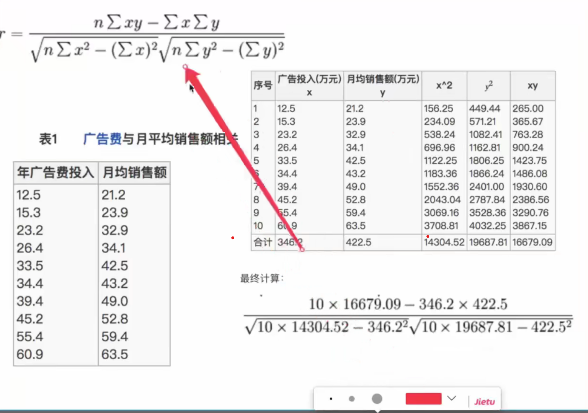

##  git stash
-   当你**正在进行项目中某一部分的工作**，里面的东西处于一个比较杂乱的状态，而你想转到其他分支上进行一些工作。问
    题是，**你不想提交进行了一半的工作，否则以后你无法回到这个工作点**。解决这个问题的办法就是git stash命令。**储藏(stash)可以获取你工作目录的中间状态——也就是你修改过的被追踪的文件和暂存的变更——并将它保存到一个未完结变更的堆栈中，随时可以重新应用。**
-   **git stash就可以将你当前未提交到本地（和服务器）的代码推入到Git的栈中**，这时候你的工作区间和上一次提交的内
    容是完全一样的，所以你可以放心的修Bug，等到修完Bug，提交到服务器上后，再使用**git stash apply将以前一半的工作应用回来。**
-   git stash pop命令**恢复之前缓存的工作目录**
    -   这个指令**将缓存堆栈中的第一个stash删除**，并将对应修改应用到当前的工作目录下
    -   git stash apply命令，**将缓存堆栈中的stash多次应用到工作目录中，但并不删除stash拷贝**。
    -   git stash apply命令时**可以通过名字指定使用哪个stash，默认使用最近的stash**
-   git stash drop stash@{0}
    -   git stash clear命令，**删除所有缓存的stash。**
-   如果**你储藏了一些工作，暂时不去理会，然后继续在你储藏工作的分支上工作**，你在**重新应用**工作时可能会碰到一
    些问题。如果尝试应用的变更是针对一个你那之后修改过的文件，你会碰到一个**归并冲突**并且必须去化解它。如果你想用更方便的方法来重新检验你储藏的变更，你可以**运行 git stash branch，这会创建一个新的分支，检出你储藏工作时的所处的提交，重新应用你的工作，如果成功，将会丢弃储藏。**
##  v-if    v-for
-    v-if 和 v-for 同时用在同一个元素上，带来**性能方面的浪费**（每次渲染都会先循环再进行条件判断）
    -   如果避免出现这种情况，则在外层嵌套template（页面渲染不生成dom节点），在这一层进行v-if判断，然后在内部进
        行v-for循环
    -   <template v-show='isShow'>
        

        </template>
    -   如果**条件出现在循环内部**，可通过计算属性**computed提前过滤掉那些不需要显示的项**
    -   computed:{
            items:function(){
                return this.arr.filter(function(item){
                    return item.isShow
                })
            }
        }
    -   过滤条件数组
##  组件重复打包
-   假设A.js文件是一个**常用的库，现在有多个路由使用了A.js文件，这就造成了重复下载**
    解决方案：在webpack的config文件中，修改**CommonsChunkPlugin**的配置  
##  为obj添加新属性的时候，却无法触发事件属性的拦截
-   obj的foo属性被设成了响应式数据，**而bar是后面新增的属性，并没有通过Object.defineProperty设置成响应式数据**
-   解决方案
    -   Vue.set()
        -   Vue.set(target,name/index,value)
        -   this.$set(target,name/index,value)
        -   原理
            -   **再次使用defineReactive方法**      来触发数据的响应式
            -   defineReactive内部还是使用Object.defineProperty来实现属性的拦截

    -   Object.assign()
    -   直接使用Object.assign()**添加到对象的新属性不会触发更新**
    -   **应创建一个新的对象，合并原对象和混入对象的属性**
    -   this.obj = Object.assign({},this.obj,{name:'Tom',age:18})

    -   $forcecUpdated()
    -   $forceUpdate迫使Vue **实例重新渲染**

##  插件通常用来为 Vue 添加全局功能

-   通过**全局混入来添加一些组件选项**。如vue-router

-   **添加 Vue 实例方法**，通过把它们添加到 Vue.prototype 上实现

### 编写组件

-   常见的就是vue单文件的这种格式

-   还可以通过**template属性来编写一个组件**，如果组件内容多，我们可以在外部定义template组件内容，如果组件内容
    并不多，我们可直接写在template属性上

    -   <template id='testComponent'>
        
component

        </template>

    -   Vue.component('componentA',{
        id:'testComponent',
        template:`
component
`
        })

-   组件注册

    -   全局注册
        -   Vue.component('componentA',{})

    -   局部注册
        -   const component1 = {}
            components:{
                component1
            }

### 编写插件       

-   vue插件的实现应该暴露一个 **install 方法**。这个方法的**第一个参数是 Vue 构造器**，第二个参数是一个可选的
    选项对象

    -   myPlugin.js
        -   myPlugin.install = function (Vue, options) {

            Vue.globalMethod = function () {

            }

            Vue.directive('my-directive', {
                bind(el,binding,vnode,oldVnode) {

                }
            })

            Vue.mixin({
                created: function () {

                }
            })
        }

-   插件注册
    
    -   Vue.use(插件名称, {})

    -   注册插件的时候  需要在 new Vue() 启动应用之前完成

-   props 是子组件的属性

##  机器学习

-   人工智能概述        --》        机器学习        --》深度学习

    -   机器学习是人工智能的一个实现途径

    -   深度学习是机器学习的一个方法发展而来

-   达特茅斯会议        人工智能的起点

    -   1956年      人工智能的元年

-   机器学习        垃圾邮件过滤

-   人工神经网络是机器学习的一个方法

-   图像识别

-   机器学习    深度学习的应用

    -   传统预测

        -   店铺销量预测    量化投资    广告推荐

    -   图像识别

        -   人脸识别    道路标记识别

    -   自然语言处理
        
        -   文本分类    情感分析    自动聊天    

-   机器学习算法    切入业务领域解决问题

##  机器学习

-   从数据中自动分析获得模型    并利用模型对未知数据进行预测

##  数据集的构成

-   结构:   特征值  +   目标值

    -   根据特征值获取目标值

    -   每一行数据称之为样本

    -   有一些数据集可以没有目标值

-   可用的数据集

    -   scikit-learn    数据量小    方便学习

        -   python语言的机器学习工具

        -   安装

            -   python3.6.X

            -   https://www.lfd.uci.edu/~gohlke/pythonlibs/

            -   NumPy       SciPy       pyparsing       Matplotlib      scikit-learn

            -   pip install "numpy-1.19.5+mkl-cp36-cp36m-win_amd64.whl"

            -   pip install "scipy-1.5.4-cp36-cp36m-win_amd64.whl"

            -   pip install pyparsing-2.4.7-py3-none-any.whl

            -   pip install matplotlib-2.2.5-cp36-cp36m-win_amd64.whl
        
        -   分类    聚类     回归
        
        -   特征工程    
        
        -   模型选择    调优

-   scikit-learn    数据集API介绍

    -   sklearn.datasets

        -   **加载流行数据集**

        -   datasets.load_*()

            -   获取小规模的数据集  数据包含在datasets里面

        -   datasets.fetch_*(data_home=None)

            -   获取大规模的数据集  从网络下载  函数的第一个参数是 data_home 表示数据集下载的目录

                默认是  ~/scikit_learn_data/
        
-   sklearn小数据集

    -   sklearn.datasets.load_iris()

-   sklearn大数据集

    -   sklearn.datasets.fetch_20newsgroups(data_home=None,subset="train")

    -   train代表训练集     test代表测试集      all代表都需要

    -   加载并且返回鸢尾花数据集

-   数据集并不是全部都用来训练一个模型          因为还需要对**数据集训练的数据模型进行评估**

-   数据集的划分        一般划分为两个部分

    -   训练数据        用于训练    构建模型        

    -   测试数据        在模型检测中使用    用于评估模型是否有效

    -   73分        82分

-   数据集划分API

    -   sklearn.model_selection.train_test_split(arrays, *options)

        -   x数据集的特征值

        -   y数据集的标签值

        -   test_size测试集的大小   一般是float

        -   random_state随机数种子  不同的种子会造成不同的随机采样的结果    相同的种子采样结果是相同的

        -   return  训练集的特征值  测试集的特征值  训练集的目标值  测试集的目标值

### 特征工程

-   数据和特征决定了机器学习的上限  模型和算法逼近这个上线

-   专业知识和技巧处理数据          使得特征能在机器学习算法上发挥更好的作用

-   会影响机器学习的效果

-   pandas  数据清洗    数据处理

-   sklearn 特征工程        为特征工程提供了强大的接口

-   特征工程的步骤

    -   特征抽取

        -   将任意数据( 文本或者图像 )转换为机器学习的数字特征

        -   特征值化是为了计算机更好去理解数据

        -   字典特征提取

        -   文本特征提取

        -   图像特征提取
    
    -   特征提取API

        -   sklearn.feature_extraction

        -   字典特征提取        one-hot编码

            -   sklearn.feature_extraction.DictVectorizer( sparse = True,...)

                -   vector      数学:向量           物理:矢量

            -   DictVectorizer.fit_transform(X)

                -   X:字典或者包含字典的迭代器返回值    返回sparse矩阵

            -   DictVectorizer.inverse_transform(X)

                -   X:array数组或者sparse矩阵   返回值转化之前的数据格式

            -   DictVectorizer.get_feature_names()  返回类别的名称

            -   one-hot 编码

                -   不同的类别表示区分      用1 2 3 4这些不同数据区分会产生优先级的问题 不利于公平

                -   n个类别具有n列      数据具有相应的类别置1       否则置0     公平

            -   应用场景

                -   数据集中类别特征多

        -   文本特征提取

            -   单词作为特征

            -   文本特征抽取API

                -   sklearn.feature_extraction.text.CountVectorizer(stop_words=[])
                
                -   CountVectorizer.fit_transform(X)

                    -   X:文本或者包含文本字符串的可迭代对象        返回值:返回sparse矩阵

                -   CountVectorizer.inverse_transform(X)

                    -   X:array数组或者sparse矩阵       返回值:转化之前的数据格式

                -   CountVectorizer.get_feature_names()     返回值:单词列表

                -   统计样本特征词出现的个数        CountVectorizer

                -   中文文本特征抽取        需要对中文文本进行分词处理      不然会出现一句话是一个特征词问题

                -   停用词列表      stop_words=[]

                    -   对最终的数据训练没有帮助的数据      是不需要提取的

        -   中文文本特征抽取    自动分词的效果

            -   jieba可以中文文本自动分词

            -   在某一个类别的文章中    出现次数多  但在其他文章中出现少

            -   那么问题的出现在于解决关键词与否        解决方法是TfidfVectorizer

        -   Tf-idf文本特征提取

            -   主要思想:某个词或者短语在一篇文章中出现频率高   并且在其他文章中很少出现

            -   那么认为这种词或者短语具有很好的区分类别能力    适合用来分类

            -   作用:

                -   评估一个字词对于一个文件集或一个语料库中的其中一份文件的重要程度

            -   词频    term frequency( tf )

                -   一个给定的词汇在该文件中出现的频率

            -   逆向文档频率    inverse document frequency( idf )

                -   总文件数目除以包含该词语的文件数目      再将结果得到的商取以10为底的对数

            -   Tf-idf = tf * idf

        -   sklearn.feature_extraction.text.TfidfVectorizer(stop_words=None,...)

            -   返回词的权重矩阵
                
                -   TfidfVectorizer.fit_transform(X)

                -   X:文本或者包含文本字符串的可迭代对象

                -   返回sparse矩阵
            
            -   TfidfVectorizer.inverse_transform(X)

                -   X:array数组或者sparse矩阵

                -   返回值是转换之前的数据格式

            -   TfidfVectorizer.get_feature_names()     返回单词列表

    -   特征预处理

        -   通过一些转化函数    将特征数据转换为更加适合算法模型的特征数据过程

        -   特征预处理API

            -   sklearn.preprocessing

        -   数值型数据的无量纲化

            -   无量纲化的原因

                -   特征的单位或者大小相差较大  或者某特征的方差相比其他特征要大出几个数量级

                -   容易影响支配目标结果        使得一些算法无法学习到其他特征

            -   归一化

                -   X' = x - min / ( max - min )

                    -   max     min         为一列中的最大值        最小值

                -   X'' = X' * ( mx - mi ) + mi     

                    -   mx      mi          指定区间值  默认值是[0,1]

            -   归一化API

                -   sklearn.preprocessing.MinMaxScaler(feature_range=(0,1),...)

                -   feature_range是可以自己设定的范围数据   最后特征数据归一化的范围在里面

                -   MinMaxScalar.fit_transform(X)

                    -   X:numpy array格式的数据 [n_samples, n_features]

                    -   返回值:转化后的形状相同的array

                -   归一化结果容易受到异常点的影响    鲁棒性( 稳定性 )较差  只适合传统精确小数据场景

                -   读取文件数据

                    -   pandas

            -   标准化

                -   X' = (x - mean) / y

                -   mean是平均值        y是标准差       标准差:数据的集中程度   离散程度

                -   出现异常点  由于具有一定的数据量    少量的异常点对于平均值的影响是不大的

                -   从而方差的改变较小
            
            -   标准化API

                -   sklearn.preprocessing.StandardScaler()

                    -   处理之后的数据  对于每一列的数据    所有数据都是聚集在均值0附近的

                    -   StandardScaler.fit_transform(X)

                        -   X:numpy array格式的数据

                        -   返回值          转换后的形状相同的array

                -   应用场景

                    -   样本数量足够        适合现代大数据环境

    -   特征降维

        -   维数: 嵌套的层数

        -   0维:标量        1维:向量        2维:矩阵        3维

        -   降维

            -   在某些限定的条件下      降低随机变量的个数  得到一组 "不相关" 的主变量的过程

                -   特征和特征之间是不相关的

                -   特征之间的相关性较强    那么算法学习预测会影响较大

        -   降维的两种方式

            -   特征选择

                -   数据中包含冗余  或 相关变量     ( 从原有的特征中选取主要特征 )

                -   方法

                    -   Filter  过滤式方法

                        -   方差选择法          ( 低方差过滤 )

                            -   sklearn.feature_selection

                            -   sklearn.feature_selection.VarianceThreshold(threshold = 0.0)

                            -   删除所有低方差特征

                                -   Variance.fit_transform(X)

                                -   X:numpy array格式的数据

                                -   返回值训练集差异低于threshold的特征将被删除 默认值是保留

                                -   所有非0方差特征 就是删除所有样本中具有形同值的特征

                            -   特征方差小      那么某个特征大多样本数据较为集中

                        -   相关系数法          

                            -   特征与特征之间的相关程度

                            -   皮尔逊相关系数

                                -   反映变量之间的相关关系的密切程度的统计指标

                                -   x和y的相关性

                                    -   xy乘积的加和乘以样本数量    -   x的加和乘以y的加和  --》分子

                                    -   x平方的加和乘以样本数量 - x的加和的平方 --》得出结果开方

                                    -   y平方的加和乘以样本数量 - y的加和的平方 --》得出结果开方

                                    -   两个开方的结果数据相乘作为分母

                                    -   
                                
                                -   相关系数r是在[-1,1]

                                -   r > 0   两个变量是正相关的

                                -   r < 0   两个变量是负相关的

                                -   r = 0   两个变量无相关性 

                                -   |r| = 1 两个变量是完全相关的

                                -   |r|越接近1  两个变量相关性越紧密

                                -   |r| < 0.4   是低度相关

                                -   0.4 <= |r| < 0.7   是显著性相关

                                -   0.7 <= |r| < 1   是高度线性相关

                        -   相关系数API

                            -   from scipy.stats import pearsonr

                            -   x:(N,)array_like

                            -   y:(N,)array_like

                        -   特征和特征之间的相关性很高

                            -   选取其中一个

                            -   加权求和        特征值各占50%   得出新的数据

            -   主成分分析

                -   高纬数据转化为低维数据  过程可能会舍弃原有数据  创造新的变量

                -   作用

                    -   是数据维数压缩  尽可能降低原数据维数 ( 复杂度 ) 损失少量信息

                -   应用

                    -   回归分析或者聚类分析当中

                -   主成分分析API

                    -   sklearn.decomposition.PCA(n_components=None)

                    -   将数据分解为较低维数空间

                    -   n_components

                        -   小数表示保留百分之多少的意思

                        -   整数表示减少多少特征

                    -   PCA.fit_transform(X)

                        -   X:numpy array格式的数据

                    -   返回值:转换后指定维度的array

                    -   Embedded    嵌入式方法

                        -   决策树

                        -   正则化

                        -   深度学习

    -   UCI特点

        -   收录了360个数据集

        -   覆盖科学    生活    经济等领域

        -   数据量几十万

    -   kaggle

        -   大数据竞赛平台  

##  机器学习算法分类

-   目标值是

    -   类别        --》分类问题        ( 比如识别猫狗 )    是离散型数据    --》属于监督学习

    -   连续性数据      --》回归问题        ( 比如预测房屋价格 )        --》属性监督学习

    -   无目标值        --》无监督学习

##  监督学习    

-   分类

    -   k-近邻算法  贝叶斯分类  决策树  随机森林    逻辑回归

-   回归

    -   线性回归    岭回归

##  无监督学习

-   聚类k-means

##  机器学习开发流程

-   获取数据

-   数据处理    ( 数据不符合要求    缺失值 )

-   特征工程    ( 数据处理为学习算法更为接收的数据 )

-   机器学习算法进行训练        得到模型

-   模型评估

-   应用

##  机器学习重点

-   算法    --》数据和计算是基础

### 机器学习库和框架

-   pytorch     theano是tensorflow的前身      chainer

##  探究用户对物品类别的喜好细分降维

-   需要将用户表和商品表放在同一个表中      合并

-   找到user_id     aisle       交叉表和透视表

-   特征冗余过多    需要PCA降维

##  分类算法

-   目标值是类别的话        那么就是分类问题

-   sklearn的转换器和预估器

    -   转换器

        -   是特征工程的父类

            -   实例化一个转换器类      Transformer

            -   使用fit_transform       得到计算数据结果

    -   fit_transform()

        -   fit()       计算公式中的数据

        -   transform()         根据数据进行最终的转化      将数据代入公式

    -   估计器

        -   实例化一个估计器          estimator

        -   estimator.fit(x_train, y_train)         计算        调用完毕        模型生成

        -   estimator的模型评估

            -   直接比对真实值和预测值

                -   y_direct = estimator.predict(x_test)

                -   y_test == y_predict

            -   计算准确率

                -   estimator.score(x_test, y_test)
-   K-近邻算法  ( KNN )原理

    -   根据邻居来推断数据的类别

    -   如果一个在特征空间中的k个最相似( 即特征空间中最邻近 )的样本中的大多数属于某一个类别

    -   那么这个样本也属于这个类别

    -   k=1         容易受到异常点的影响

    -   确定谁是邻居

        -   欧式距离            a(a1, a2, a3)   b(b1, b2, b3)

        -   (a1-b1)^2+(a2-b2)^2+(a3-b3)^2       -->结果数据开方

        -   曼哈顿距离

        -   绝对值距离      |a1-b1|+|a2-b2|+|a3-b3|

        -   明可夫斯基距离

    -   k等于的数据是距离目标值数据最近的特征数据       

        -   继续从特征数据中选取占比大的特征数据类别来决定测试数据的类别

        -   k值数据过大的时候       当样本不均衡的时候  结果会受到影响

    -   KNN算法因为涉及到距离的计算     那么数据的异常点会对结果产生影响

        -   那么需要进行无量纲化的处理

    -   K-近邻算法API

        -   sklearn.neighbors.KNeighborsClassiflter(n_neighbors, algorithm='auto')

        -   n_neighbors查询默认使用的邻居数量

        -   algorithm是选择计算最近邻居的算法

            -   auto将尝试根据传递给fit方法的数据来决定适合的算法

-   鸢尾花种类的预测

    -   获取数据

    -   数据集划分

    -   特征工程

        -   标准化

    -   KNN预估器流程

    -   模型评估

-   KNN算法

    -   懒惰算法    对测试样本分类计算大    内存开销大

    -   必须指定K值     K值的选择不当精度是不能保证的

    -   使用场景是几千~几万的数据量

-   模型选择和调优

    -   什么是交叉验证

        -   将拿到的训练数据    分为训练集和验证集  比如数据分为四分    其中一份数据是验证集    

            -   那么会进行4次的测试 每一次更换不同的验证集  得到四组模型的结果

            -   将平均值作为最终结果    称为交叉验证

        -   被评估的模型更加的准确可信

    -   超参数搜索-网格搜索

        -   参数需要手动指定的参数      手动会比较麻烦  那么就预设几种超参数组合

        -   每一组超参数都采用交叉验证来进行评估    最后选出最优的参数组合建立模型

-   模型选择和调优API

    -   sklearn.model_selection.GridSearchCV(estimator, param_grid=None, cv=None)

        -   对预估器的指定参数值进行详尽搜索

        -   estimator 是估计器对象

        -   param_grid 是估计器参数

        -   cv 指定几折交叉验证

        -   fit() 输入训练数据

        -   score() 准确率

##  three.js

-   geometry

    -   创建网格    移动网格

    -   wireframe:true      网格线段

-   BoxBufferGeometry()

    -   gpu更好渲染 性能提升    体验提升

    -   存储 buffer 数据

-   dat.gui

-   纹理

    -   图像转化为纹理

    -   纹理加载器

        -   textureLoader

        -   路径很喜欢使用require('')

-   LoadingManager      加载管理器

-   图形的材料  material

    -   颜色的程序      shadow

    -   MeshBasicMaterial       材料实例化之后的        color 熟悉设置

        -   color 变为一个实例化的类     不可直接设置属性值  需要调用相应的API

        -   material.color = 'red'  --> 不可直接设置

        -   material.color = new THREE.color('#ff00ff') 或者    material.color.set('#ff00ff')

    -   材料的透明设置

        -   material.transparent = true

        -   material.opacity = 0.5

    -   材料双方向的出现

        -   material.side = THREE.DoubleSide

    -   平面图的突起        简单图形的坐标点是不足的

        -   那么需要增加坐标点  增加细节

-   环境贴图

    -   立方体材料加载器

-   字体

    -   

-   灯光位置在哪    light.position.set( )    

    -   灯光照向何处            light.lookAt( new THREE.Vector() )

-   阴影

    -   灯  物体    板      renderer    

-   烘烤图形

    -   图形阴影更加逼真

-   uv坐标

    -   aoMap       --  uv

-   alphaMap        --  transparent

-   粒子

    -   

-   物理

    -   

##  vue

-   watch中immediate

    -   immediate: true     第一次渲染便会执行 watch 元素的回调函数

-   通过computed计算属性的**配合**，**先计算出需要监听的属性后用watch监听** 从性能以及可读性考虑

-   取值get     赋值set

    -   computed: {
        fullName: {
            get() {
                <!-- 取值 -->
            },
            set(val) {
                <!-- 赋值 -->
            }
        }
    }

-   深度监听虽然可以监听到对象的变化,但是**无法监听到具体对象里面那个属性的变化**

    -   secondChange:{
        handler(oldVal,newVal){
          console.log(oldVal)
          console.log(newVal)
        },
        deep:true
      }

    -   console.log打印的结果,发现**oldVal和newVal值是一样的**

-   props传值

    -   传入的值想作为局部变量来使用,**直接使用会报错**     因为会改变父组件的值

    -   解决方案

        -   data中重新定义一个变量,改变指向,但是也**只是针对简单数据类型**,因为复杂数据类型栈存贮的是指针

        -   **复杂数据类型在栈中存贮的是指针,所以赋值给新的变量也会改变原始的变量值**

        -   **函数对象克隆**之后的对象会单独复制一次并存储实际数据，因此并不会影响克隆之前的对象

-   空值合并操作符（??）

    -   只有当左侧为null和undefined时，才会返回右侧的数

-   可选链操作符( ?. )允许读取位于连接对象链深处的属性的值，而**不必明确验证链中的每个引用是否有效。**

    -   在引用为空(nullish ) (null 或者 undefined) 的情况下**不会引起错误**

    -   let arrayItem = arr?.[42];

-   JSON.parse(JSON.stringify(obj))

    -   无法实现对**函数 、RegExp等特殊对象的克隆**

    -   会抛弃对象的constructor,**所有的构造函数会指向Object**

    -   对象的循环引用会抛出错误

        -   const oldObj = {};
            oldObj.a = oldObj;
            const newObj = JSON.parse(JSON.stringify(oldObj));
            console.log(newObj.a, oldObj.a); // TypeError: Converting circular structure to JSON

-   浅克隆          引用指向**同一块堆内存**.

    -   const obj = {};
        for ( let i in o) {
            obj[i] = o[i];
        }
        return obj;

-   深度克隆

    -   number string null undefined boolean array object regexp date

    -   提供判断复杂数据类型的函数

    -   var whichType (target, typeTarget)
        {
            let [flag] = [false]
            let toType = Object.prototype.toString.call(target)
            switch (typeTarget)
            {
                case 'Array':
                            return flag = toType === '[object Array]'
                case 'Date':
                            return flag = toType === '[object Date]'
                case 'RegExp':
                            return flag = toType === '[object RegExp]'
                     
            }
            return flag
        }

    -   提供了判断复杂数据类型函数

    -   进行深度克隆

    -   const clone = parent => {
        const parents = []
        const children = []
        const _clone = parent => {
            if(parent === null)return null
            if(typeof parent !== 'object')return parent
            let child, proto;
            if (whichType(parent, 'Array'))
            {
                child = []
            }
            else if (whichType(parent, 'Date'))
            {
                child = new Date(parent.getTime())
            }
            else
            {
                proto = Object.getPrototypeOf(target)
                child = Object.create(proto)
            }
            const index = parents.indexOf(parent)
            if(index !== -1)
            {
                return children[index]
            }
            parents.push(parent)
            children.push(child)
            for(let i of parent)
            {
                child[i] = _clone(parent[i])
            }
            return child
        }
        return _clone(parent)
    }

-   **直接使用**Object.assign()添加到对象的新属性不会触发更新

    -   **应创建一个新的对象**，合并原对象和混入对象的属性

    -   var newObj = Object.assign ({}, this.obj, {name:'Tom', ...})

-   attrs       v-bind = "$attrs"

    -   v-bind="$attrs" 传入内部组件——在创建高级别的组件时非常有用。
        简单点讲就是包含了所以**父组件在子组件上设置的属性**（除了prop传递的属性、class 和 style ）。

-   listeners       v-on = "listeners"

    -   包含了父作用域中的 (不含 .native 修饰器的) v-on **事件监听器**

    -   是一个对象，里面包含了**作用在这个组件上所有的监听器**

    -   v-on:test2 = "onTest2"

        $emit("test2", val)

-   inheritAttrs                inheritAttrs: false 

    -   默认情况下父作用域的不被认作 props 的特性绑定 (attribute bindings) 将会“回退”且作为普通的 HTML 特性
        应用在子组件的根元素上

-   vm.$el.textContent      

    -   Vue.nextTick(() => {
        console.log(vm.$el.textContent)
    })

    -   this.$nectTick(() => {console.log(this.$el.textContent)})

    -   返回的是一个    **promise对象**  

    -   **立刻得到更新后的DOM结构**，可以使用Vue.nextTick()

-   mixin

    -   参数使用数组的形式来进行功能的复用      mixins: [mixinMy]      使用复数的形式是为了可能会引入

    -   多个混入对象的使用方法      方便理解

    -   全局混入会影响全部组件实例

        -   Vue.mixin({created() {console.log('mixin')}})

    -   组件选项会覆盖 mixin 选项

    -   但是生命周期钩子函数的时候  会合并成一个数组    先执行 mixin 中的钩子函数   再来执行组件中的钩子函数

    -   mixin是一个混入对象 里面包括了混入的选项    key-value

    -   封装一些可以复用的功能  方便    实用

    -   const myMixin = {
        data() {return {isShowing: false}},
        methods: {fn1() {this.isShowing = !this.isShowing}}
        }

    -   Vue.mixin --> mergeOptions      合并选项

    -   mixin是为了复用代码 方便实用        mixins: [mixinMy]       mixinMy是对象的形式

-   slot插槽的理解      是web组件的一个占位符

    -   占位符的作用后期可以使用自己的标记语言进行一个填充

    -   为了拓展组件    更好地复用组件和进行定制化处理

    -   默认插槽

        -   <slot>
插槽内容
</slot>            使用的时候直接写入自己的标签语言即可

    -   不同页面中相似但是不完全相同的组件  组件中使用 slot 来代替不同的区域    组件即可多处复用

-   native

    -   让组件变成像html内置标签那样**监听根元素的原生事件**，否则组件上使用 v-on **只会监听自定义事件**

    -   @click.native

-   @click.left @click.right    @click.middle       鼠标的左右以及中间事件的触发

-   **设置key**能够大大减少对页面的DOM操作，提高了diff效率

-   axios取消请求

    -   var cancelToken = axios.CancelToken
        var source = cancelToken.source()
        source.cancel('主动取消请求')

-   console.time('排序算法的时间')      console.timeEnd('排序算法的时间')

    -   while ( i > 0) {
        var pos= 0; //每趟开始时,无记录交换
        for (var j= 0; j< i; j++)
            if (arr[j]> arr[j+1]) {
                pos= j; //记录交换的位置
                var tmp = arr[j]; arr[j]=arr[j+1];arr[j+1]=tmp;
            }
        i= pos; //为下一趟排序作准备
        }

    -   不断正反向排序  每一次的正反向排序算法得出的结果是剩余未成功排序的一个最大值最小值的得出

-   选择排序算法    n个数据得出一个最值需要n-1次计算    固定的模式计算
    固定的时间复杂度O(n^2)
    每一次找出最小的数据的下标  进行数据交换

-   快速排序寻找了基准值    但是归并排序没有寻找基准值  快速排序和归并排序分为左边和右边来递归排序数据  

-   **计数排序不是比较排序，排序的速度快于任何比较排序算法**

    -   计数排序的时间复杂度O(n+k)

-   **桶排序是计数排序的升级版。它利用了函数的映射关系，高效与否的关键就在于这个映射函数的确定。**

-   **基数排序也是非比较的排序算法**，对每一位进行排序，从最低位开始排序，**复杂度为O(kn)**,为数组长度，k为数组
    中的数的 最大的位数；

-   axios拦截器 权限的管理  请求拦截器是根据请求头的信息来操作

    -   axios.interceptors.request.use(config => {
        config.headers['token'] = cookie.get('token')
        return config
    })
-   响应拦截器是根据响应状态码来进行操作

    -   axios.interceptors.response.use((response)=> {
        if(response.data.code === 40099) {
            router.push('/login')
        }
    })

-   axios的请求拦截器和响应拦截器是接口权限管理的实现方式

-   路由权限控制    初始化挂在全部的路由    路由上面标记相应的权限信息  每次路由跳转前会进行一个校验工作

    -   meta: {
        title: 'permission',
        roles: ['admin', 'editor']      //是超级管理员/作者才能对资源进行访问
    }

    -   直接在路由里面添加权限的相关信息的缺点

        -   路由太多    性能影响

        -   全局路由守卫 beforeEach(to, from, next) {}  每一次路由跳转之前会进行判断    比较麻烦

-   自定义指令

    -   Vue.directive('has', {
        bind: function(el, binding, vnode) {
            let btnArr = []
            if(binding.value) {
                btnArr = Array.of(binding.value)
            }else {
                btnArr = vnode.context.$route.meta.btnPermission
            }
        }
    })

-   跨域是浏览器的限制  协议 主机 端口 一项不同则产生跨域   保证了浏览器最核心最基本的安全功能
    抓包工具可以顺利获取数据    再次证明跨域是浏览器的一个限制

-   解决跨域的方法

    -   cors方法解决跨域

        -   cors是一个系统  由一系列的http请求头组成    根据这些请求头决定是否阻止前端js代码获取跨域资源

        -   cors        -->         cross-origin resource sharing           跨域资源共享

        -   cors使用起来非常方便    只需要增加一些http请求头    让服务器声明允许访问来源

        -   只要后端实现了cors      就实现了跨域

        -   主要是后端实现Access-Control-Allow-Origin

-   proxy代理来解决跨域

    -   服务端和前端都可配置代理进行请求转发
    
-   history模式下的404      
    
    -   可能没有配置文件路径转发的操作  

-   props: {
    name: {
        required: true,
        type: String
    }
    }

-   vue3中的teleport        类似于传送内容到指定位置的一个传送门的功能

    -   <teleport to="teleport-target">content</teleport>

    -   teleport的内容传送到了teleport-target的位置

-   vue3 中 watch 不在支持点分隔字符串路径  使用计算函数作为参数

-   vue3 中 的template选项没有特殊指令的标记    v-if v-else v-for v-slot 

    -   template被视为普通元素  并将生成原生template元素   而不是渲染内部内容

-   vue3是基于TS编写的  提供更好的类型检查

-   vue2中  数据劫持是通过Object.defineProperty()

    -   缺陷是不可检测对象属性的添加和删除

-   vue3中  通过proxy来监听整个对象 对于删除还是添加都是可以监听的

    -   proxy是不能监听内部深层的对象变化   vue3中在getter中递归响应式

    -   只有真正访问到数据对象的时候才会变成响应式  而不是无脑递归  提高性能

    -   

-   vue3优化

    -   diff算法优化

        -   flag标记区分静态内容    和    动态内容  数据变化直接寻找flag标记为动态内容的区域

            忽略静态标记的内容

-   Object.keys(obj)    取得对象的key值

-   proxy

    -   const observed = new Proxy(obj, {
        get(target, key, receiver) {
            const res = Reflect.get(target, key, receiver)
            return res
        }
        set(target, key, value, receiver) {
            const res = Reflect.set(target, key, value, receiver)
            return res
        }
        deleteProperty(target, key) {
            const res = Reflect.deleteProperty(target, key)
            return res
        }
    })

    -   proxy 属于元编程    修改的是程序的默认行为

    -   proxy 用于创建一个对象的代理    从而实现基本操作的拦截和自定义 (属性查找 赋值 枚举 函数调用)

    -   const proxy = new Proxy(target, handler)

    -   handler 通常代表以函数为属性的对象  各属性中的函数分别定义了在执行各种操作时候代理 p 的行为

    -   有着 13 个操作是可以拦截的

    -   需要对 Proxy 内部调用对象的默认行为 建议使用 Reflect Reflect 具有 Proxy 的所有代理方法  

        以静态方法的形式存在    让 Object 的操作变为函数行为

    -   严格模式下  set 代理没有返回 true       就会报错

    -   Reflect.deleteProperty(target, propKey)

    -   Proxy.revocable(target, handler)    // 创建一个可以撤销的代理对象

        -   var revocable = Proxy.revocable(target, handler)
        <!-- 取得生成的代理本身  revoke() 撤销代理方法和生成的代理对象-->
            var proxy = revocabel.proxy
            
            revocable.revoke()

    -   函数形式        
    
    -   key-value 形式:  fn1: function () {}  

    -       简写形式: fn1 () {}

-   Object.defineProperty   和  proxy的比较

    -   前者是只能对对象属性遍历进行劫持        后者可以劫持整个对象    并且返回一个新的对象

-   vue3的composition Api       和      vue2的options api

    -   两种api是js代码的组装形式的改变     options api     是data methods computed watch...形式

        -   碎片化的组织形式    代码的理解和维护会变得困难

    -   composition api将某个逻辑点相关的代码放在一个函数       修改属性相关的代码的时候

        不需要在文件里面跳跃查找

        一个函数包含了一个逻辑点参数以及逻辑点参数参与的函数运算        逻辑组织方面更加集中处理 更加方便

        composition api几乎全是函数形式     可以更好的类型判断

        computed watch里面的参数形式是函数形式      
        
        composition api里面的函数的参数一般的形式为函数或者对象的形式

    -   mixin带来的麻烦     

        -   命名冲突

        -   数据来源不清晰

-   vue3 的 tree shaking

    -   清除多余代码的方式来优化项目打包体积的技术

-   api的形式调用组件       vue2(Vue.extend来获取组件实例)        vue3 的不同形式

    -   import componentMy from './componentMy'
        const componentClass = Vue.extend(componentMy)
        const instance = new componentClass({el: document.createElement("div")})
        document.body.appendChild(instance.$el)

    -   vue3移除了extend获取组件        使用的是createVNode

    -   const container = document.createElement("div")
        const vNode = createVNode(componentMy)
        render(vNode, container)
        
-   扩展运算符实现的是浅拷贝

-   Array.from(arrayLike, callback)将类似于数组的对象和可遍历的对象转换为数组

    -   Array.from([1, 2, 3], x => x*x)     将处理后的值放入返回的数组

-   Array.of()将一组值转化为数组            Array.of(1, 2, 3)

    -   没有参数的时候返回一个空数组

    -   当只有一个参数的时候    指定的是数组的长度

    -   只有参数不小于2个的时候     才会返回由参数组成的新数组

-   数组的扩展运算符    ...

    -   数组的实例对象新增的方法

        -   copyWithin()    将指定位置的成员复制到其他位置(会覆盖原有的成员)    然后返回当前数组

            -   copyWithin(target, start, end)      

                -   参数形式是基本数据类型

                -   从target位置开始替换元素

                -   start是开始复制元素的位置

                -   end是复制元素的结束位置

                -   [1, 2, 3, 4, 5].copyWithin(0, 3)        //[4,5,3,4,5]

        -   find(function, obj)找出第一个符合条件的数组成员

            -   参数的形式函数形式  动作是找出条件元素

            -   参数函数的参数依次顺序是值      下标        当前数组

            -   arr.find(function(value, index, arr) {
                return value > 9
                })

        -   findIndex(function, obj)返回第一个满足条件的成员的下标

            -   function是动作函数          obj是function中的this指向

        -   复用的境界就是尽量提取函数等数据类型    然后用传参的方式来复用代码

        -   fill(7, 1, 2)函数填充的是数组元素

            -   7是填充的数据       1   2是填充的起始位置和结束位置

            -   填充的数据是对象    那么是浅拷贝

        -   keys()  values()        entries()   是对数组元素的键名  键值    键值对的遍历

        -   for(let [index,elem] of arr.entries())

        -   arr.includes(item, startIndex)      判断数组是否包含给定的数据值

            方法的第二个参数表示搜索的起始位置

        -   数组的扁平化处理        将数组数据扁平化处理    返回一个新的数组    对原来数据是没有影响的

        -   flat()      flatMap()

            -   flat默认是拉平一层数组      针对的是嵌套的数组      flat()传入参数  表示扁平化的层数

            -   flatMap()       就是flat  map函数的结合

                -   首先对每一个数组元素进行map里面的函数操作   例如    x => [x, x*2]

                -   再来进行flat扁平化数组的操作        

                -   arr.flatMap(x => [x, x*2])

                -   flatMap可以具有第二个参数   用来绑定遍历函数里面的this

                -   arr.flatMap(x => [x, x*2], obj)

-   object新增的特性

    -   函数里面返回对象形式    return {x, y}

    -   简写的对象方法是不能用作构造函数形式的  否则会报错

        -   f: function() {}        //标准模式

        -   f(){}                   //简写模式

-   函数的非尾部参数设置默认值  那么函数使用的时候  不能在非尾部参数没有设置的情况下    设置后面的参数

    -   f(, 1) // 报错      不可省略前面的设置

-   函数参数使用了默认值    解构赋值    扩展运算符  那么函数是不可使用use strict声明的  否则会报错

-   set map

    -   set是集合数据结构       map是字典数据结构

    -   集合是一堆无序的 相关联的 不重复的数据组成的组合        存储数据的形式是[value,value]

    -   字典是一些元素的集合    每个元素有一个key域     不同元素的key各不相同 存储数据的形式是[key,value]

    -   set类似于数组   但是成员的值都是唯一的  没有重复的值    const mySet = new Set()

    -   set增删改查的方法           set具有size属性  

        -   mySet.add(1)     参数：value元素本身         返回值：mySet结构

        -   mySet.delete(1)     参数：删除的数据值         返回值：boolean值    表示删除是否成功

        -   mySet.has(1)        判断mySet数据结构里面是否存在参数传入的数据 返回类型是boolean

        -   mySet.clear()       直接清空mySet的数据

    -   set的遍历的方法

        -   keys()

        -   values()...

        -   entries()       mySet.entries()

            -   for(let item of mySet.entries())        //item的数据形式是[value,value]

    -   set中数据结构可以实现的操作     实现并集    交集    差集

        -   并集                new Set([...arr1,...arr2])
        
        -   交集                new Set([...arr1].filter((item) => arr2.includes(item)))

        -   差集                new Set([...arr1].filter((item) => !arr2.includes(item)))

        -   [...new Set(arr)]       扩展运算符和Set数据结构来进行数组去重

    -   map字典数据结构

        -   map增删改查的属性和操作方法

        -   const myMap = new Map()

        -   myMap.size          myMap.set(key, value)       myMap.get(key)      myMap.has(key)

            myMap.delete(key)           myMap.clear()      

        -   map使用entries()        简单的形式直接使用for       来遍历得到相应的数据

            -   for(let [key,value] of myMap) {}//相当于使用了myMap.entries()

        -   forEach的参数形式是函数

-   WeakSet()     WeakMap()

    -   let myWeakSet = new WeakSet()

    -   weakSet没有size属性     没有可以操作的API

    -   weakset的成员类型只可以是引用数据类型           let myWeakSet = new WeakSet()

    -   let myWeakMap = new WeakMap()       WeakMap的弱引用只是键名  而不是键值     键值是正常引用

        也就是说WeakMap的键名是浅拷贝       键值是深拷贝        并且键名只接收对象作为键名

-   异步代表不阻塞主线程        回调函数的形式  一个函数可以执行的前提条件是另一个函数的返回值作为参数

    也就是回调函数的执行        等其他函数的执行结果来执行程序

-   promise     then方法返回的是新的promise实例     也就是promise可以链式书写的原因

    -   then方法的链式调用      解决了回调地狱的问题

    -   then的第一个第二个参数分别是成功和失败的回调函数

    -   catch方法是then方法第二个参数的别名

    -   promise 的all方法       all方法可以将多个请求合并在一起

        -   全成功则为成功  否则为失败      失败的promise若是自身有catch方法    那么直接触发自身的catch方法
        
            不会触发实例对象的catch方法         自身没有catch方法才会去触发实例对象的catch方法

        -   const p = new Promise.all([p1,p2,p3])       

    -   promise的race方法           race方法设置图片请求超时        也就是资源超时的情况

        -   const p = new Promise.race([p1,p2,p3])

        -   根据率先改变的promise对象的状态改变而改变       取决于多个promise改变状态的速度

    -   promsie的allSettled方法 

        -   const p = new Promise.allSettled([p1,p2,p3])

        -   allSettled方法是等待所有promise返回结果     无论成功还是失败        所有promise返回结果之后

            包装新的promise实例对象才算结束

    -   resolve()将现有的对象转换为 promise 对象

        -   没有参数的时候  直接返回一个resolved状态的Promise对象

    -   const p = new Promise((reslove, reject) => {
                    resolve('ok')
                }).then((res) => {
                    console.log(res)
                },
                (reason) => {
                    console.log(error)
                }
                )

-   generator函数会返回一个遍历器对象       就是具有Symbol.iterator属性     并且返回给自己

    -   function* fn1() {
        yield 'status1'
    }

    -   * yield     yield返回返回遍历器对象的状态

    -   next方法携带的参数是作为上一个yield表达式的返回值

    -   function* fn1(x) {
        var y = 2 * (yield(x+1))
        var z = yield(y/3)
        return (x+y+z)
        }
        var b = new fn1(5)
        b.next()    //{value: 6, done: false}
        b.next(12)    //{value: 8, done: false}
        b.next(13)    //{value: 42, done: true}

    -   因为generator函数返回的是遍历器对象     那么可以使用for of来进行遍历

    -   function* fn1() {
        yield 1;
        yield 2;
        yield 3;
        yield 4;
        return 5
        }
        for(let v of foo()) {
            console.log(v)
        }

-   js提供了四种数据集合        arr object map set

    -   数据集合可以被循环遍历的原因是迭代器的支撑  任何数据结构只要配置了iterator接口  那么就可以完成遍历操作

    -   迭代器为不同的数据结构提供了统一的访问机制  使得数据结构里的成员按照顺序依次被遍历访问

-   Generator 函数返回 Interator 对象       可以使用 for of 进行遍历

    -   function* fn1 () {
        yield 1;
        yield 2;
    }

    -   fn1 返回的是迭代器对象      可以使用 for of 来进行遍历

-   Reflect.ownKeys( obj )        得到对象的 key 数组

-   异步解决方案

    -   回调函数    promise     generator   async/await
    
    -   Promise 解决函数嵌套    改为链式调用

    -   Generator 函数返回迭代器对象        iterator

        -   yield 代表函数暂停执行  next 方法恢复函数执行

        -   非常适合将异步任务同步化        因为可以暂停    恢复执行

        -   不只是用于异步任务  还可部署Iterator接口    对象迭代    控制输出

        -   function* generatorIterator (obj) {
            let keys = Object.keys(obj)
            for (let i = 0; i < keys.length; i++) {
                let key = keys[i]
                yield [key, obj[key]]
            }
        }   // 函数返回的是迭代器对象   具有迭代器对象的数据结构可以使用 for of 遍历数据

        -   for (let [key, value] of generatorIterator(obj)) {
                console.log(key, value)
            }

    -   async / await

        -   async fn1 () {
            const f1 = await readFile( '/etc/fstab' )
            console.log( f1.toString() )
        }

        -   是 Generator 的语法糖   相当于自动执行 Generator 函数

##  es6 module

-   es6 设计思想尽量静态化  使得编译时就可确定模块的依赖关系    以及输入输出的变量

    -   let {stat, exists, readFile} from 'fs'

    -   代码只加载三个方法  其他方法是不加载的  也就是说 es6 是编译时完成模块的加载

-   10 进制转换为 16 进制的数据        Number(target).toString(16)     rgb(255, 255, 255) --> #ffffff

-   16 进制转换为 10 进制的数据        parseInt("0x" + target)  

-   es6 模块内部自动采用了严格模式

    -   export 规定模块的对外接口

        -   export {firstName, lastName, year}

        -   直观看出暴露的变量

        -   export {
            v1 as streamV1,
            v2 as streamV2
            }       // as 可以进行输出变量的重命名      也可用于 import 

        -   import {lastName as surname} from './profile.js'

        -   export default 是模块的默认输出     import 加载对应文件的时候 可以给文件任意命名

    -   import 用于输入其他模块提供的功能   加载整个模块

        -   import * as circle from './path'

        -   编译阶段 import 会提升到整个模块的头部  首先执行

    -   动态加载模块    不必预先加载所有模块    存在明显的性能优势

        -   import 作为函数调用 参数是模块路径  它返回一个 promise  然后访问对象的导出

        -   import('./path').then((res) => {
            // code
            })

    -   复合写法    如果在一个模块中    先输入后输出同一个模块  import 语句可以和 export 语句写在一起

        -   export {foo, bar} from 'my_module'

##  decorator 装饰器

-   装饰器命名相当于一个注释

-   不改变原有代码的基础上  对原来的功能进行扩展

-   修饰对象的两种用法

    -   类的装饰

        -   @decorator
            class A {}

        -   等同于
            class A {}
            A = decorator(A) || A

        -   一个装饰器的书写

        -   function decorator (target) {
                target.parameter = true     // 装饰器给对象添加静态属性 parameter
            }

        -   装饰器想要传递参数  装饰器外层需要再封装一层函数

            -   function decorator (parameter) {        // 外层传递的参数
                return function (target) {
                    target.parameter = parameter        // 内部装饰修饰的对象
                }
            }

            -   @decorator(true)        // 传递的参数
                class A {}
                A.parameter // true

    -   类属性的装饰

        -   对类属性进行装饰的时候  能够接受三个参数

            -   类的原型对象

            -   装饰的属性名

            -   装饰属性名的描述对象

        -   定义一个 readOnly 的装饰器

            -   function readOnly (target, name, descriptor) {
                descriptor.writable = false  // 类的属性只可读 不可更改
                return descriptor
            }

            -   class A {
                @readOnly           // 不是函数形式 需要传递参数的时候  写为函数形式
                name () {}
                }

            -   相当于 readOnly(A.prototype, 'name', descriptor)

            -   如果一个方法有多个装饰器    先从外到内进入  再从内到外执行

                -   class A () {
                    @des(1)      // 函数形式会传递参数
                    @des(2)
                    method () {}
                    }
    
    -   装饰器不能修饰函数  函数存在变量声明的情况  会出现和预期结果不符的情况

##  基本数据类型    引用数据类型

-   基本数据类型存储在栈内存中  数据赋值的时候  栈内存中开辟一块新的空间来存储数据

-   引用数据类型    引用地址存储在栈内存中  具体数据值存储在堆内存中    数据赋值的时候  将栈内存中的地址

    赋值给新的数据  那么新的数据和旧的数据共同指向一个堆内存对象

-   js 只有运行时才能确定当前类型

-   需要数据类型转化的时候  可以尝试运算符来进行数据类型转化

    -   显式转换    parseInt() Number() String() Boolean()

    -   隐式转换    运算符 + - * /          
    
    -   这是算术运算存在的隐式转换      + '0'           - '0'       

    -   比较运算中存在的隐式转换        == != > < if while

    -   null --> 数值 0      undefined --> 数值 NaN         null == 0 --> false

    -   字符串的有值    无值    是需要判断的        ''       'false'

-   null undefined 数据判断的时候   可以直接使用 == === 

    -   null == undefined --> true

    -   null === undefined --> false

-   深拷贝 JSON.parse(JSON.stringify(obj))

    -   存在的缺点是会忽略  undefined symbol    function

-   闭包    

    -   创建私有变量

    -   延长变量的生命周期

        -   一般函数的词法环境在函数返回之后会被销毁    但是闭包会保存对创建时所在词法环境的引用

            即便创建时所在的执行上下文被销毁    但是创建时的词法环境是存在的    那么就可延长变量的生命周期

    -   柯里化函数

        -   避免频繁调用具有相同参数函数的同时  轻松重用函数

        -   function getArea (width, height) {
            return width * height
            }

        -   const area1 = getArea(10, 20)
        -   const area2 = getArea(10, 30)
        -   const area3 = getArea(10, 40)

        -   频繁调用函数        那么使用闭包柯里化这计算面积函数

        -   function getArea (width) {
            return height => {
                return width * height
            }
            }       //返回值是一个函数  那么需要变量来接取这个函数

        -   const getTenWidthArea = getArea(10) // 得到一个宽度为 10 的面积计算函数 getTenWidthArea

            -   减少了相同参数的使用

    -   闭包可以模拟私有方法

        -   就是 return {fn1, fn2}      return 的对象里面是函数形式     里面的函数是实例对象私有的方法

-   创建新的对象和类的时候  方法通常应该关联于对象的原型    而不是定义在对象的构造器中

-   词法作用域

    -   也叫做静态作用域    变量被创建时就确定好了  而非执行阶段确定的  

    -   var a = 2
        function A () {
            console.log(a)
        }
        function B () {
            var a = 3
            A()
        }
        B()

    -   同层级的函数 A 和 B 是没有办法访问彼此块作用域中的变量的    所以输出 2

-   Ucaught ReferenceError: age is not defined

##  原型链

-   部分属性和方法在对象构造器函数上的 prototype 属性上     而非实例本身

-   每个函数都有一个特殊的属性  prototype   

    -   fn.prototype        -->     具有一个 constructor 还有就是属性和方法 coustructor 指向该函数fn

-   __proto__   是对象实例和构造器之间的链接        是实例对象用来指向构造函数的原型对象 prototype 的

    -   instance.__proto__ === fn.prototype

    -   **所有的构造器都是函数对象**

-   滤清关系        instance    Obj () {}    Function () { native code }        Object

    -   instance.__proto__ === Obj.prototype

    -   Obj.prototype.__proto__ === Object.prototype

    -   Obj.__proto__ === Function.prototype

    -   Object.prototype.__proto__ === null

    -   Object.__proto__ === Function.prototype

    -   Function.__proto__ === Function.prototype

-   Object.create() 方法实现的是浅拷贝  寄生组合式继承是最优的继承方式  extends 语法糖和寄生组合式继承类似

    -   function myExtend (Parent, Son) {
        Son.prototype = Object.create(Parent.prototype)
        Son.prototype.constructor = Son
        }       // 寄生组合式继承

    -   原型对象上的数据是共享的    引用数据类型方法改变数据的时候  可能其他实例对象会受到牵连

##  this 指针

-   大多数情况是函数的调用方式决定了 this 的值  ( this 指针是运行时绑定的)

    -   this 是函数运行时自动生成的一个内部对象 只能在函数内部使用  总是指向调用它的对象

-   严格模式下  全局对象不可用于默认绑定    this 会绑定到 undefined 只有函数运行在非严格模式

    默认绑定才会绑定到全局对象

-   普通函数 this 指针的指向取决于普通函数调用的方式 形式

    -   函数执行的形式  可以是对象调用  可以是全局环境的函数调用

    -   obj.fn()    -->     对象调用        fn2()       -->     全局环境调用

    -   构造器返回的是 {}   --> return {}    那么 this 指针指向了 {}

    -   箭头函数 this 指向是编译时绑定      箭头函数的作用域是块级作用域    不是普通函数的函数作用域

    -   new 绑定 > 显式绑定 > 隐式绑定 > 默认绑定

    -   new obj.fn()        --> new 绑定 和 obj.fn() 隐式绑定

    -   var fn1 = obj.fn.bind(obj2)     --> bind apply call 是显式绑定

    -   fn()        -->     在全局环境式默认绑定    当然严格模式会报错

##  执行上下文

-   创建    -->     执行    -->     回收

-   创建

    -   确定 this 的值

        -   运行时确定

    -   词法环境

        -   全局环境

        -   函数环境

    -   变量环境

    -   词法环境和变量环境区别在于前者是用于存储函数声明和(let const)变量绑定的     后者是仅存储变量(var)绑定

##  执行栈  存储    执行上下文

-   全局执行上下文      函数执行上下文      栈 先进后出 后进先出

        

            

    

    

